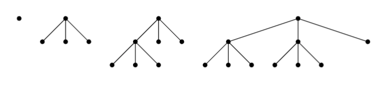

## Question 1

> How many 16-bit strings (that is, strings consisting of sixteen bits) contain exactly eight 1-bits? Explain how you arrived at your answer.

---

The number of 16-bit strings that contain exactly eight 1-bits can be calculated using the combination formula—which states that for a set of $n$ items, the number of ways to choose $r$ items from the set (where the order does not matter) is given by:

$$
C(n, r) = \frac{n!}{r!(n-r)!}
$$

In this case, we have 16 items (bits) and we want to fill 8 of them with 1-bits. Since order does not matter, we can use the combination formula to calculate the number of ways (combinations) to choose 8 positions out of 16 to place the 1-bits:

$$
C(16, 8) = \frac{16!}{8!(16-8)!} = \frac{16!}{8!8!} = 12870
$$

Therefore, there are $12870$ 16-bit strings that contain exactly eight 1-bits.

## Question 2

> In the game of Poker, a full house is a group of five cards in which three share the same rank and the other two share a different rank (e.g., 999KK). Assuming a standard deck of 52 cards (containing 4 Aces, 4 Kings, etc.), how many full house poker hands can be created? Explain how you arrived at your answer.

---

The answer can be determined using the combination formula, which states that for a set of $n$ items, the number of ways to choose $r$ items from the set (where the order does not matter) is given by:

$$
C(n, r) = \frac{n!}{r!(n-r)!}
$$

Determining the number of unique hands will involve determining the number of ways to choose the ranks of the cards in the hand and then determining the number of ways to choose the suits for each rank:

1. There are 13 ranks in a standard deck of 52 cards. We need to choose 1 rank for the three-of-a-kind, which can be done in $C(13, 1)$ ways, then choose 1 rank for the pair, which can be done in $C(12, 1)$ ways.
2. For the three-of-a-kind, we have 4 suits to choose from, yielding $C(4, 3)$ possible combinations of suits.
3. For the pair, we also have 4 suits to choose from, yielding $C(4, 2)$ possible combinations of suits.

Since each of these choices is independent, the total number of full house poker hands that can be created is simply their product. That is:

$$
C(13, 1) \times C(12, 1) \times C(4, 3) \times C(4, 2) = 
$$

$$
\frac{13!}{1!(13-1)!} \times \frac{12!}{1!(12-1)!} \times \frac{4!}{3!(4-3)!} \times \frac{4!}{2!(4-2)!} = 3744
$$

Therefore, there are $3744$ full house poker hands that can be created from a standard deck of 52 cards.

## Question 3

> Consider the sequence $s : 2, 8, 14, 20, 26, 32, \dots$. Note that $s_1 = 2$.

#### a

> Evaluate $\prod_{i=1}^{3} s_{2i - 1}$.

---

$$
\prod_{i=1}^{3} s_{2i - 1} = s_{2 \times 1 - 1} \times s_{2 \times 2 - 1} \times s_{2 \times 3 - 1} = s_1 \times s_3 \times s_5 =
$$

Substitute the values of $s_1, s_3, s_5$:

$$
2 \times 14 \times 26 = 728
$$

Therefore, $\prod_{i=1}^{3} s_{2i - 1} = 728$.

#### b

> Create a recurrence relation (and its initial condition) that produces s.

---

The sequence $s$ can be defined by the recurrence relation and initial condition as follows:

$$
s_n = s_{n-1} + 6, \quad s_1 = 2
$$

#### c

> Construct a closed–form formula (i.e., not a recurrence, and not a summation) for the sequence $s$. Explain how you determined your answer.

---

The differences between consecutive terms in the sequence are:

- $s_2 - s_1 = 8 - 2 = 6$
- $s_3 - s_2 = 14 - 8 = 6$
- $s_4 - s_3 = 20 - 14 = 6$
- $s_5 - s_4 = 26 - 20 = 6$
- $s_6 - s_5 = 32 - 26 = 6$
- ...

From the pattern above, we can see that the difference between consecutive terms is a constant value of 6. Therefore, the sequence $s$ is an arithmetic sequence with a common difference of 6. The general formula for an arithmetic sequence is:

$$
s_n = a + (n-1)d
$$

Where:

- $s_n$ is the $n^{th}$ term of the sequence
- $a$ is the first term of the sequence
- $d$ is the common difference between consecutive terms

In this case, $d = 6$, as shown, and $a = 2$ (since $s_1 = 2$). Therefore, the closed-form formula for the sequence $s$ is:

$$
s_n = 2 + (n-1)6 = 6n - 4
$$

#### d

> Prove that your solution to part (c) produces the same sequence as your solution to part (b).

---

**Proof (Direct):**

To prove that the closed-form formula $s_n = 6n - 4$ produces the same sequence as the recurrence relation $s_n = s_{n-1} + 6$ with the initial condition $s_1 = 2$, we can substitute the formula into the recurrence relation and verify that it satisfies the relation.

Starting with the recurrence relation:

$$
s_n = s_{n-1} + 6
$$

Substitute the closed-form formula $s_n = 6n - 4$ for $s_n$ and $s_{n-1}$:

$$
6n - 4 = 6(n-1) - 4 + 6 \implies
$$

$$
6n - 4 = 6n - 6 - 4 + 6 \implies
$$

$$
6n - 4 = 6n - 4
$$

The closed-form formula $s_n = 6n - 4$ satisfies the recurrence relation $s_n = s_{n-1} + 6$ with the initial condition $s_1 = 2$. Therefore, the solution to part (c) produces the same sequence as the solution to part (b). $\blacksquare$

## Question 4

> Prove by Contradiction: If 40 coins are distributed among 9 pockets such that each pocket contains at least one coin, then at least two pockets contain the same number of coins.

---

**Proof by Contradiction:**

FTSC, assume that it is possible to distribute 40 coins among 9 pockets such that

1. Each pocket contains at least one coin, and
2. No two pockets contain the same number of coins.

Since each pocket must contain at least one coin, and no two pockets can contain the same number of coins, the number of coins in each pocket must be distinct.

The smallest set of distinct integers, starting from 1, that can be assigned to the pockets is:

$$
\{ 1, 2, 3, 4, 5, 6, 7, 8, 9 \}
$$

This set represents the minimum number of coins required to satisfy the conditions of distinct coin counts in each pocket.

The sum of the coins in this distribution is:

$$
1 + 2 + 3 + 4 + 5 + 6 + 7 + 8 + 9 = 45
$$

However, we are only given 40 coins. Since at least 45 coins are required to satisfy conditions (1) and (2), it is impossible to distribute the 40 coins in this way. Thus, we have reached a contradiction.

The assumption that no two pockets can contain the same number of coins must be false. Therefore, if 40 coins are distributed among 9 pockets such that each pocket contains at least one coin, then at least two pockets must contain the same number of coins. $\blacksquare$

## Question 5

> Prove, or disprove with a counter–example: $\frac{1}{1 * 3} + \frac{1}{3 * 5} + \frac{1}{5 * 7} + \dots + \frac{1}{(2n-1)(2n+1)} = \frac{n}{2n+1}$.

---

**Proof by Induction on $n \in \mathbb{Z}^+$:**

***Basis:***

Let $n = 1$. 

The left-hand side of the equation is:

$$
\frac{1}{1 \cdot 3} = \frac{1}{3} = \frac{1}{2 \cdot 1 + 1} = \frac{1}{3}
$$

The right-hand side of the equation is:

$$
\frac{1}{2 \cdot 1 + 1} = \frac{1}{3}
$$

Therefore, the equation holds for $n = 1$.

***Inductive Hypothesis:***

Assume that the equation holds for $n = k$, where $k \in \mathbb{Z}^+$. That is:

$$
\frac{1}{1 \cdot 3} + \frac{1}{3 \cdot 5} + \dots + \frac{1}{(2k-1)(2k+1)} = \frac{k}{2k+1}
$$

***Inductive Step:***

WTSP: The equation holds for $n = k + 1$. That is:

$$
\sum_{i=1}^{k+1} \frac{1}{(2i-1)(2i+1)} = \frac{k+1}{2(k+1)+1}
$$

Substitute the inductive hypothesis:

$$
\sum_{i=1}^{k+1} \frac{1}{(2i-1)(2i+1)} = \frac{k}{2k+1} + \frac{1}{(2k+1)(2k+3)} =
$$

$$
\frac{k(2k+3) + 1}{(2k+1)(2k+3)} =
$$

$$
\frac{2k^2 + 3k + 1}{(2k+1)(2k+3)} =
$$

$$
\frac{(2k+1)(k+1)}{(2k+1)(2k+3)} =
$$

$$
\frac{k+1}{2k+3} = 
$$

$$
\frac{k+1}{2(k+1)+1}
$$

Since the equation holds for $n = k + 1$, by the principle of mathematical induction, the equation $\frac{1}{1 \cdot 3} + \frac{1}{3 \cdot 5} + \dots + \frac{1}{(2n-1)(2n+1)} = \frac{n}{2n+1}$ therefore holds for all positive integers $n$. $\blacksquare$

## Question 6

#### a

> How many ways are there to insert a pair of parentheses around one or more letters in a sequence
of $n$ letters? For example, if $n = 3$, there are 6 ways: $(a)bc$, $(ab)c$, $(abc)$, $a(b)c$, $a(bc)$, and $ab(c)$

---

For a sequence of $n$ letters, the number of ways to insert a pair of parentheses around one or more letters in the sequence is given by the sum of the first $n$ positive integers:

$$
\frac{n(n+1)}{2}
$$

#### b

> Prove that your answer is correct.

---

**Proof by Induction on $n \in \mathbb{Z}^+$:**

***Basis:***

Start with the base case of $n = 1$ for which there is only one letter and therefore only one way to insert a pair of parentheses. The formula $\frac{n(n+1)}{2}$ evaluates to $\frac{1(1+1)}{2} = 1$, which is correct.

***Inductive Hypothesis:***

Assume that the formula holds for some $k \geq 1$. That is, the number of ways to insert a pair of parentheses around one or more letters in a sequence of $k$ letters is $\frac{k(k+1)}{2}$.

***Inductive Step:***

WTSP: The formula holds for $k + 1$. That is, the number of ways to insert a pair of parentheses around one or more letters in a sequence of $k + 1$ letters is $\frac{(k+1)(k+2)}{2}$.

Consider a sequence of $k + 1$ letters. 

All previous combinations for $k$ letters remain valid when you add a new letter. These combinations contribute $\frac{k(k+1)}{2}$ ways to insert parentheses around the $k$ letters.

Now, for the $k + 1$-th letter, parentheses can be inserted around:

- The $k + 1$-th letter itself,
- The last two letters,
- The last three letters,
- $\dots$,
- Or the entire sequence

This yields $k + 1$ *new* ways to insert parentheses. Therefore, the total number of ways to insert parentheses around one or more letters in a sequence of $k + 1$ letters is:

$$
\frac{k(k+1)}{2} + (k+1) = 
$$

$$
\frac{k(k+1)}{2} + \frac{2(k+1)}{2} = 
$$

$$
\frac{k^2 + k + 2k + 2}{2} = 
$$

$$
\frac{k^2 + 3k + 2}{2} = 
$$

$$
\frac{(k+1)(k+2)}{2}
$$

Since this is the exact formula we were trying to prove, the formula holds for $k + 1$. By the principle of mathematical induction, the formula $\frac{n(n+1)}{2}$ is therefore correct for all positive integers $n$. $\blacksquare$

## Question 7

> For this problem, assume that a complete tree is a non–empty tree that is full of nodes on each level, excepting perhaps the last level, which is full on the left side and empty on the right. Also assume that a complete $k$-ary tree is a complete tree with the additional restriction that every internal (parent) node has exactly $k$ children. For example, the four smallest complete $3$-ary trees are shown below:
>
> 
>
> For each part below, provide an answer **and** prove its correctness

#### a

> If $T$ is a complete $k$-ary tree with $i$ internal nodes, how many <u>leaf</u> nodes does $T$ have?

---

**Conjecture:**

In a complete $k$-ary tree, $T$, with $i$ internal nodes, the number of leaf nodes $l_i$ can be calculated using the formula:

$$
l_i = (k - 1)i + 1
$$

**Proof by Induction on $i \in \mathbb{Z}^*$:**

***Basis:*** 

Let $i = 0$. In this case, the tree has no internal nodes, and there is only one leaf node (the root node). The formula evaluates to $(k - 1) \times 0 + 1 = 1$, which is correct.

***Inductive Hypothesis:***

Assume that the formula holds for some $n \geq 1$. That is, the number of leaf nodes in a complete $k$-ary tree with $n$ internal nodes is:

$$
l_n = (k - 1)n + 1
$$

***Inductive Step:***

WTSP: The formula holds for $n + 1$. That is, the number of leaf nodes in a complete $k$-ary tree with $n + 1$ internal nodes is $(k - 1)(n + 1) + 1$.

From the definition of a complete $k$-ary tree, we know that adding one internal node to the tree will add $k$ new leaf nodes to the tree, since each internal node must have $k$ children. On the other hand, in order to create an internal node, we must do so by converting an existing leaf node into an internal node, since the process of creating an internal node involves adding children to an existing leaf node. Therefore, the number of leaf nodes in the tree will increase by $k - 1$ for each new internal node added.

Then, the number of leaf nodes in a complete $k$-ary tree with $n + 1$ internal nodes is:

$$
l_{n+1} = l_n + (k - 1)
$$

Substitute the inductive hypothesis $l_n = (k - 1)n + 1$:

$$
l_{n+1} = (k - 1)n + 1 + (k - 1)
$$

Group the terms that have a factor of $(k - 1)$ and factor out $(k - 1)$:

$$
l_{n+1} = (k - 1)(n + 1) + 1
$$

This is the formula we were trying to prove, so the formula holds for $n + 1$. By the principle of mathematical induction, the formula $l_i = (k - 1)i + 1$ is therefore correct for all positive integers $i$. $\blacksquare$

#### b

> If $T$ is a complete $k$-ary tree with $i$ internal nodes, how many <u>total</u> nodes does $T$ have?

---

**Conjecture:**

In a complete $k$-ary tree, $T$, with $i$ internal nodes, the number of total nodes $t_i$ can be calculated using the formula:

$$
t_i = ki + 1
$$

**Proof by Induction on $i \in \mathbb{Z}^*$:**

***Basis:***

Let $i = 0$. In this case, the tree has no internal nodes, and there is only one node (the root node). The formula evaluates to $k \times 0 + 1 = 1$, which is correct.

***Inductive Hypothesis:***

Assume that the formula holds for some $n \geq 1$. That is, the number of total nodes in a complete $k$-ary tree with $n$ internal nodes is:

$$
t_n = kn + 1
$$

***Inductive Step:***

WTSP: The formula holds for $n + 1$. That is, the number of total nodes in a complete $k$-ary tree with $n + 1$ internal nodes is $k(n + 1) + 1$.

From the definition of a complete $k$-ary tree, we know that adding one internal node to the tree will add $k$ new leaf nodes to the tree, since each internal node must have $k$ children. Therefore, the number of total nodes in the tree will increase by $k$ for each new internal node added.

Then, the number of total nodes in a complete $k$-ary tree with $n + 1$ internal nodes is:

$$
t_{n+1} = t_n + k
$$

Substitute the induction hypothesis $t_n = kn + 1$:

$$
t_{n+1} = kn + 1 + k
$$

Group the terms that have a factor of $k$ and factor out $k$:

$$
t_{n+1} = k(n + 1) + 1
$$

This is the formula we were trying to prove, so the formula holds for $n + 1$. By the principle of mathematical induction, the formula $t_i = ki + 1$ is therefore correct for all positive integers $i$. $\blacksquare$

## Question 8

What is logically wrong with the following inductive “proof?

>
> **Conjecture 1** *If a and b are positive integers, then a = b*
> 
> <u>Proof (by Induction on n, where n = max(a, b))</u>:
> 
> ***Basis:*** *Let n = 1. If a and b are positive integers and max(a, b) = 1, it must be the case that a = b = 1.*
> 
> ***Inductive:*** *Assume that if a′ and b′ are positive integers and n = max(a′, b′), then a′ = b′. Suppose that a and b are positive integers and that n + 1 = max(a, b). Now n = max(a − 1, b − 1). By the inductive hypothesis, a − 1 = b − 1. Thus, a = b.*
> 
> *Therefore, if a and b are positive integers, then a = b.*
>

---

The logical error in the proof is that the inductive step is not valid. In particular, this implication does not hold for all positive integers $a$ and $b$:

$$
n = \max(a - 1, b - 1) \implies a - 1 = b - 1
$$ 

The statement $n = \max(a - 1, b - 1)$ implies that $(a - 1 \leq n)$ and $(b - 1 \leq n)$ and $((a - 1 = n) \lor (b - 1 = n))$. However, it may be the case that $a - 1 = n$ and $b - 1 < n$, or vice versa. In this case, the inductive step does not hold, since $a - 1 \neq b - 1$. Therefore, the proof is invalid.

The conjecture was valid for the base case because $n = 1$ and $a = b = 1$ are the only positive integers that are less than or equal to 1. However, as $n$ increases, $a$ and $b$ exist as elements of a non-unitary set of values (and can therefore be distinct), and the inductive step therefore does not hold for all positive integers $a$ and $b$.