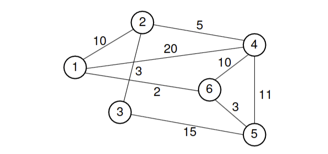
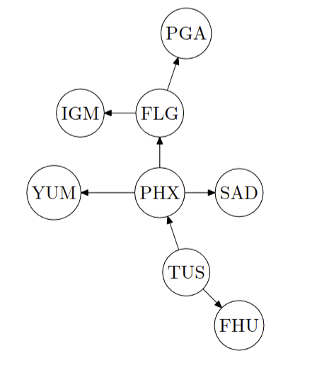

## Question 1a

> [11.10] Show the shortest paths generated by running Dijkstra’s shortest-paths algorithm on the graph of Figure 11.26, beginning at Vertex 4. Show the D values as each vertex is processed, as in Figure 11.19.
>
> 
>
> (use Bellman–Ford’s algorithm instead of Dijkstra’s, and you can use either the book’s table or the one I used in class)
> 

---

Let the graph in the picture be $G = (V, E, w)$ with vertices $V$, edges $E$, and weighting function $w: E \rightarrow \mathbb{R}$, where:

$$
V = \{1, 2, 3, 4, 5, 6\}
$$

$$
E = \{(1, 2), (1, 4), (1, 6), (2, 3), (2, 4), (3, 5), (4, 6), (4, 5), (5, 6)\}
$$

$$
w = \{ ((1, 2), 10), ((1, 4), 20), ((1, 6), 2), ((2, 3), 3), ((2, 4), 5), \\
((3, 5), 15), ((4, 6), 10), ((4, 5), 11), ((5, 6), 3) \}
$$

Iterate over the symmetric closure of $G$ (since it is undirected) $|V| - 1 = 5$ times to find the shortest paths from the source vertex $4$ to all other vertices, then iterate one more time to check for negative cycles:


|           | Vertex 1 | Vertex 2 | Vertex 3 | Vertex 4 | Vertex 5 | Vertex 6 |
|-----------|--------|--------|--------|--------|--------|--------| 
| Initial   |   ∞   |    ∞   |    ∞   |    0   |    ∞   |    ∞   | 
| Iteration 1 |    20   |    5  |        ∞  |        0  |        11 |       10 |    
| Iteration 2 |    12   |    5  |        26  |       0  |        11 |       10 |    
| Iteration 3 |    12   |    5  |        8  |        0  |        11 |       10 |    
| Iteration 4 |    12   |    5  |        8  |        0  |        11 |       10 |    
| Iteration 5 |    12   |    5  |        8  |        0  |        11 |       10 |
| Negative Cycle Check |    12   |    5  |        8  |        0  |        11 |       10 |

> Rows represent the distances array at the end of each iteration.


## Question 1b

> [11.17] List the order in which the edges of the graph in Figure 11.26 are visited when running Prim’s MST algorithm starting at Vertex 3. Show the final MST

----

Let the graph in the picture be $G = (V, E, w)$ with vertices $V$, edges $E$, and weighting function $w: E \rightarrow \mathbb{R}$, where:

$$
V = \{1, 2, 3, 4, 5, 6\}
$$

$$
E = \{(1, 2), (1, 4), (1, 6), (2, 3), (2, 4), (3, 5), (4, 6), (4, 5), (5, 6)\}
$$

$$
w = \{ ((1, 2), 10), ((1, 4), 20), ((1, 6), 2), ((2, 3), 3), ((2, 4), 5), \\
((3, 5), 15), ((4, 6), 10), ((4, 5), 11), ((5, 6), 3) \}
$$

### Prim's Algorithm - Steps

Let $c$ represent the current vertex.

1. Add $c$ to the visited set.
2. Add all edges connected to $c$ to the priority queue (PQ).
3. Pop the edge with the smallest weight (first element in PQ). Continue popping until an edge is found that connects to an unvisited vertex.
4. Add the edge to the MST.
5. Set $c$ to the vertex at the other end of the edge.
6. Repeat from step 1 until all vertices are visited.


### Step-by-Step Execution for $G$

1. **Initialize**:
   - Start at node $3$. Add initial edges to PQ: $[(3, 3, 2), (15, 3, 5)]$.

2. **Iteration 1**:
   - **Current Vertex**: $c = 3$
   - **Step 1**: Add $3$ to the visited set.
   - **Step 2**: Add edges connected to $3$ to PQ: $[(3, 3, 2), (15, 3, 5)]$
   - **Step 3**: Pop edge $(3, 2, 3)$ from PQ.
   - **Step 4**: Add edge $(3, 2, 3)$ to MST.
   - **Step 5**: Set $c = 2$ (next vertex).
   - **Updated PQ**: $[(5, 2, 4), (15, 3, 5), (10, 2, 1)]$

3. **Iteration 2**:
   - **Current Vertex**: $c = 2$
   - **Step 1**: Add $2$ to the visited set.
   - **Step 2**: Add edges connected to $2$ to PQ: $(2, 1, 10)$, $(2, 4, 5)$.
   - **Step 3**: Pop edge $(2, 4, 5)$ from PQ.
   - **Step 4**: Add edge $(2, 4, 5)$ to MST.
   - **Step 5**: Set $c = 4$ (next vertex).
   - **Updated PQ**: $[(10, 2, 1), (10, 4, 6), (20, 4, 1), (15, 3, 5), (11, 4, 5)]$

4. **Iteration 3**:
   - **Current Vertex**: $c = 4$
   - **Step 1**: Add $4$ to the visited set.
   - **Step 2**: Add edges connected to $4$ to PQ: $(4, 1, 20)$, $(4, 6, 10)$, $(4, 5, 11)$.
   - **Step 3**: Pop edge $(2, 1, 10)$ from PQ.
   - **Step 4**: Add edge $(2, 1, 10)$ to MST.
   - **Step 5**: Set $c = 1$ (next vertex).
   - **Updated PQ**: $[(2, 1, 6), (10, 4, 6), (20, 4, 1), (15, 3, 5), (11, 4, 5)]$

5. **Iteration 4**:
   - **Current Vertex**: $c = 1$
   - **Step 1**: Add $1$ to the visited set.
   - **Step 2**: Add edges connected to $1$ to PQ: $(1, 6, 2)$.
   - **Step 3**: Pop edge $(1, 6, 2)$ from PQ.
   - **Step 4**: Add edge $(1, 6, 2)$ to MST.
   - **Step 5**: Set $c = 6$ (next vertex).
   - **Updated PQ**: $[(3, 6, 5), (10, 4, 6), (20, 4, 1), (15, 3, 5), (11, 4, 5)]$

6. **Iteration 5**:
   - **Current Vertex**: $c = 6$
   - **Step 1**: Add $6$ to the visited set.
   - **Step 2**: Add edges connected to $6$ to PQ: $(6, 5, 3)$.
   - **Step 3**: Pop edge $(6, 5, 3)$ from PQ.
   - **Step 4**: Add edge $(6, 5, 3)$ to MST.
   - **Step 5**: Set $c = 5$ (next vertex).
   - **Updated PQ**: $[(10, 4, 6), (20, 4, 1), (15, 3, 5), (11, 4, 5)]$

7. **Final MST**:
   - Minimum Spanning Tree: $[(3, 2, 3), (2, 4, 5), (2, 1, 10), (1, 6, 2), (6, 5, 3)]$

&nbsp;


Final MST $G' = (V, E', w)$, where:

$$
E' = \boxed{\{(3, 2), (2, 4), (2, 1), (1, 6), (6, 5)\}}
$$
   
Order of edges visited:

$$
\boxed{(3, 2) \prec (2, 4) \prec (2, 1) \prec (1, 6) \prec (6, 5)}
$$


## Question 1c

> [11.18] List the order in which the edges of the graph in Figure 11.26 are visited when running Kruskal’s MST algorithm. Each time an edge is added to the MST, show the result on the equivalence array, (e.g., show the array as in Figure 6.7)

   
---

Let the graph in the picture be $G = (V, E, w)$ with vertices $V$, edges $E$, and weighting function $w: E \rightarrow \mathbb{R}$, where:

$$
V = \{1, 2, 3, 4, 5, 6\}
$$

$$
E = \{(1, 2), (1, 4), (1, 6), (2, 3), (2, 4), (3, 5), (4, 6), (4, 5), (5, 6)\}
$$

$$
w = \{ ((1, 2), 10), ((1, 4), 20), ((1, 6), 2), ((2, 3), 3), ((2, 4), 5), \\
((3, 5), 15), ((4, 6), 10), ((4, 5), 11), ((5, 6), 3) \}
$$

### Kruskal's Algorithm - Steps

1. **Initialize**:
   - Initialize an empty MST.
   - Initialize an equivalence array with each vertex as a set.

2. **Sort Edges**:
   - Sort the edges in non-decreasing order of weights.

3. **Iterate Over Edges**:
    - For each edge $(u, v)$:
      - If $u$ and $v$ are in different sets in the equivalence array:
        - Add $(u, v)$ to the MST.
        - Merge the sets containing $u$ and $v$ in the equivalence array.

### Step-by-Step Execution for $G$


1. **Initial Equivalence Array**:

   | 1 | 2 | 3 | 4 | 5 | 6 |
   |---|---|---|---|---|---|
   | 1 | 2 | 3 | 4 | 5 | 6 |

2. **Edges Sorted by Weight**:
   $$
   \{(1, 6), (2, 3), (5, 6), (2, 4), (1, 2), (4, 6), (4, 5), (3, 5), (1, 4)\}
   $$

3. **Iteration 1**:
   - **Equivalence Class Check**: $v_1 = 1 \neq v_6 = 6 \rightarrow$
   - **Action**: Add edge $(1, 6)$ to MST.
   - **Merge Sets**: Update the equivalence array to merge sets 1 and 6.
   
   **Updated Equivalence Array**:

   | 1 | 2 | 3 | 4 | 5 | 6 |
   |---|---|---|---|---|---|
   | 1 | 2 | 3 | 4 | 5 | 1 |

4. **Iteration 2**:
   - **Equivalence Class Check**: $v_2 = 2 \neq v_3 = 3 \rightarrow$
   - **Action**: Add edge $(2, 3)$ to MST.
   - **Merge Sets**: Update the equivalence array to merge sets 2 and 3.

   **Updated Equivalence Array**:

   | 1 | 2 | 3 | 4 | 5 | 6 |
   |---|---|---|---|---|---|
   | 1 | 2 | 2 | 4 | 5 | 1 |

5. **Iteration 3**:
   - **Equivalence Class Check**: $v_5 = 5 \neq v_6 = 1 \rightarrow$
   - **Action**: Add edge $(5, 6)$ to MST.
   - **Merge Sets**: Update the equivalence array to merge sets 5 and 1.

   **Updated Equivalence Array**:

   | 1 | 2 | 3 | 4 | 5 | 6 |
   |---|---|---|---|---|---|
   | 5 | 2 | 2 | 4 | 5 | 5 |

6. **Iteration 4**:
   - **Equivalence Class Check**: $v_2 = 2 \neq v_4 = 4 \rightarrow$
   - **Action**: Add edge $(2, 4)$ to MST.
   - **Merge Sets**: Update the equivalence array to merge sets 2 and 4.

   **Updated Equivalence Array**:

   | 1 | 2 | 3 | 4 | 5 | 6 |
   |---|---|---|---|---|---|
   | 5 | 2 | 2 | 2 | 5 | 5 |

7. **Iteration 5**:
   - **Equivalence Class Check**: $v_1 = 5 \neq v_2 = 2 \rightarrow$
   - **Action**: Add edge $(1, 2)$ to MST.
   - **Merge Sets**: Update the equivalence array to have all elements in the same set.

   **Final Equivalence Array**:

   | 1 | 2 | 3 | 4 | 5 | 6 |
   |---|---|---|---|---|---|
   | 5 | 5 | 5 | 5 | 5 | 5 |

&nbsp;

Final MST $G' = (V, E', w)$, where:

$$
E' = \{(1, 6), (2, 3), (5, 6), (2, 4), (1, 2)\}
$$

Order of edges visited:

$$
\boxed{(1, 6) \prec (2, 3) \prec (5, 6) \prec (2, 4) \prec (1, 2)}
$$


## Question 1d

> [11.23] Consider the collection of edges selected by Dijkstra’s algorithm as the shortest paths to the graph’s vertices from the start vertex. Do these edges form a spanning tree (not necessarily of minimum cost)? Do these edges form an MST? Explain why or why not
> 
> 
> (note that there are two questions; explain your answers to both, and also note that “MST” means Minimal–cost Spanning Tree – I used “MCST” in class)


---

The question asks us to consider the set of edges selected by Dijkstra's algorithm as the "shortest paths to the graph's vertices from the start vertex" and to determine if they form a spanning tree and an MST.

Let $G = (V, E, w)$ be a weighted graph with vertices $V$, edges $E$, and a weighting function $w: E \rightarrow \mathbb{R}$.

Let $S$ be the set of edges selected by Dijkstra's algorithm for the shortest paths from the start vertex $V_{\text{start}}$ to every other vertex in $G$.

### First Question: Do these edges form a Spanning Tree?

Since Dijkstra’s algorithm finds the shortest path from $V_{\text{start}}$ to every reachable vertex in the graph, the edges in $S$ will connect $V_{\text{start}}$ to each other vertex in $G$. If $G$ is connected, this means $S$ will contain a path to every vertex, forming a tree that spans all vertices in $G$. Therefore, **$S$ does form a spanning tree**.

### Second Question: Do these edges form a Minimum-cost Spanning Tree (MST)?

No, $S$ does not necessarily form an MST. While Dijkstra’s algorithm finds the shortest paths from $V_{\text{start}}$ to each vertex, it doesn’t optimize the total weight of the edges in $S$; it only ensures that each individual path from $V_{\text{start}}$ to a vertex is the shortest. This means that some edges in $S$ may be unnecessary if we aim to minimize the total weight of the spanning tree.

We can demonstrate this with a counterexample.

#### Counterexample
Suppose $V_{\text{start}} = 4$. Applying Dijkstra's algorithm from $V_4$ to every other vertex yields the following shortest paths:

- Shortest path from $V_4$ to $V_1$: $\{(4, 6), (6, 1)\}$, Total weight: 12
- Shortest path from $V_4$ to $V_2$: $\{(4, 2)\}$, Total weight: 5
- Shortest path from $V_4$ to $V_3$: $\{(4, 2), (2, 3)\}$, Total weight: 8
- Shortest path from $V_4$ to $V_5$: $\{(4, 5)\}$, Total weight: 11
- Shortest path from $V_4$ to $V_6$: $\{(4, 6)\}$, Total weight: 10

The set of edges $S$ chosen by Dijkstra's algorithm is therefore:

$$
S = \{(4, 6), (6, 1), (4, 2), (2, 3), (4, 5)\}
$$

Calculating the total weight of $S$:

$$
w(S) = w(4, 6) + w(6, 1) + w(4, 2) + w(2, 3) + w(4, 5) = 10 + 2 + 5 + 3 + 11 = 31
$$

In comparison, the MST calculated using Kruskal’s algorithm from the previous problem has a total weight of:

$$
w(\text{MST}_{\text{Kruskal}}) = 2 + 3 + 3 + 5 + 10 = 23
$$

Since $w(\text{MST}_{\text{Kruskal}}) = 23 < w(S) = 31$, the edges selected by Dijkstra’s algorithm do not necessarily form a minimum-cost spanning tree. Therefore, **the edges in $S$ do not form an MST**. $\blacksquare$


## Question 1e

> Determine two correct topological sort orderings of the digraph shown below.
>
> 

---


### Topological Sort - Steps


1. **Initialize**:
   - Create an empty stack for the topological order and an empty set for visited nodes.

2. **Perform DFS**:
   - For each unvisited **source node** (a node with no incoming edges):
     - Start a **DFS**:
       - Mark the node as visited.
       - Recursively visit each unvisited neighbor.
       - After all neighbors have been visited (tail-end of recursion), or if there are no neighbors, add the node to the stack.

3. **Construct Topological Order**:
   - Once all nodes are visited, the stack will contain the nodes in **reverse topological order**.
   - **Reverse the stack** to get the correct topological sort order.

4. **Output the Result**:
   - The stack now represents the topological sort order of the graph.


### First Topological Sort

Starting DFS from source vertex: TUS

```
Visiting neighbor: PHX
——Visiting neighbor: FLG
————Visiting neighbor: PGA
——————Adding to stack: PGA
————Visiting neighbor: IGM
——————Adding to stack: IGM
————Adding to stack: FLG
——Visiting neighbor: YUM
————Adding to stack: YUM
——Visiting neighbor: SAD
————Adding to stack: SAD
——Adding to stack: PHX
Visiting neighbor: FHU
——Adding to stack: FHU
Adding to stack: TUS
```

$\boxed{TUS\prec FHU \prec PHX \prec SAD \prec YUM \prec FLG \prec IGM \prec PGA}$

### Second Topological Sort

Starting DFS from source vertex: TUS

```
Visiting neighbor: FHU
——Adding to stack: FHU
Visiting neighbor: PHX
——Visiting neighbor: SAD
————Adding to stack: SAD
——Visiting neighbor: YUM
————Adding to stack: YUM
——Visiting neighbor: FLG
————Visiting neighbor: IGM
——————Adding to stack: IGM
————Visiting neighbor: PGA
——————Adding to stack: PGA
————Adding to stack: FLG
——Adding to stack: PHX
Adding to stack: TUS
```

$\boxed{TUS\prec PHX \prec FHU \prec FLG \prec PGA \prec IGM \prec SAD \prec YUM}$


## Question 1f

> Imagine that the edge (IGM,PHX) is added to the graph below. Can the resulting graph be topologically sorted? Why or why not?

----


Adding the edge $(\text{IGM}, \text{PHX})$ creates a cycle in the graph: $(\text{IGM} \rightarrow \text{PHX} \rightarrow \text{FLG} \rightarrow \text{IGM})$.

Because a cycle is present, the graph is no longer acyclic, which is a requirement for topological sorting. In a graph with cycles, some nodes depend on each other in a loop, making it impossible to order them linearly. Therefore, the graph cannot be topologically sorted.


## Question 2a

> Using weak induction, prove that the Insertion Sort algorithm, as presented in class, will produce a sorted list of data elements.

---

### Insertion Sort Algorithm as Presented in Class

Idea: Build a sorted list an item at a time by inserting the next item into the growing list in the correct position.

### Proof by Weak Induction on the Length of the List

Let $L = [L_1, L_2, \ldots, L_n]$ be a sequence (list) of elements inserted from some set $A$, and let $R \subseteq A \times A$ be a binary relation on $A$.

We define sortedness of $L$ with respect to $R$ as follows:

$$
\forall i, j \in \mathbb{N}, \; i < j \rightarrow R(L_i, L_j)
$$

**Base Case**:

For $n = 1$, the list $L$ has only one element, and it is trivially sorted. Similarly, for $n = 0$, the list is empty, and the property vacuously holds.

**Inductive Hypothesis**:

Assume that for some $n = k$, the list $L$ with $k$ elements, sorted by the Insertion Sort algorithm, satisfies the sortedness property with respect to $R$.

**Inductive Step**:

Consider the list $L$ with $n = k + 1$ elements. The Insertion Sort algorithm inserts the $(k + 1)$-th element into the sorted list of $k$ elements.

Let this new element be $a$.

The algorithm determines the correct position for $a$ by starting from the beginning (or end) of the list and finding the first index $i$ such that $R(a, L_i)$ (or $R(L_i, a)$ if starting from the end). The algorithm then inserts $a$ at index $i$.

Since the algorithm ensures that $\forall m < i, \; R(L_m, a)$, the list remains sorted up to index $i$ after insertion. 

For elements at indices after $i$, we have a contiguous subsequence $L[i:]$. Since $L$ was already sorted by the inductive hypothesis, this subsequence $L[i:]$ retains sortedness by the transitivity of $R$.

Finally, since $R(a, L_i)$ holds and $\forall m > i, \; R(L_i, L_m)$ (by transitivity of $R$), it follows that $\forall m \geq i, \; R(a, L_m)$.

Therefore, the list $L$ with $n = k + 1$ elements is sorted. By weak induction, the Insertion Sort algorithm produces a sorted list of data elements. $\blacksquare$

## Question 2b

> [7.6] Recall that a sorting algorithm is said to be stable if the original ordering for duplicate keys is preserved. Of the sorting algorithms Insertion Sort, Bubble Sort, Selection Sort, Shellsort, Mergesort, Quicksort, Counting Sort, and Radix Sort, which of these are stable, and which are not? 
> 
> For each one, describe either why it is or is not stable. If a minor change to the implementation would make it stable, describe the change
>
> (drop Heapsort and BinSort, add Counting Sort)


---

### Insertion Sort

**Stability**: Insertion Sort is stable.

**Explanation**: Insertion Sort iterates through the list, inserting each element into its correct position within the sorted portion of the list. If there are duplicate elements, the insertion process places each new occurrence after previous occurrences, preserving their relative order. This stability arises from the fact that insertion is performed by moving elements one position at a time rather than swapping, ensuring duplicates retain their input order.

### Bubble Sort

**Stability**: Bubble Sort is stable.

**Explanation**: Bubble Sort repeatedly swaps adjacent elements if they are out of order. Since it only swaps elements when the left element is greater than the right element, it leaves duplicates in their original relative order. Thus, when two duplicate elements are adjacent, they will not be swapped, preserving stability.

### Selection Sort

**Stability**: Selection Sort is not stable.

**Explanation**: Selection Sort finds the minimum element in the unsorted portion and swaps it with the first unsorted element. This swap operation can disrupt the relative order of duplicate elements if a duplicate minimum value is swapped with an earlier position in the list. For example, if two equal elements are found at different positions, the later occurrence may be moved ahead of the earlier occurrence.

**Modification for Stability**: To make Selection Sort stable, instead of swapping, we could move the minimum element to its correct position by shifting all elements between the minimum's original position and the insertion point to the right. This approach ensures that duplicate elements remain in their initial order.

### Shellsort

**Stability**: Shellsort is generally not stable.

**Explanation**: Shellsort sorts elements at varying gap distances, which can result in non-adjacent elements being swapped. When duplicates are involved, this can disrupt their relative order since elements are moved long distances based on the gap sequence. Stability is not inherently guaranteed due to these non-local swaps.

**Modification for Stability**: To make Shellsort stable, one could restrict the gap sequence and swaps to only affect elements within their original sublist ordering. However, this modification undermines Shellsort’s efficiency and is generally impractical.

### Mergesort

**Stability**: Mergesort is stable.

**Explanation**: Mergesort recursively divides the list into halves, sorts each half, and then merges them. During the merge step, if two elements are equal, Mergesort consistently places the element from the left half before the element from the right half. This consistent choice preserves the initial order of duplicates across the merge operations, ensuring stability.

### Quicksort

**Stability**: Quicksort is not stable.

**Explanation**: Quicksort partitions the list around a pivot element and recursively sorts each partition. During partitioning, elements equal to the pivot can end up in different relative positions depending on the specific partitioning implementation (such as Lomuto or Hoare partition schemes). These placements disrupt the relative order of duplicates, resulting in an unstable sort.

**Modification for Stability**: To make Quicksort stable, one can use a three-way partitioning scheme that separates elements into three groups: those less than, equal to, and greater than the pivot. Elements equal to the pivot retain their input order, preserving stability. However, this adjustment can impact Quicksort's typical performance characteristics.

### Counting Sort

**Stability**: Counting Sort is stable.

**Explanation**: Counting Sort counts occurrences of each element and uses these counts to position elements directly in the output array. When duplicates are present, elements are placed in the output in the same order as they appear in the input, since the counts are processed sequentially. This order-preserving placement ensures stability.

### Radix Sort

**Stability**: Radix Sort is stable.

**Explanation**: Radix Sort sorts elements digit by digit, starting with the least significant digit. For each digit level, it applies a stable sorting algorithm (such as Counting Sort) to sort the elements based on that digit. Because each pass preserves the relative order of elements with equal digit values, Radix Sort maintains the original order of duplicates throughout the sorting process, ensuring stability.


## Question 2c

> [7.16a, 7.16b] (a) Devise an algorithm to sort three numbers. It should make as few comparisons as possible. How many comparisons and swaps are required in the best, worst, and average cases? 
> 
> (b) Devise an algorithm to sort five numbers. It should make as few comparisons as possible. How many comparisons and swaps are required in the best, worst, and average cases?

---

### Sorting Three Numbers

#### Algorithm

```java
void sortThree(int[] arr) {
  if (arr[0] > arr[1]) swap(arr, 0, 1);
  if (arr[1] > arr[2]) swap(arr, 1, 2);
  if (arr[0] > arr[1]) swap(arr, 0, 1);
}

void swap(int[] arr, int i, int j) {
  int temp = arr[i];
  arr[i] = arr[j];
  arr[j] = temp;
}
```

#### Analysis

- **Comparisons**:
  - The algorithm uses *exactly* $3$ comparisons in all cases, it does not vary with the input order.

- **Swaps**:
  - Best Case: $0$ swaps (when $arr[0] \leq arr[1] \leq arr[2]$)
  - Worst Case: $3$ swaps (when $arr[0] > arr[1] > arr[2]$)
  - Average Case: $\approx 1$ swap

### Sorting Five Numbers

#### Algorithm

```java
void sortFive(int[] arr) {
  for (int i = 0; i < 4; i++) {
    int minIndex = i;
    for (int j = i + 1; j < 5; j++) if (arr[j] < arr[minIndex]) minIndex = j;
    if (minIndex != i) swap(arr, i, minIndex);
  }
}

void swap(int[] arr, int i, int j) {
  int temp = arr[i];
  arr[i] = arr[j];
  arr[j] = temp;
}
```

#### Analysis

- **Comparisons**:
  - Consider each pass of the outer loop:
    - Pass 1: $4$ comparisons
    - Pass 2: $3$ comparisons
    - Pass 3: $2$ comparisons
    - Pass 4: $1$ comparison
  - In general, $\frac{n(n-1)}{2}$ comparisons for $n$ elements.
  - Best Case: $10$ comparisons
  - Worst Case: $10$ comparisons
  - Average Case: $10$ comparisons

- **Swaps**:
  - Best Case: $0$ swaps (when the array is already sorted)
  - Worst Case: $4$ swaps
    - For example

        Starting list: `[2, 4, 5, 3, 1]`

        After swap 1: `[1, 4, 5, 3, 2]`

        After swap 2: `[1, 2, 5, 3, 4]`

        After swap 3: `[1, 2, 3, 5, 4]`

        After swap 4: `[1, 2, 3, 4, 5]`
  - Average Case: $\approx 2$ swaps


## Question 2d

> Typically, Internal Merge Sort is presented as doing two–way merging – that is, two sorted runs are merged. Consider the following pseudocode for three–way Internal Merge Sort, where list is the array of data elements, and low and high are the low and high indices of the range of data elements to be sorted:
>
> ```pseudo
> WIMS(list,low,high):
>  if low < high:
>   f <-- last index of the first third of list
>   s <-- last index of the second third of list
>   3WIMS(list,low,f)
>   3WIMS(list,f+1,s)
>   3WIMS(list,s+1,high)
>   3WayMerge(list,low,f,s,high)
> ```

----

### Part $i$

> Determine the recurrence relation $K(n)$ and initial condition $K(1)$ that describes the quantity of key comparisons performed by `3WIMS`, and construct at least two additional equivalent recurrence relations for $K(n)$ using the “Find the Pattern” (a.k.a. Backward Substitutions) approach. Assume that the key comparison cost of `3WayMerge()` is $2n$, where $n$ is the initial quantity of data items in the list.

---

### Recurrence Relation for $K(n)$

Let $K(n)$ represent the total number of key comparisons needed to sort a list of size $n$ using `3WIMS`.

1. **Divide Step**: The `3WIMS` function divides the list into three equal parts, each of size $\frac{n}{3}$.
2. **Recursive Calls**: There are three recursive calls on sublists of size $\frac{n}{3}$.
3. **Merge Step**: The `3WayMerge` function merges the three sorted sublists and requires $2n$ comparisons.

Thus, the recurrence relation for $K(n)$ can be written as:

$$
K(n) = 3 \cdot K\left(\frac{n}{3}\right) + 2n
$$

with the base case:

$$
K(1) = 0
$$

because no comparisons are needed to sort a single element.

### Expanding the Recurrence (Two Iterations)

To understand the pattern, we can expand $K(n)$ by substituting it into itself a couple of times.

#### First Expansion Step

Expanding $K(n)$ once:

$$
K(n) = 3 \cdot \left(3 \cdot K\left(\frac{n}{9}\right) + 2\frac{n}{3}\right) + 2n
$$

Simplifying:

$$
K(n) = 3^2 \cdot K\left(\frac{n}{9}\right) + 3 \cdot 2\frac{n}{3} + 2n
$$

$$
= 3^2 \cdot K\left(\frac{n}{9}\right) + 2n + 2n
$$

$$
K(n) = 3^2 \cdot K\left(\frac{n}{9}\right) + 2n + 2n
$$

#### Second Expansion Step

Expanding $K\left(\frac{n}{9}\right)$ in the same way:

$$
K(n) = 3^2 \cdot \left(3 \cdot K\left(\frac{n}{27}\right) + 2\frac{n}{9}\right) + 2n + 2n
$$

$$
= 3^3 \cdot K\left(\frac{n}{27}\right) + 3^2 \cdot 2\frac{n}{3} + 2n
$$

$$
= 3^3 \cdot K\left(\frac{n}{27}\right) + 2n \left(1 + \frac{1}{3} + \frac{1}{9}\right)
$$

This pattern shows that each expansion introduces an additional power of 3 to the recursive term and adds another term to the geometric series in the non-recursive part.

### Part $ii$

> Using the three (or more) versions of the $K(n)$ recurrence relations you created in part $i$, create the “in general” version of the $K(n)$ recurrence relation and solve that version, producing the closed–form (non–recurrence) expression for $K(n)$.

#### General Form of the Recurrence (After $k$ Expansions)

After $k$ expansions, we have the general form:

$$
K(n) = 3^k \cdot K\left(\frac{n}{3^k}\right) + 2n \sum_{i=0}^{k-1} \frac{1}{3^i}
$$

As $k \rightarrow \log_3(n)$, the term $K\left(\frac{n}{3^k}\right)$ approaches $K(1) = 0$. Therefore, we can eliminate the recursive term and focus on evaluating the sum.

The sum is a geometric series:

$$
\sum_{i=0}^{k-1} \frac{1}{3^i} = \frac{3}{2} \left(1 - \frac{1}{n}\right)
$$

Substituting this into our expression for $K(n)$, we get:

$$
K(n) = 2n \cdot \frac{3}{2} \left(1 - \frac{1}{n}\right) = 3n - 3
$$

Thus, the closed-form solution for the recurrence relation is:

$$
K(n) = 3n - 3
$$

### Part $iii$

> Using weak induction, prove that your closed–form expression for $K(n)$ from part (b) is the solution to the recurrence relation from part (a). We want to see a complete, clear, easy–to–follow proof — the basis step, the inductive step (starting with a clear “if–then” that states the inductive hypothesis and the conjecture being proven, followed by a proof of that conjecture that clearly shows where the inductive hypothesis is being used).

### Proof by Weak Induction on $n$

Let $K(n)$ be the total number of key comparisons needed to sort a list of size $n$ using the `3WIMS` algorithm.

**Base Case**: For $n = 1$,

$$
K(1) = 0
$$

which satisfies our closed-form solution $K(n) = 3n - 3$ because $K(1) = 3(1) - 3 = 0$.

**Inductive Hypothesis**: 

Assume that for some integer $k \geq 1$, the closed-form expression holds for all values up to $k$, meaning:

$$
K(k) = 3k - 3
$$


**Inductive Step**:

WTSP: $K(k + 1) = 3(k + 1) - 3$

Using the recurrence relation for $K(k + 1)$:

$$
K(k + 1) = 3 \cdot K\left(\frac{k + 1}{3}\right) + 2(k + 1)
$$

If $k + 1$ is divisible by 3, say $k + 1 = 3m$ for some integer $m$, then:

$$
K(k + 1) = 3 \cdot K(m) + 2(3m)
$$

Substituting the inductive hypothesis:

$$
K(k + 1) = 3 \cdot (3m - 3) + 6m
$$

Simplify:

$$
K(k + 1) = 9m - 9 + 6m = 15m -9 = 5(3m) - 9 = 5(k + 1) - 9 = \\

$$

Therefore, if the closed-form solution holds for $k$, it also holds for $k + 1$. By weak induction, the closed-form expression $K(n) = 3n - 3$ is the solution to the recurrence relation $K(n) = 3 \cdot K\left(\frac{n}{3}\right) + 2n$. $\blacksquare$


## Question 3

> External Sorting. Consider this sequence of 50 two–letter pairs:
>
> ```
> EL DO BY ED EM EF UT ZA EN WO ER MU KI NO MI OD FE AG AD HA
> HE TA RE SI PE SO AB HI ID AA GO AI KA AS IT AL PA UN TI PI
> QI NU LA MA LI MO BI BE OH ON
> ```
>
>  Use Multiway External Merge Sort to sort the pairs into ascending order. Assume that your buffers can hold up to four two-letter pairs each, and you have four buffers available. 
>
> Show your collection of sorted runs at the end of each pass of the algorithm. Also, during passes $1-n$, every fifth time you write out the content of the output buffer (that is, after the 5th, 10th, 15th, etc. writes), show the content of the input buffers at that time (the output buffer, having just be written, will be empty). 
> 
> That’s how we’ll be able to tell if you’re following the algorithm correctly. (Yes, we know that this is a pain. But it’s also a good exercise to make sure that you know how the algorithm works, and that’s the reason to do homeworks.)

---

Pass 0: `[['BY', 'DO', 'ED', 'EF', 'EL', 'EM', 'EN', 'UT', 'ZA'], ['AG', 'ER', 'FE', 'KI', 'MI', 'MU', 'NO', 'OD', 'WO'], ['AB', 'AD', 'HA', 'HE', 'PE', 'RE', 'SI', 'SO', 'TA'], ['AA', 'AI', 'AL', 'AS', 'GO', 'HI', 'ID', 'IT', 'KA'], ['LA', 'LI', 'MA', 'NU', 'PA', 'PI', 'QI', 'TI', 'UN'], ['BE', 'BI', 'MO', 'OH', 'ON']]`


Input Buffer state on 5th ouput buffer write-out:

`[[], ['MI', 'MU', 'NO', 'OD'], ['PE', 'RE', 'SI', 'SO']]`


Input Buffer state on 10th ouput buffer write-out:

`[['AS'], ['LA', 'LI', 'MA', 'NU'], ['BE', 'BI', 'MO', 'OH']]`


Input Buffer state on 15th ouput buffer write-out:

`[[], ['PA', 'PI', 'QI', 'TI'], []]`


Pass 1: Runs = `[['AB', 'AD', 'AG', 'BY', 'DO', 'ED', 'EF', 'EL', 'EM', 'EN', 'ER', 'FE', 'HA', 'HE', 'KI', 'MI', 'MU', 'NO', 'OD', 'PE', 'RE', 'SI', 'SO', 'TA', 'UT', 'WO', 'ZA'], ['AA', 'AI', 'AL', 'AS', 'BE', 'BI', 'GO', 'HI', 'ID', 'IT', 'KA', 'LA', 'LI', 'MA', 'MO', 'NU', 'OH', 'ON', 'PA', 'PI', 'QI']]`


Input Buffer state on 20th ouput buffer write-out:

`[['EF', 'EL'], ['GO', 'HI']]`


Input Buffer state on 25th ouput buffer write-out:

`[['MI'], ['LI', 'MA', 'MO', 'NU']]`


Input Buffer state on 30th ouput buffer write-out:

`[['SI', 'SO', 'TA'], []]`


Final merged result: `['AA', 'AB', 'AD', 'AG', 'AI', 'AL', 'AS', 'BE', 'BI', 'BY', 'DO', 'ED', 'EF', 'EL', 'EM', 'EN', 'ER', 'FE', 'GO', 'HA', 'HE', 'HI', 'ID', 'IT', 'KA', 'KI', 'LA', 'LI', 'MA', 'MI', 'MO', 'MU', 'NO', 'NU', 'OD', 'OH', 'ON', 'PA', 'PE', 'PI', 'QI', 'RE', 'SI', 'SO', 'TA', 'UT', 'WO', 'ZA']`


## Question 4

> Interpolation Search. You have an array of one million elements, indexed $0$ through $999,999$. The range of element values is $0 .. 499,999,000,000$. (That is, array[0] = 0 and array[999,999] = 499,999,000,000.) The search target is 8,675,309. 
> 
> Use Interpolation Search as described in class to perform the first three probes into the data. Assume that the element found at probe index $i$ is equal to $\frac{i^2}{2}$. 
> 
> What are the three indices of the three probes? Show your calculation expressions for all three probes for full credit; just listing the indices will be worth only one point.


### Interpolation Search Algorithm

$$
\text{mid} = \text{low} + \lfloor \left( \frac{\text{target} - \text{arr[low]}}{\text{arr[high]} - \text{arr[low]}} \right) \times (\text{high} - \text{low}) \rfloor 
$$

### Solution


#### First Probe

$$
\text{mid} = 0 + \lfloor \left( \frac{8,675,309 - 0}{\left\lfloor \frac{999,999^2}{2} \right\rfloor - 0} \right) \times (999,999 - 0) \rfloor = \boxed{17}
$$

The element at index 17 is $\lfloor \frac{17^2}{2} \rfloor = 144$

Since $144$ is less than the target, we update the `low` index to `mid`:

`low = mid = 17`


#### Second Probe


$$
\text{mid} = 17 + \lfloor \left( \frac{8,675,309 - 144}{\left\lfloor \frac{999,999^2}{2} \right\rfloor - 144} \right) \times (999,999 - 17) \rfloor = \boxed{34}
$$

The element at index $34$ is $\lfloor \frac{34^2}{2} \rfloor = 578$

Since $578$ is less than the target, we update the `low` index to `mid`:

`low = mid = 34`


#### Third Probe

$$
34 +\lfloor \left( \frac{8675309 - 578}{\left\lfloor \frac{999,999^2}{2} \right\rfloor - 578} \times (999999 - 34) \right) \rfloor = \boxed{51}
$$

Index: 51, Value: 1300

The element at index $51$ is $\lfloor \frac{51^2}{2} \rfloor = 1300$

Since $1300$ is less than the target, we update the `low` index to `mid`:

`low = mid = 51`


