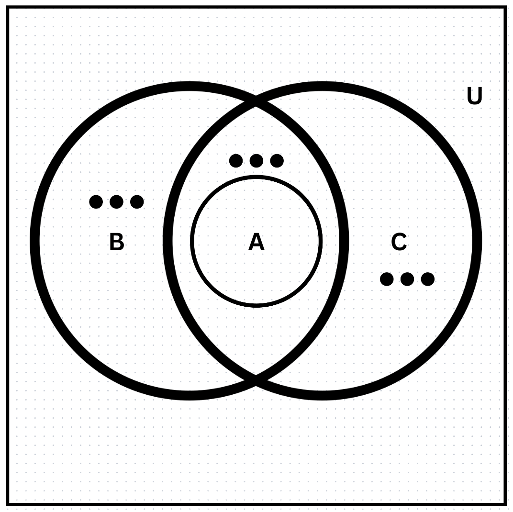
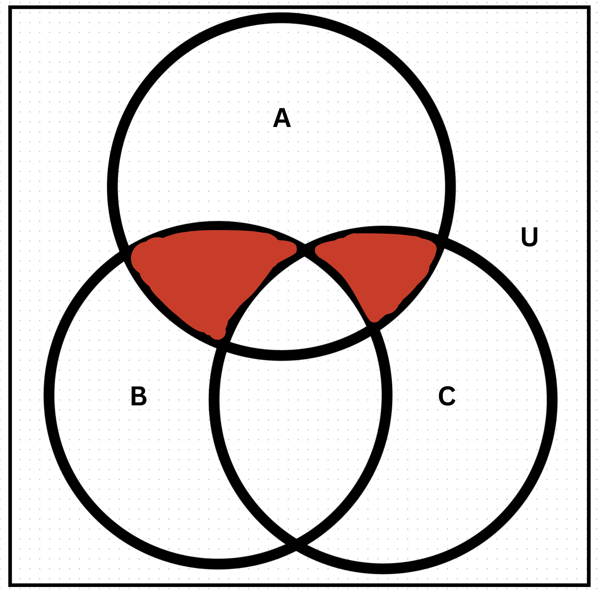

## Section 2.1 - Question 3

Which of the intervals `(0, 5)`,`(0, 5]`,`[0, 5)`,`[0, 5]`,`(1, 4]`,`[2, 3]`,`(2, 3)` contains:

#### a) 0

`[0, 5)`, `[0, 5]`

#### b) 1

`(0, 5)`, `(0, 5]`, `[0, 5)`, `[0, 5]`

#### c) 2

`(0, 5)`, `(0, 5]`, `[0, 5)`, `[0, 5]`, `(1, 4]`, `[2, 3]`

#### d) 3

`(0, 5)`, `(0, 5]`, `[0, 5)`, `[0, 5]`, `(1, 4]`, `[2, 3]` 

#### e) 4

`(0, 5)`, `(0, 5]`, `[0, 5)`, `[0, 5]`, `(1, 4]`

#### f) 5

`(0, 5]`, `[0, 5]`

## Section 2.1 - Question 5

For each of these pairs of sets, determine whether the first is a subset of the second, the second is a subset of the first, or neither is a subset of the other.

#### a)

> the set of airline flights from New York to New Delhi, the set of nonstop airline flights from New York to New Delhi

The second set is a subset of the first set.

#### b)

> the set of people who speak English, the set of people who speak Chinese

Neither is a subset of the other.

#### c)

> the set of flying squirrels, the set of living creatures that can fly

The first set is a subset of the second set.

## Section 2.1 - Question 7

Determine whether each of these pairs of sets are equal.

#### a)

> {1, 3, 3, 3, 5, 5, 5, 5, 5}, {5, 3, 1}

Equal

#### b)

> {{1}}, {1, {1}}

Not equal

#### c) 

> ∅, {∅}

Not equal

## Section 2.1 - Question 9

For each of the following sets, determine whether 2 is an element of that set.

#### a)

> {x ∈ R | x is an integer greater than 1}

2 ∈ {x ∈ R | x is an integer greater than 1}

#### b) 

> {x ∈ R | x is the square of an integer}

2 ∉ {x ∈ R | x is the square of an integer}

#### c) 

> {2,{2}}

2 &isin; {2,{2}}

#### d) 

> {{2},{{2}}}

2 ∉ {{2},{{2}}}

#### e) 

> {{2},{2,{2}}}

2 ∉ {{2},{2,{2}}}

#### f) 

> {{{2}}}

2 &notin; {{{2}}}

## Section 2.1 - Question 11

Determine whether each of these statements is true or false.

#### a)

> 0 ∈ ∅

false

#### b)

> ∅ ∈ {0}

false

#### c)

> {0} ⊂ ∅

false

#### d)

> ∅ ⊂ {0}

true

#### e)

> {0} ∈ {0}

false

#### f)

> {0} ⊂ {0}

false

#### g)

> {∅} ⊆ {∅}

true

## Section 2.1 - Question 13

Determine whether each of these statements is true or false.

#### a)

> x ∈ {x}

true

#### b)

> {x} ⊂ {x}

false

#### c)

> {x} ∈ {x}

false

#### d)

> {x} ∈ {{x}}

true

#### e)

> ∅ ⊆ {x}

true

#### f)

> ∅ ∈ {x}

false

## Section 2.1 - Question 18

> Use a Venn diagram to illustrate the relationships A ⊂ B and A ⊂ C.

The dots indicate that the regions are not empty

## Section 2.1 - Question 23

Find the power set of each of these sets, where a and b are distinct elements.

#### a)

> {a}

{∅, {a}}

#### b)

> {a, b}

{∅, {a}, {b}, {a, b}}

#### c)

> {∅, {∅}}

{∅, {∅}, {{∅}}, {∅, {∅}}}

## Section 2.1 - Question 25

How many elements does each of these sets have where a and b are distinct elements?

#### a)

> P({a, b, {a, b}})

8

#### b)

> P({∅, a, {a}, {{a}}})

16

#### c)

> P(P(∅))

- P(x) represents the power set of x
- The power set of ∅ is {∅}
- The power set of {∅} is {∅, {∅}}
- So P(P(∅)) = {∅, {∅}} which has 2 elements

## Section 2.1 - Question 29

Let A = {a, b, c, d} and B = {y, z}.Find

#### a)

> A × B.

`{(a, y), (a, z), (b, y), (b, z), (c, y), (c, z), (d, y), (d, z)}`

#### b)

> B × A.

`{(y, a), (y, b), (y, c), (y, d), (z, a), (z, b), (z, c), (z, d)}`

## Section 2.1 - Question 35

Find A^2 if

#### a)

> A = {0, 1, 3}.

A^2 = A × A = {(0, 0), (0, 1), (0, 3), (1, 0), (1, 1), (1, 3), (3, 0), (3, 1), (3, 3)}

#### b)

> A = {1, 2, a, b}.

A^2 = A × A = {(1, 1), (1, 2), (1, a), (1, b), (2, 1), (2, 2), (2, a), (2, b), (a, 1), (a, 2), (a, a), (a, b), (b, 1), (b, 2), (b, a), (b, b)}

## Section 2.1 - Question 37

> How many different elements does A × B have if A has m elements and B has n elements?

A × B has m * n elements

## Section 2.1 - Question 44

> Prove or disprove that if A, B, and C are nonempty sets and A × B = A × C, then B = C.

Hypothesis: A, B, and C are nonempty sets and A × B = A × C

Conclusion: B = C

Prove by contradiction:

1. Assume hypothesis is true - A, B, and C are nonempty sets and A × B = A × C
2. Assume conclusion is false - B ≠ C
3. If B ≠ C and B is a nonempty set, then there exists an element b in B that is not in C
4. Since A × B = A × C, then for every element a in A, (a, b) is in A × B if and only if (a, b) is in A × C
5. Since (a, b) is in A × B, then (a, b) is in A × C
6. Since (a, b) is in A × C, then b is in C
7. This contradicts the assumption that b is not in C
8. Therefore, B = C necessarily by contradiction

## Section 2.1 - Question 47

Find the truth set of each of these predicates where the domain is the set of integers.

#### a)

> P(x): x^2 < 3

`{-1, 0, 1}`

#### b)

> Q(x): x^2 > x

`{..., -3, -2, 2, 3, ...}`

#### c)

> R(x): 2x + 1 = 0

`{-1}`

## Section 2.1 - Question 48

Find the truth set of each of these predicates where the domain is the set of integers.

#### a)

> P(x): x^3 ≥ 1

`{1, 2, 3, ...}`

#### b)

> Q(x): x^2 = 2

∅

#### c)

> R(x): x < x^2

`{..., -2, -1, 2, 3, ...}`

## Section 2.2 - Question 3

Let A = {1, 2, 3, 4, 5} and B ={0, 3, 6}.Find

#### a)

> A ∪ B.

`{0, 1, 2, 3, 4, 5, 6}`

#### b)

> A ∩ B.

`{3}`

#### c)

> A − B.

`{1, 2, 4, 5}`

#### d)

> B − A.

`{0, 6}`

## Section 2.2 - Question 7

Prove the domination laws in Table 1 by showing that

#### a)

> A ∪ U = U.

1. A ∪ U = U
2. A ∪ U = A ∪ (A' ∪ A)
3. A ∪ U = (A ∪ A') ∪ A
4. A ∪ U = U ∪ A
5. A ∪ U = U
6. Therefore, A ∪ U = U

#### b)

> A ∩ ∅ = ∅.

1. A ∩ ∅ = ∅
2. A ∩ ∅ = A ∩ (A' ∩ A)
3. A ∩ ∅ = (A ∩ A') ∩ A
4. A ∩ ∅ = ∅ ∩ A
5. A ∩ ∅ = ∅
6. Therefore, A ∩ ∅ = ∅

## Section 2.2 - Question 9

Prove the complement laws in Table 1 by showing that

#### a) 

> A ∪ !A = U.

1. A ∪ !A = U
2. A ∪ !A = A ∪ (A' ∪ A)
3. A ∪ !A = (A ∪ A') ∪ A
4. A ∪ !A = U ∪ A
5. A ∪ !A = U
6. Therefore, A ∪ !A = U

#### b) 

> A ∩ !A = ∅.

1. A ∩ !A = ∅
2. A ∩ !A = A ∩ (A' ∩ A)
3. A ∩ !A = (A ∩ A') ∩ A
4. A ∩ !A = ∅ ∩ A
5. A ∩ !A = ∅
6. Therefore, A ∩ !A = ∅

## Section 2.2 - Question 25

Prove the first distributive law from Table 1 by showing that if A, B, and C are sets, then A ∪ (B ∩ C) = (A ∪ B) ∩ (A ∪ C).

1. A ∪ (B ∩ C) = {x | x ∈ A or x ∈ B and x ∈ C}
2. = {x | x ∈ A or (x ∈ B and x ∈ C)}
3. = {x | (x ∈ A or x ∈ B) and (x ∈ A or x ∈ C)}
4. = (A ∪ B) ∩ (A ∪ C)
5. Therefore, A ∪ (B ∩ C) = (A ∪ B) ∩ (A ∪ C)

## Section 2.2 - Question 27

Let A = {0, 2, 4, 6, 8, 10}, B = {0, 1, 2, 3, 4, 5, 6}, and C = {4, 5, 6, 7, 8, 9, 10}. Find

#### a)

> A ∩ B ∩ C.

`{4, 6}`

#### b)

> A ∪ B ∪ C.

`{0, 1, 2, 3, 4, 5, 6, 7, 8, 9, 10}`

#### c)

> (A ∪ B) ∩ C.

`{4, 5, 6, 8, 10}`

#### d)

> (A ∩ B) ∪ C.

`{0, 2, 4, 5, 6, 7, 8, 9, 10}`

## Section 2.2 - Question 29c

> Draw the Venn diagrams for (A ∩ !B) ∪ (A ∩ !C)

Simplify:

1. (A ∩ !B) ∪ (A ∩ !C)
2. A ∩ (!B ∪ !C)
3. A ∩ !(B ∩ C)
4. This is the intersection of A with the area of B that is not in C and the area of C that is not in B

## Section 2.2 - Question 31

What can you say about the sets A and B if we know that

#### a)

> A ∪ B = A?

- B does not have any elements that are not in A.
- B is a subset of A

#### b)

> A ∩ B = A?

- All of the elements of A are in B.
- A is a subset of B

#### c)

> A − B = A?

- None of the elements of B are in A. 
- A ∩ B = ∅

#### d)

> A ∩ B = B ∩ A?

- Nothing

#### e)

> A − B = B − A?

- A and B are equal or have no elements in common

## Section 2.2 - Question 39

> Find the symmetric difference of the set of computer science majors at a school and the set of mathematics majors at this school.

{ x | x is a computer science major ⊕ x is a mathematics major }

## Section 2.2 - Question 43d

> Show that if A is a subset of a universal set U, then A ⊕ !A = U.

1. A ⊕ !A = U
2. A ⊕ !A = (A - !A) ∪ (!A - A)
3. A ⊕ !A = A ∪ !A
4. A ⊕ !A = U
5. Therefore, A ⊕ !A = U

## Section 2.2 - Question 47

> Suppose that A, B, and C are sets such that A ⊕ C = B ⊕ C. Must it be the case that A = B?

1. A ⊕ C = B ⊕ C
2. A ⊕ C = (A - C) ∪ (C - A)
3. B ⊕ C = (B - C) ∪ (C - B)
4. (A - C) ∪ (C - A) = (B - C) ∪ (C - B)
5. Yes

## Section 2.2 - Question 49

> If A, B, C, and D are sets, does it follow that (A ⊕ B) ⊕ (C ⊕ D) = (A ⊕ D) ⊕ (B ⊕ C)?

1. (A ⊕ B) ⊕ (C ⊕ D) = (A ⊕ D) ⊕ (B ⊕ C)
2. (A ⊕ B) ⊕ (C ⊕ D) = ((A - B) ∪ (B - A)) ⊕ ((C - D) ∪ (D - C)) = (A - B - C - D) ∪ (B - A - C - D) ∪ (C - D - A - B) ∪ (D - C - A - B)

Yes

## Section 2.2 - Question 50

> Show that if A and B are finite sets, then A ∪ B is a finite set.

Direct Proof:

1. A and B are finite sets
2. Therefore, A and B have a countable number of elements
3. So we can suppose that A has n elements and B has m elements, where n and m are integers
4. Then A ∪ B has n + m elements
5. Because integers are closed under addition, n + m is an integer
6. Therefore, A ∪ B has an integer number of elements and is a finite set

## Section 2.2 - Question 54

Let Ai = {…, −2, −1, 0, 1, …, i}.Find

#### a)

> The union of *n* intervals, where each interval is denoted as A_i for i = 1, 2, 3, ..., n.

`{..., −2, −1, 0, 1, ..., n}`

#### b)

> The intersection of *n* intervals, where each interval is denoted as A_i for i = 1, 2, 3, …, n.

`{..., -2, -1, 0, 1}`

## Section 2.2 - Question 56

Find the Union and Intersection of *n* intervals, where each interval is denoted as A_i for i = 1, 2, 3, ...

#### a)

> Ai = {i, i + 1, i + 2, …}.

- Union {1, 2, 3, ...}
- Intersection ∅

#### b)

> Ai = {0, i}.

- Union {0, 1, 2, ...}
- Intersection {0}
  
#### c)

> Ai = (0, i), that is, the set of real numbers x with 0 < x < i.

- Union {x ∈ R ∣ x > 0}
- Intersection {x ∈ R ∣ 0 < x < 1}

#### d)

> Ai = (i, ∞), that is, the set of real numbers x with x > i.

- Union {x ∈ R ∣ x > 1}
- Intersection ∅

## Section 2.2 - Question 59

Using the same universal set as in the last exercise, find the set specified by each of these bit strings.

#### a) 

> 11 1100 1111

`{1, 2, 3, 4, 7, 8, 9, 10}` 

#### b) 

> 01 0111 1000

`{2, 4, 5, 6, 7}`

#### c) 

> 10 0000 0001

`{1, 10}` 

## Section 2.2 - Question 67

Let A and B be the multisets {3 · a, 2 · b, 1 · c} and {2 · a, 3 · b, 4 · d}, respectively. Find

#### a)

> A ∪ B.

{3 . a, 3 . b, 2 . a, 2 . b, 1 . c, 4 . d}

#### b)

> A ∩ B.

{2 . a, 2 . b}

#### c)

> A − B.

{3 . a, 1 . c}

#### d)

> B − A.

{3 . b, 4 . d}

#### e)

> A + B.

{5 . a, 5 . b, 1 . c, 4 . d}

