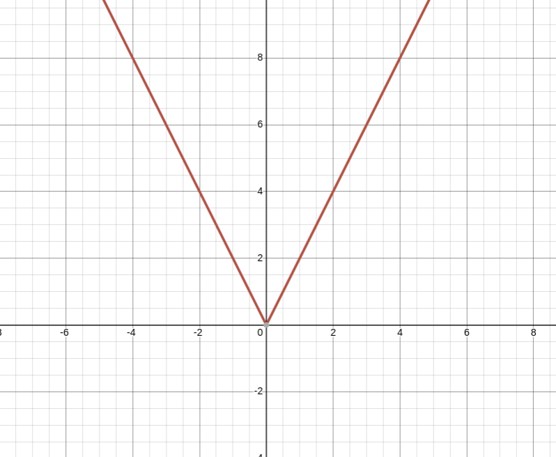

## Section 2.3 - Question 1

Why is f not a function from R to R if

#### a

> f(x) = 1/x?

The function is not defined for x = 0.

#### b

> f(x) = sqrt(x)?

The function is not defined for x < 0.

#### c

> f(x) = +/- sqrt((x^2) + 1)?

Even though the function is defined for all x, it is not a function from R to R because it is not a single-valued function. For each x, there are two possible values for f(x).

## Section 2.3 - Question 9

#### a

ceiling(3/4) = 1

#### b

floor(7/8) = 0

#### c

ceiling(-3/4) = 0

#### d

floor(-7/8) = -1

#### e

ceiling(3) = 3

#### f

floor(-1) = -1

#### g

floor(1/2 + ceiling(3/2)) = floor(1/2 + 2) = floor(2.5) = 2

#### h

floor(1/2 * floor(5/2)) = floor(1/2 * 2) = floor(1) = 1

## Section 2.3 - Question 10

Determine whether each of these functions from {a, b, c, d} to itself is one-to-one.

#### a

> f(a) = b, f(b) = a, f(c) = c, f(d) = d

The function is **one-to-one** because each element in the domain is mapped to a unique element in the codomain.

#### b

> f(a) = b, f(b) = b, f(c) = d, f(d) = c

The function is **not one-to-one** because both a and b are mapped to b.

#### c

> f(a) = d, f(b) = b, f(c) = c, f(d) = d

The function **not one-to-one** because both a and d are mapped to d.

## Section 2.3 - Question 11

Which functions in Exercise 10 are onto?

#### a

> f(a) = b, f(b) = a, f(c) = c, f(d) = d

The function is onto because each element in the codomain is mapped to by an element in the domain.

#### b

> f(a) = b, f(b) = b, f(c) = d, f(d) = c

The function is not onto because a is not mapped to by any element in the domain.

#### c

> f(a) = d, f(b) = b, f(c) = c, f(d) = d

The function is not onto because a is not mapped to by any element in the domain.

## Section 2.3 - Question 21

Give an explicit formula for a function from the set of integers to the set of positive integers that is

#### a 

> one-to-one, but not onto.

The function f(x) = 2x is one-to-one because f(x) = f(y) implies x = y. However, the function is not onto because there is no integer x such that f(x) = 1.

#### b 

> onto, but not one-to-one.

The function f(x) = |x| is onto because for every positive integer y, there is an integer x such that f(x) = y. However, the function is not one-to-one because f(x) = f(-x) for all x.

#### c 

> one-to-one and onto.

The function f(x) = x is one-to-one because f(x) = f(y) implies x = y. The function is also onto because for every positive integer y, there is an integer x such that f(x) = y.

#### d 

> neither one-to-one nor onto.

The function f(x) = 1 is neither one-to-one nor onto because f(1) = f(2) and there is no integer x such that f(x) = 2.

## Section 2.3 - Question 23

Determine whether each of these functions is a bijection from R to R.

#### a 

> f(x) = 2x + 1

The function is a bijection because it is both one-to-one and onto.

#### b 

> f(x) = x^2 + 1

The function is not a bijection because it is not onto. For example, there is no real number x such that f(x) = 0.

#### c 

> f(x) = x^3

The function is a bijection because it is both one-to-one and onto.

#### d 

> f(x) = (x^2 + 1)/(x^2 + 2)

The function is not a bijection because it is not one-to-one. For example, f(1) = f(-1) = 2/3.

## Section 2.3 - Question 25

> Let f : R → R and let f(x) > 0 for all x ∈ R. Show that f(x) is strictly decreasing if and only if the function g(x) = 1/f(x) is strictly increasing.

Suppose f(x) is strictly decreasing. Then for all x, y ∈ R, if x < y, then f(x) > f(y). Then 1/f(x) < 1/f(y), so g(x) is strictly increasing.

## Section 2.3 - Question 26a

> Prove that a strictly increasing function from R to itself is one-to-one.

- Prove f is one-to-one by way of contradiction
- Assume that f is strictly increasing from R to itself
  - Then, for all x, y ∈ R, if x < y, then f(x) < f(y)
- Assume that f is not one-to-one. 
  - Then, there exist a, b ∈ R such that a ≠ b and f(a) = f(b).
- Without loss of generality, assume a < b.
  - Then f(a) < f(b), which is a contradiction.
  - Therefore, f is indeed one-to-one if it is strictly increasing.

## Section 2.3 - Question 36

> If f and f∘g are one-to-one, does it follow that g is one-to-one? Justify your answer.

- Yes, it follows that g is one-to-one.
- Suppose f and f∘g are one-to-one.
- Then for all x, y ∈ R, if f(x) = f(y), then x = y.
- Then for all x, y ∈ R, if f(g(x)) = f(g(y)), then g(x) = g(y).
- Therefore, g is one-to-one.

## Section 2.3 - Question 38

> Find f∘g and g∘f, where f(x) = x2 + 1 and g(x) = x + 2, are functions from R to R.

- f∘g(x) = f(g(x)) = f(x + 2) = (x + 2)^2 + 1 = x^2 + 4x + 4 + 1 = x^2 + 4x + 5
- g∘f(x) = g(f(x)) = g(x^2 + 1) = x^2 + 1 + 2 = x^2 + 3

## Section 2.3 - Question 45

Let f be a function from the set A to the set B. Let S be a subset of B. We define the inverse image of S to be the subset of A whose elements are precisely all preimages of all elements of S. We denote the inverse image of S by f−1(S), so f−1(S) = {a ∈ A | f(a) ∈ S}.

Let g(x) = floor(x). Find

#### a

> g^−1({0}).

g^−1({0}) = {x | floor(x) = 0} = {x | 0 ≤ x < 1}.

#### b

> g^−1({−1, 0, 1}).

g^−1({−1, 0, 1}) = {x | floor(x) = −1 or floor(x) = 0 or floor(x) = 1} = {x | −1 ≤ x < 0 or 0 ≤ x < 1 or 1 ≤ x < 2} = {x | −1 ≤ x < 2}.

#### c

> g^−1({x | 0 < x < 1}).

g^−1({x | 0 < x < 1}) = {x | 0 < floor(x) < 1} = {x | 0 < x < 1}.

## Section 2.3 - Question 53a

> Show that if x is a real number and n is an integer, then x < n if and only if floor(x) < n.

Suppose x < n. Then floor(x) ≤ x < n, so floor(x) < n.

## Section 2.3 - Question 55

> Prove that if n is an integer, then n/2 = n/2 if n is even and (n − 1)/2 if n is odd.

Suppose n is even. Then n = 2k for some integer k, so n/2 = k = n/2.

## Section 2.3 - Question 65

> Draw the graph of the function f(x) = |2x| from R to R.

## Section 2.3 - Question 71

> Find the inverse function of f(x) = x^3 + 1.

f^-1(x) = (x - 1)^(1/3)

## Section 2.3 - Question 78

> Let x be a real number. Show that floor(3x) = floor(x) + floor(x + 1/3) + floor(x + 2/3).

- Let x = n + e, where n is an integer and 0 ≤ e < 1.
- Case 1: e < 1/3
  - then floor(x) = n, floor(x + 1/3) = n, and floor(x + 2/3) = n, so floor(3x) = floor(x) + floor(x + 1/3) + floor(x + 2/3) = 3n.
- Case 2: 1/3 ≤ e < 2/3
  - then floor(x) = n, floor(x + 1/3) = n, and floor(x + 2/3) = n + 1, so floor(3x) = floor(x) + floor(x + 1/3) + floor(x + 2/3) = 3n + 1.
- Case 3: 2/3 ≤ e < 1 
  - then floor(x) = n, floor(x + 1/3) = n + 1, and floor(x + 2/3) = n + 1, so floor(3x) = floor(x) + floor(x + 1/3) + floor(x + 2/3) = 3n + 2.

## Section 2.3 - Question 79

For each of these partial functions, determine its domain, codomain, domain of definition, and the set of values for which it is undefined. Also, determine whether it is a total function.

#### a 

> f : Z → R, f(n) = 1/n

The domain is Z, the codomain is R, the domain of definition is Z - {0}, and the set of values for which it is undefined is {0}. The function is not a total function.

#### b 

> f : Z → Z, f(n) = n/2

The domain is Z, the codomain is Z, the domain of definition is Z, and the set of values for which it is undefined is the set of all odd integers. The function is not a total function.

#### c 

> f : Z × Z → Q, f(m, n) = m/n

The domain is Z × Z, the codomain is Q, the domain of definition is Z × (Z - {0}), and the set of values for which it is undefined is Z × {0}. The function is not a total function.

#### d 

> f : Z × Z → Z, f(m, n) = mn

The domain is Z × Z, the codomain is Z, the domain of definition is Z × Z, and the set of values for which it is undefined is the empty set. The function is a total function.

#### e 

> f : Z × Z → Z, f(m, n) = m − n if m > n

The domain is Z × Z, the codomain is Z, the domain of definition is Z × Z, and the set of values for which it is undefined is the empty set. The function is a total function.

## Section 2.4 - Question 1

Find these terms of the sequence {an}, where an = 2 · (−3)n + 5n.

#### a 

> a_0

a_0 = 2 · (−3)^0 + 5^0 = 2 · 1 + 1 = 3

#### b 

> a_1

a_1 = 2 · (−3)^1 + 5^1 = 2 · (−3) + 5 = −6 + 5 = −1

#### c 

> a_4

a_4 = 2 · (−3)^4 + 5^4 = 2 · 81 + 625 = 162 + 625 = 787

#### d 

> a_5

a_5 = 2 · (−3)^5 + 5^5 = 2 · (−243) + 3125 = −486 + 3125 = 2639

## Section 2.4 - Question 4

What are the terms a_0, a_1, a_2, and a_3 of the sequence {an}, where an equals

#### a

- a_0 = (−2)^0 = 1
- a_1 = (−2)^1 = −2
- a_2 = (−2)^2 = 4
- a_3 = (−2)^3 = −8

#### b

- a_0 = 3
- a_1 = 3
- a_2 = 3
- a_3 = 3

#### c

- a_0 = 7 + 4^0 = 8
- a_1 = 7 + 4^1 = 11
- a_2 = 7 + 4^2 = 23
- a_3 = 7 + 4^3 = 39

#### d

- a_0 = 2^0 + (−2)^0 = 1 + 1 = 2
- a_1 = 2^1 + (−2)^1 = 2 − 2 = 0
- a_2 = 2^2 + (−2)^2 = 4 + 4 = 8
- a_3 = 2^3 + (−2)^3 = 8 − 8 = 0

## Section 2.4 - Question 6b

> List the first 10 terms of the sequence whose nth term is the sum of the first n positive integers

`1, 3, 6, 10, 15, 21, 28, 36, 45, 55`

## Section 2.4 - Question 9e

> Find the first five terms of the sequence defined by each of these recurrence relations and initial conditions: a_n = a_n−1 + a_n−3, a_0 = 1, a_1 = 2, a_2 = 0

a_3 = a_2 + a_0 = 0 + 1 = 1

## Section 2.4 - Question 13abdg

Is the sequence {an} a solution of the recurrence relation an = 8an−1 − 16an−2 if

#### a

> an = 0?

a_1 = 8a_0 - 16a_(-1) = 8 * 0 - 16 * 0 = 0

#### b

> an = 1?

a_1 = 8a_0 - 16a_(-1) = 8 * 1 - 16 * 0 = 8

#### d

> an = 4^n?

a_1 = 8a_0 - 16a_(-1) = 8 * 4 - 16 * 2 = 32

#### g

> an = (−4)^n?

a_1 = 8a_0 - 16a_(-1) = 8 * (-4) - 16 * 0 = -32

#### h

> an = n^2*4^n?

a_1 = 8a_0 - 16a_(-1) = 8 * 4 - 16 * 0 = 32

## Section 2.4 - Question 15d

> Show that the sequence {an} is a solution of the recurrence relation an = an−1 + 2an−2 + 2n − 9 if a_n = 7 · 2^n − n + 2.

a_1 = a_0 + 2a_(-1) + 2 - 9 = 7 * 2 - 0 + 2 - 9 = 14 - 7 = 7

## Section 2.4 - Question 19

Suppose that the number of bacteria in a colony triples every hour.

#### a 

> Set up a recurrence relation for the number of bacteria after n hours have elapsed.

a_n = 3a_(n-1)

#### b 

> If 100 bacteria are used to begin a new colony, how many bacteria will be in the colony in 10 hours?

a_10 = 3^10 * 100 = 5904900

## Section 2.4 - Question 22

An employee joined a company in 2017 with a starting salary of $50,000. Every year this employee receives a raise of $1000 plus 5% of the salary of the previous year.

#### a 

> Set up a recurrence relation for the salary of this employee n years after 2017.

a_n = a_(n-1) + 1000 + 0.05a_(n-1)

#### b 

> What will the salary of this employee be in 2025?

- a_1 = 50000 + 1000 + 0.05 * 50000 = 51000 + 2500 = 53500
- a_2 = 53500 + 1000 + 0.05 * 53500 = 54500 + 2675 = 57175
- a_3 = 57175 + 1000 + 0.05 * 57175 = 58175 + 2858.75 = 61033.75
- a_4 = 61033.75 + 1000 + 0.05 * 61033.75 = 62033.75 + 3051.6875 = 65085.4375
- a_5 = 65085.4375 + 1000 + 0.05 * 65085.4375 = 66085.4375 + 3254.271875 = 69339.709375
- a_6 = 69339.709375 + 1000 + 0.05 * 69339.709375 = 70339.709375 + 3466.98546875 = 73806.69484375
- a_7 = 73806.69484375 + 1000 + 0.05 * 73806.69484375 = 74806.69484375 + 3690.3347421875 = 78497.0295859375
- a_8 = 78497.0295859375 + 1000 + 0.05 * 78497.0295859375 = 79497.0295859375 + 3949.851479296875 = 83446.881065234375

#### c 

> Find an explicit formula for the salary of this employee n years after 2017.

a_n = 50000 + n * 1000 + 0.05 * (50000 + (n - 1) * 1000) = 50000 + n * 1000 + 0.05 * 50000 + 0.05 * (n - 1) * 1000 = 50000 + n * 1000 + 2500 + 0.05 * (n - 1) * 1000 = 52500 + n * 1000 + 0.05 * (n - 1) * 1000

explict formula: a_n = 52500 + n * 1000 + 0.05 * (n - 1) * 1000

## Section 2.4 - Question 29c

> What is the value of these sums: `for (i = 1; i <= 10; i++) { 3 }`

3 * 10 = 30

## Section 2.4 - Question 30a

> What are the values of these sums, where S = {1, 3, 5, 7}? `for (i in S) { i }`

1 + 3 + 5 + 7 = 16

## Section 2.4 - Question 31c

> What is the value of each of these sums of terms of a geometric progression? for (i = 2; i <= 8; i++) { 2*(-3)^i }

2 * (-3)^2 + 2 * (-3)^3 + 2 * (-3)^4 + 2 * (-3)^5 + 2 * (-3)^6 + 2 * (-3)^7 + 2 * (-3)^8 = 2 * 9 - 2 * 27 + 2 * 81 - 2 * 243 + 2 * 729 - 2 * 2187 + 2 * 6561 = 18 - 54 + 162 - 486 + 1458 - 4374 + 13122 = 18630 - 18630 = 0

## Section 2.4 - Question 32

Find the value of each of these sums

#### a

> for (i = 0; i <= 8; i++) { 1 + (-1)^i }

10

> for (i = 0; i < 8; i++) { 1 + (-1)^i }

8

#### b

> for (i = 0; i <= 8; i++) { 3^i - 2^i }

0 + 1 + 5 + 19 + 65 + 211 + 665 + 2059 + 6305 = 9330

> for (i = 0; i < 8; i++) { 3^i - 2^i }

3025

#### c

> for (i = 0; i <= 8; i++) { 2*3^i + 3*2^i }

7325

> for (i = 0; i < 8; i++) { 2*3^i + 3*2^i }

21215

#### d

> for (i = 0; i <= 8; i++) { 2^(i+1) - 2^i }

511

for (i = 0; i < 8; i++) { 2^(i+1) - 2^i }

255

