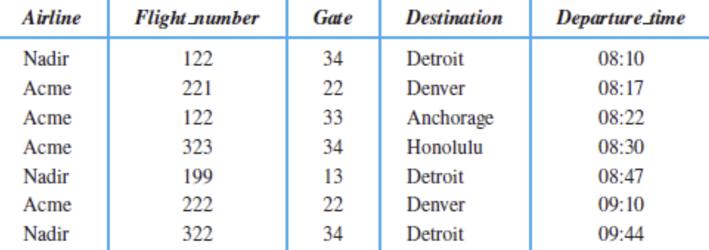
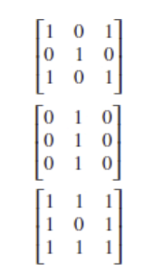
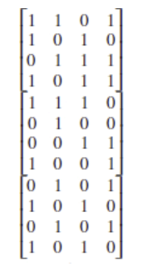
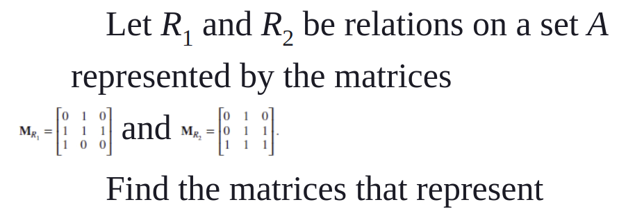

## Section 9.1 - Question 31

Let A be the set of students at your school and B the set of books in the school library. Let $R_1$ and $R_2$ be the relations consisting of all ordered pairs (a, b), where student a is required to read book b in a course, and where student a has read book b, respectively. Describe the ordered pairs in each of these relations.

#### a) $R_1 ∪ R_2$

The ordered pairs (a, b) in the union of $R_1$ and $R_2$ are those where student a is either required to read book b from the school library in a course and/or has read book b.


#### b) $R_1 ∩ R_2$

The ordered pairs (a, b) in the intersection of $R_1$ and $R_2$ describe instances in which a student a is required to read book b in a course and has read book b.


#### c) $R_1 ⊕ R_2$

The ordered pairs (a, b) in the symmetric difference of $R_1$ and $R_2$ are those where student a is required to read book b in a course or has read book b, but not both.


#### d) $R_1 − R_2$

The ordered pairs (a, b) in the difference of $R_1$ and $R_2$ are those where student a is required to read book b in a course, but has not read book b.


#### e) $R_2 − R_1$

The ordered pairs (a, b) in the difference of $R_2$ and $R_1$ are those where student a has read book b, but was not required to read book b in a course.


## Section 9.1 - Question 33

Let R be the relation on the set of people consisting of pairs (a, b), where a is a parent of b. Let S be the relation on the set of people consisting of pairs (a, b), where a and b are siblings (brothers or sisters). What are $S ∘ R$ and $R ∘ S$?

**$S ∘ R$**: The composition of S and R is the relation on the set of people consisting of pairs (a, b), where a is a parent of b and a and b are siblings. This relation would describe all parent-child relationships in which the parent has multiple children or the parent's child has half- or step-siblings.

**$R ∘ S$**: The composition of R and S is the relation on the set of people consisting of pairs (a, b), where a and b are siblings and a is a parent of b. This relation would describe relationships between aunts/uncles and nieces/nephews.


## Section 9.1 - Question 34h

$R_1 = \{(a, b) ∈ R^2 | a > b\}$, the greater than relation, $R_2 = \{(a, b) ∈ R^2 | a ≥ b\}$, the greater than or equal to relation,

$R_3 = \{(a, b) ∈ R^2 | a < b\}$, the less than relation, $R_4 = \{(a, b) ∈ R^2 | a ≤ b\}$, the less than or equal to relation,

$R_5 = \{(a, b) ∈ R^2 | a = b\}$, the equal to relation, $R_6 = \{(a, b) ∈ R^2 | a ≠ b\}$, the unequal to relation.

> Find $R^2 ⊕ R_4$

$R_2 ⊕ R_4 = \{(a, b) ∈ R^2 | a ≥ b\} ⊕ \{(a, b) ∈ R^2 | a ≤ b\} = \{(a, b) ∈ R^2 | a ≠ b\} = R_6$


## Section 9.1 - Question 36a

$R_1 = \{(a, b) ∈ R^2 | a > b\}$, the greater than relation, $R_2 = \{(a, b) ∈ R^2 | a ≥ b\}$, the greater than or equal to relation,

$R_3 = \{(a, b) ∈ R^2 | a < b\}$, the less than relation, $R_4 = \{(a, b) ∈ R^2 | a ≤ b\}$, the less than or equal to relation,

$R_5 = \{(a, b) ∈ R^2 | a = b\}$, the equal to relation, $R_6 = \{(a, b) ∈ R^2 | a ≠ b\}$, the unequal to relation.

> Find $R_1 ∘ R_1$


$R_1 ∘ R_1 = \{(a, b) ∈ R^2 | a > b\} ∘ \{(a, b) ∈ R^2 | a > b\} = \{(a, b) ∈ R^2 | a > b\} = R_1$


## Section 9.1 - Question 37


#### a) $R_2 ∘ R_1$


$R_2 ∘ R_1 = \{(a, b) ∈ R^2 | a ≥ b\} ∘ \{(a, b) ∈ R^2 | a > b\} = \{(a, b) ∈ R^2 | a > b\} = R_1$


#### b) $R_2 ∘ R_2$


$R_2 ∘ R_2 = \{(a, b) ∈ R^2 | a ≥ b\} ∘ \{(a, b) ∈ R^2 | a ≥ b\} = \{(a, b) ∈ R^2 | a ≥ b\} = R_2$


#### c) $R_3 ∘ R_5$

$R_3 ∘ R_5 = \{(a, b) ∈ R^2 | a < b\} ∘ \{(a, b) ∈ R^2 | a = b\} = \{(a, b) ∈ R^2 | a < b\} = R_3$


#### d) $R_4 ∘ R_1$

$R_4 ∘ R_1 = \{(a, b) ∈ R^2 | a ≤ b\} ∘ \{(a, b) ∈ R^2 | a > b\} = R^2$


#### e) $R_5 ∘ R_3$

$R_5 ∘ R_3 = \{(a, b) ∈ R^2 | a = b\} ∘ \{(a, b) ∈ R^2 | a < b\} = \{(a, b) ∈ R^2 | a < b\} = R_3$


#### f) $R_3 ∘ R_6$


$R_3 ∘ R_6 = \{(a, b) ∈ R^2 | a < b\} ∘ \{(a, b) ∈ R^2 | a ≠ b\} = R^2$


#### g) $R_4 ∘ R_6$

$R_4 ∘ R_6 = \{(a, b) ∈ R^2 | a ≤ b\} ∘ \{(a, b) ∈ R^2 | a ≠ b\} = R^2$


#### h) $R_6 ∘ R_6$


$R_6 ∘ R_6 = \{(a, b) ∈ R^2 | a ≠ b\} ∘ \{(a, b) ∈ R^2 | a ≠ b\} = R^2$


## Section 9.1 - Question 39

Find the relations $S^2$ for $i = 1, 2, 3, 4, 5, 6$ where

> $S_1 = \{(a, b) ∈ Z^2 | a > b\}$, the greater than relation,

$S_1^2 = \{(a, b) ∈ Z^2 | a > b\} ∘ \{(a, b) ∈ Z^2 | a > b\} = \{(a, b) ∈ Z^2 | a - 1 > b\}$


> $S_2 = \{(a, b) ∈ Z^2 | a ≥ b\}$, the greater than or equal to relation,


$S_2^2 = \{(a, b) ∈ Z^2 | a ≥ b\} ∘ \{(a, b) ∈ Z^2 | a ≥ b\} = \{(a, b) ∈ Z^2 | a ≥ b\}$

> $S_3 = \{(a, b) ∈ Z^2 | a < b\}$, the less than relation,

$S_3^2 = \{(a, b) ∈ Z^2 | a < b\} ∘ \{(a, b) ∈ Z^2 | a < b\} = \{(a, b) ∈ Z^2 | a < b - 1\}$

> $S_4 = \{(a, b) ∈ Z^2 | a ≤ b\}$, the less than or equal to relation,

$S_4^2 = \{(a, b) ∈ Z^2 | a ≤ b\} ∘ \{(a, b) ∈ Z^2 | a ≤ b\} = \{(a, b) ∈ Z^2 | a ≤ b\}$

> $S_5 = \{(a, b) ∈ Z^2 | a = b\}$, the equal to relation,

$S_5^2 = \{(a, b) ∈ Z^2 | a = b\} ∘ \{(a, b) ∈ Z^2 | a = b\} = \{(a, b) ∈ Z^2 | a = b\}$

> $S_6 = \{(a, b) ∈ Z^2 | a ≠ b\}$, the unequal to relation.

$S_6^2 = \{(a, b) ∈ Z^2 | a ≠ b\} ∘ \{(a, b) ∈ Z^2 | a ≠ b\} = Z^2$


## Section 9.1 - Question 41

Let R be the relation on the set of people with doctorates such that (a, b) ∈ R if and only if a was the thesis advisor of b. When is an ordered pair (a, b) in $R^2$? When is an ordered pair (a, b) in $R^n$, when n is a positive integer? (Assume that every person with a doctorate has a thesis advisor.)

- An ordered pair (a, b) is in $R^2$ if and only if a was the thesis advisor of the thesis advisor of b.
- An ordered pair (a, b) is in $R^n$ for n > 2 if and only if a was the thesis advisor of the thesis advisor of the thesis advisor of ... of b, where the number of iterations is n.

## Section 9.1 - Question 43


Let $R_1$ and $R_2$ be the “congruent modulo 3” and the “congruent modulo 4” relations, respectively, on the set of integers. That is, $R_1 = \{(a, b) | a ≡ b (mod 3)\}$ and $R_2 = \{(a, b) | a ≡ b (mod 4)\}$


#### a) $R_1 ∪ R_2$


$R_1 ∪ R_2 = \{(a, b) | a ≡ b (mod 3)\} ∪ \{(a, b) | a ≡ b (mod 4)\} = \{(a, b) | a ≡ b (mod 3) ∨ a ≡ b (mod 4)\}$


#### b) $R_1 ∩ R_2$

$R_1 ∩ R_2 = \{(a, b) | a ≡ b (mod 3)\} ∩ \{(a, b) | a ≡ b (mod 4)\} = \{(a, b) | a ≡ b (mod 12)\}$


#### c) $R_1 − R_2$

$R_1 − R_2 = \{(a, b) | a ≡ b (mod 3)\} − \{(a, b) | a ≡ b (mod 4)\} = \{(a, b) | a ≡ b (mod 3) ∧ a ≢ b (mod 4)\}$


#### d) $R_2 − R_1$


$R_2 − R_1 = \{(a, b) | a ≡ b (mod 4)\} − \{(a, b) | a ≡ b (mod 3)\} = \{(a, b) | a ≡ b (mod 4) ∧ a ≢ b (mod 3)\}$


#### e) $R_1 ⊕ R_2$


$R_1 ⊕ R_2 = \{(a, b) | a ≡ b (mod 3)\} ⊕ \{(a, b) | a ≡ b (mod 4)\} = \{(a, b) | a ≡ b (mod 3) ∨ a ≡ b (mod 4) ∧ a ≢ b (mod 12)\}$


## Section 9.2 - Question 1

> List the triples in the relation {(a, b, c) | a, b, and c are integers with 0 < a < b < c < 5}.

- (1, 2, 3)
- (1, 2, 4)
- (1, 3, 4)
- (2, 3, 4)

## Section 9.2 - Question 2

> Which 4-tuples are in the relation {(a, b, c, d) | a, b, c, and d are positive integers with abcd = 6}?

- (6, 1, 1, 1)
- (1, 6, 1, 1)
- (1, 1, 6, 1)
- (1, 1, 1, 6)
- (1, 1, 2, 3)
- (1, 2, 3, 1)
- (2, 3, 1, 1)
- (1, 1, 3, 2)
- (1, 3, 2, 1)
- (3, 2, 1, 1)
- (1, 2, 1, 3)
- (2, 1, 3, 1)
- (1, 3, 1, 2)
- (3, 1, 2, 1)
- (2, 1, 1, 3)
- (3, 1, 1, 2)


## Section 9.2 - Question 3

> List the 5-tuples in the relation in Table 8.




- (Nadir, 122, 34, Detroit, 08:10)
- (Acme, 221, 22, Denver, 08:17)
- (Acme, 122, 33, Anchorage, 08:22)
- (Acme, 323, 34, Honolulu, 08:25)
- (Nadir, 199, 13, Detroit, 08:47)
- (Acme, 222, 22, Denver, 09:10)
- (Nadir, 322, 34, Detroit, 09:44)


## Section 9.2 - Question 5


Composite keys containing *Airline* field: Airline and flight number, airline and departure time


## Section 9.2 - Question 9

The 5-tuples in a 5-ary relation represent these attributes of all people in the United States: name, Social Security number, street address, city, state.

#### a)

> Determine a primary key for this relation.


The Social Security number is a unique identifier for each person in the United States and can be used as a primary key for this relation.


#### b)

> Under what conditions would (name, street address) be a composite key?


If two people in the United States have the same name and street address, then (name, street address) would not be a unique identifier and would not be a composite key. For this to be a composite key, (a) each person in the United States would have a unique name, (b) each person in the United States would have a unique street address, or (c) the combination of name and street address would be unique for each person in the United States.


#### c)

> Under what conditions would (name, street address, city) be a composite key?


If two people in the United States have the same name, street address, and city, then (name, street address, city) would not be a unique identifier and would not be a composite key. For this to be a composite key, (a) each person in the United States would have a unique name, (b) each person in the United States would have a unique street address + city, (c) each person in the United States would have a unique city, or (d) the combination of name, street address, and city would be unique for each person in the United States.


## Section 9.2 - Question 10

> What do you obtain when you apply the selection operator $s_C$, where *C* is the condition Room = A100, to the database in Table 7?


Table 7

| Professor | Department       | Course_number | Room  | Time     |
|-----------|------------------|---------------|-------|----------|
| Cruz      | Zoology          | 335           | A100  | 9:00 A.M.|
| Cruz      | Zoology          | 412           | A100  | 8:00 A.M.|
| Farber    | Psychology       | 501           | A100  | 3:00 P.M.|
| Farber    | Psychology       | 617           | A110  | 11:00 A.M.|
| Grammer   | Physics          | 544           | B505  | 4:00 P.M.|
| Rosen     | Computer Science | 518           | N521  | 2:00 P.M.|
| Rosen     | Mathematics      | 575           | N502  | 3:00 P.M.|


The selection operator $s_C$, where *C* is the condition Room = A100, applied to the database in Table 7 would return the following tuples:

| Professor | Department | Course_number | Room  | Time     |
|-----------|------------|---------------|-------|----------|
| Cruz      | Zoology    | 335           | A100  | 9:00 A.M.|
| Cruz      | Zoology    | 412           | A100  | 8:00 A.M.|
| Farber    | Psychology | 501           | A100  | 3:00 P.M.|


## Section 9.2 - Question 15

> Which projection mapping is used to delete the first, second, and fourth components of a 6-tuple?


The projection mapping used to delete the first, second, and fourth components of a 6-tuple is π{3, 5, 6}.

## Section 9.2 - Question 28b


#### a) 

What are the operations that correspond to the query expressed using this SQL statement?


```SQL
SELECT Supplier
FROM Part_needs
WHERE 1000 ≤ Part number ≤ 5000
```

Projection on Supplier attribute from the records in the Part_needs table that satisfies the condition 1000 ≤ Part number ≤ 5000.

#### b) 

What is the output of this query given the database in Table 11 as input?

| Supplier | Part_number | Project |
|----------|-------------|---------|
| 23       | 1092        | 1       |
| 23       | 1101        | 3       |
| 23       | 9048        | 4       |
| 31       | 4975        | 3       |
| 31       | 3477        | 2       |
| 32       | 6984        | 4       |
| 32       | 9191        | 2       |
| 33       | 1001        | 1       |

The output of this query given the database in Table 11 as input is:

| Supplier |
|----------|
| 23       |
| 31       |
| 33       |


## Section 9.2 - Question 31


Let R be the relation on Z × Z × Z+ consisting of triples (a, b, m), where a, b, and m are integers with m ≥ 1 and a ≡ b (mod m). Then (8, 2, 3), (−1, 9, 5), and (14, 0, 7) all belong to R, but (7, 2, 3), (−2, −8, 5), and (11, 0, 6) do not belong to R because 8 ≡ 2(mod 3), −1 ≡ 9(mod 5), and 14 ≡ 0 (mod 7), but 7  2(mod 3), −2  −8 (mod 5), and 11  0 (mod 6). This relation has degree 3 and its first two domains are the set of all integers and its third domain is the set of positive integers.

> Determine whether there is a primary key for this relation.

To give counterexample for each field, consider the following:

- For a
  - 8 ≡ 14 (mod 6) and 8 ≡ 2 (mod 4)
- For b
  - 8 ≡ 2 (mod 3) and 9 ≡ 2 (mod 7)
- For m
  - 3 ≡ 4 (mod 1) and 5 ≡ 6 (mod 1) 

Thus, no field can be used as a primary key for this relation because there is at least one counterexample for each field wherein a value is in the set of integers but is in the same equivalence class as another value in the set of integers.


## Section 9.3 - Question 2c

{(1, 2), (1, 3), (1, 4), (2, 1), (2, 3), (2, 4), (3, 1), (3, 2), (3, 4), (4, 1), (4, 2), (4, 3)}

Represent this relation on {1, 2, 3, 4} with a matrix (with the elements of this set listed in increasing order).

|   | 1 | 2 | 3 | 4 |
|---|---|---|---|---|
| **1** | 0 | 1 | 1 | 1 |
| **2** | 1 | 0 | 1 | 1 |
| **3** | 1 | 1 | 0 | 1 |
| **4** | 1 | 1 | 1 | 0 |


## Section 9.3 - Question 3


> List the ordered pairs in the relations on {1, 2, 3} corresponding to these matrices (where the rows and columns correspond to the integers listed in increasing order).



#### a)

(1, 1), (1, 3), (2, 2), (3, 1), (3, 3)


#### b)

(1, 2), (2, 2), (3, 2)


#### c)


(1, 1), (1, 2), (1, 3), (2, 1), (2, 3), (3, 1), (3, 2), (3, 3)


## Section 9.3 - Question 5


> How can the matrix representing a relation R on a set A be used to determine whether the relation is irreflexive?

If the diagonal of the matrix representing a relation R on a set A contains all 0s, then the relation is irreflexive. This is because the diagonal of the matrix represents the ordered pairs (a, a) for each element a in the set A, and if all of these pairs are 0, then no element is related to itself, making the relation irreflexive.


## Section 9.3 - Question 7


> Determine whether the relations represented by the matrices in Exercise 3 are reflexive, irreflexive, symmetric, antisymmetric, and/or transitive.


- **a)** Reflexive, symmetric, transitive
- **b)** Antisymmetric, transitive
- **c)** Symmetric


## Section 9.3 - Question 8

> Determine whether the relations represented by the matrices in Exercise 4 are reflexive, irreflexive, symmetric, antisymmetric, and/or transitive.




- **a)** Symmetric
- **b)** Reflexive
- **c)** Irreflexive, symmetric


## Section 9.3 - Question 9


How many nonzero entries does the matrix representing the relation R on A = {1, 2, 3, …, 100} consisting of the first 100 positive integers have if R is

#### a) $\{(a, b) | a > b\}$


99 + 98 + 97 + ... + 1 is an arithmetic series with a common difference of -1 and a first term of 99. The sum of the first 99 positive integers is $\frac{99(99 + 1)}{2} = 4950$.


#### b) $\{(a, b) | a ≠ b\}$

Each number in the set A = {1, 2, 3, …, 100} can be related to 99 other numbers in the set, resulting in 100 * 99 = 9900 ordered pairs.


#### c) $\{(a, b) | a = b + 1\}$

99 ordered pairs, as each number in the set A = {1, 2, 3, …, 100} is related to the number that is one greater than it except for 100, which is not related to any number in this relation.


#### d) $\{(a, b) | a = 1\}$

100 ordered pairs, as the number 1 is related to every number in the set A = {1, 2, 3, …, 100}.


#### e) $\{(a, b) | ab = 1\}$

1 ordered pair, as the only pair of numbers in the set A = {1, 2, 3, …, 100} that satisfies the condition ab = 1 is (1, 1).


## Section 9.3 - Question 10a


> How many nonzero entries does the matrix representing the relation R on A ={1, 2, 3, …, 1000} consisting of the first 1000 positive integers have if R is $\{(a, b) | a ≤ b\}$?

1 + 2 + 3 + ... + 1000 is an arithmetic series with a common difference of 1 and a first term of 1. The sum of the first 1000 positive integers is $\frac{1000(1000 + 1)}{2} = 500500$.


## Section 9.3 - Question 12

> How can the matrix for $R^{−1}$, the inverse of the relation R, be found from the matrix representing R, when R is a relation on a finite set A?

If $R$ is represented by the matrix $m_{ij} \begin{cases} 1 & \text{if } (a_i, a_j) \in R \\ 0 & \text{if } (a_i, a_j) \notin R \end{cases}$


Then if $R^{-1} = \{(b, a) | (a, b) \in R\}$ it should be represented by the matrix $m_{ji} \begin{cases} 1 & \text{if } (a_j, a_i) \in R \\ 0 & \text{if } (a_j, a_i) \notin R \end{cases}$


So the matrix for $R^{-1}$ can be found by transposing the matrix for R. This means that the rows of the matrix for R become the columns of the matrix for $R^{-1}$ and vice versa.


## Section 9.3 - Question 13


Let R be the relation represented by the matrix

|   | 1 | 2 | 3 |
|---|---|---|---|
| 1 | 0 | 1 | 1 |
| 2 | 1 | 1 | 0 |
| 3 | 1 | 0 | 1 |


#### a) $R^{-1}$

|   | 1 | 2 | 3 |
|---|---|---|---|
| 1 | 0 | 1 | 1 |
| 2 | 1 | 1 | 0 |
| 3 | 1 | 0 | 1 |


#### b) $\overline{R}$

|   | 1 | 2 | 3 |
|---|---|---|---|
| 1 | 1 | 0 | 0 |
| 2 | 0 | 0 | 1 |
| 3 | 0 | 1 | 0 |


#### c) $R^2$

|   | 1 | 2 | 3 |
|---|---|---|---|
| 1 | 1 | 1 | 1 |
| 2 | 1 | 1 | 1 |
| 3 | 1 | 1 | 1 |

## Section 9.3 - Question 14



#### a) $R_1 ∪ R_2$

|   | 1 | 2 | 3 |
|---|---|---|---|
| 1 | 0 | 1 | 0 |
| 2 | 1 | 1 | 1 |
| 3 | 1 | 1 | 1 |


#### b) $R_1 ∩ R_2$

|   | 1 | 2 | 3 |
|---|---|---|---|
| 1 | 0 | 1 | 0 |
| 2 | 0 | 1 | 1 |
| 3 | 1 | 0 | 0 |


#### c) $R_2 o R_1$


|   | 1 | 2 | 3 |
|---|---|---|---|
| 1 | 1 | 1 | 1 |
| 2 | 1 | 1 | 1 |
| 3 | 1 | 1 | 1 |


#### d) $R_1 o R_1$

|   | 1 | 2 | 3 |
|---|---|---|---|
| 1 | 1 | 1 | 1 |
| 2 | 1 | 1 | 1 |
| 3 | 1 | 1 | 1 |


#### e) $R_1 ⊕ R_2$


|   | 1 | 2 | 3 |
|---|---|---|---|
| 1 | 0 | 0 | 0 |
| 2 | 1 | 0 | 0 |
| 3 | 1 | 1 | 1 |


## Section 9.3 - Question 15

Let R be the relation represented by the matrix


|   | 1 | 2 | 3 |
|---|---|---|---|
| 1 | 0 | 1 | 0 |
| 2 | 0 | 0 | 1 |
| 3 | 1 | 1 | 0 |

Find the matrices that represent


#### a) $R^2$


|   | 1 | 2 | 3 |
|---|---|---|---|
| 1 | 0 | 0 | 1 |
| 2 | 1 | 1 | 0 |
| 3 | 0 | 1 | 1 |


#### b) $R^3$


|   | 1 | 2 | 3 |
|---|---|---|---|
| 1 | 1 | 1 | 0 |
| 2 | 0 | 1 | 1 |
| 3 | 1 | 1 | 1 |


#### c) $R^4$


|   | 1 | 2 | 3 |
|---|---|---|---|
| 1 | 0 | 1 | 1 |
| 2 | 1 | 1 | 1 |
| 3 | 1 | 1 | 1 |


## Section 9.4 - Question 1


Let R be the relation on the set {0, 1, 2, 3} containing the ordered pairs (0, 1), (1, 1), (1, 2), (2, 0), (2, 2), and (3, 0). Find the

#### a) reflexive closure of R

The reflexive closure of R is the union of R and the set of ordered pairs (a, a) for each element a in the set {0, 1, 2, 3}. The reflexive closure of R is:

{(0, 1), (1, 1), (1, 2), (2, 0), (2, 2), (3, 0), (0, 0), (1, 1), (2, 2), (3, 3)}


#### b) symmetric closure of R


The symmetric closure of R is the union of R and the set of ordered pairs (b, a) for each ordered pair (a, b) in R. The symmetric closure of R is:

{(0, 1), (1, 0), (1, 1), (1, 2), (2, 1), (2, 0), (2, 2), (3, 0), (0, 1), (1, 1), (1, 2), (2, 0), (2, 2), (0, 0), (3, 0)}


## Section 9.4 - Question 2


> Let R be the relation {(a, b) | a ≠ b} on the set of integers. What is the reflexive closure of R?

$Z^2$

The reflexive closure of R is the union of R and the set of ordered pairs (a, a) for each element a in the set of integers. Since the relation R is defined as {(a, b) | a ≠ b}, the reflexive closure of R is the set of all ordered pairs of integers.

 
 
 
 