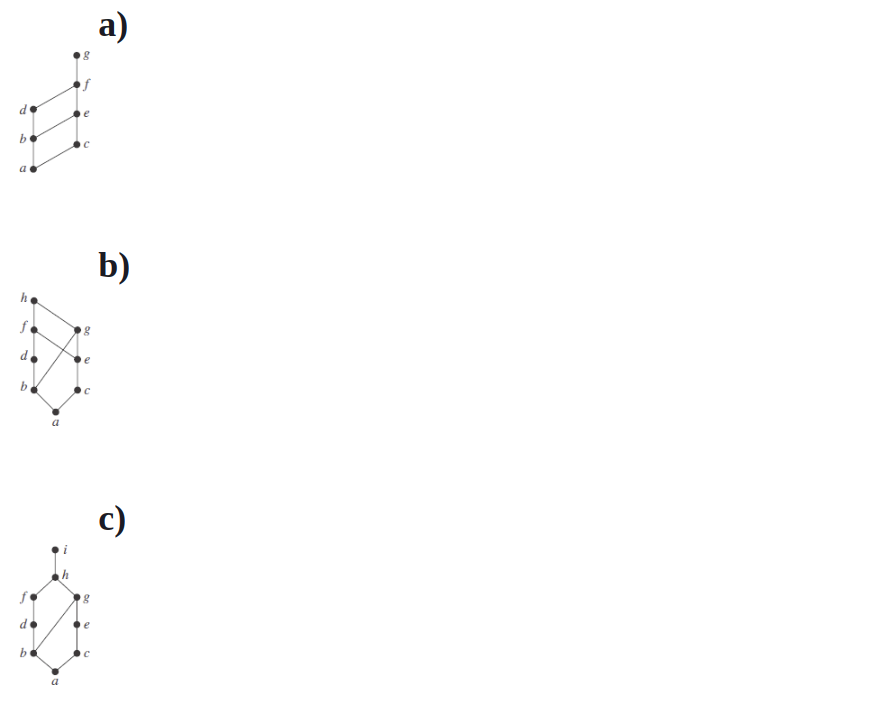
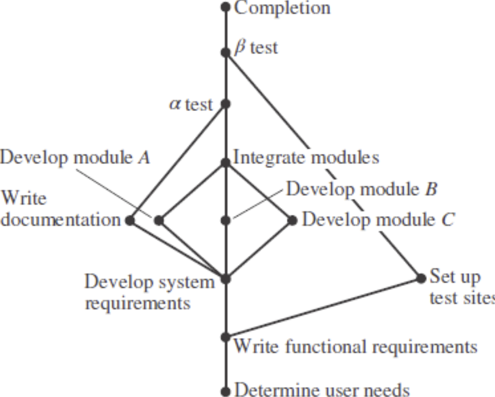

## Section 9.4 - Question 3

> Let R be the relation {(a, b) | a divides b} on the set of integers. What is the symmetric closure of R?


{(a, b) | a divides b} ∪ {(b, a) | b divides a}


## Section 9.4 - Question 15

> When is it possible to define the "irreflexive closure" of a relation R, that is, a relation that contains R, is irreflexive, and is contained in every irreflexive relation that contains R?


When R is already irreflexive, the irreflexive closure of R is R itself. Otherwise, the closure does not exist.

## Section 9.4 - Question 19

Let R be the relation on the set{1, 2, 3, 4, 5} containing the ordered pairs (1, 3), (2, 4), (3, 1), (3, 5), (4, 3), (5, 1), (5, 2), and (5, 4). Find

#### a) $R^2$

{(1, 1), (1, 5), (2, 2), (2, 4), (3, 3), (3, 1), (3, 5), (4, 4), (4, 3), (5, 5), (5, 1), (5, 2), (5, 4)}

#### b) $R^3$

{(1, 1), (1, 2), (1, 3), (1, 4), (2, 1), (2, 5), (3, 1), (3, 3), (3, 4), (3, 5), (4, 1), (4, 2), (4, 3), (4, 4), (5, 1), (5, 3), (5, 5)}


#### c) $R^4$

{(1, 1), (1, 3), (1, 4), (1, 5), (2, 1), (2, 2), (2, 3), (2, 4), (3, 1), (3, 2), (3, 3), (3, 4), (3, 5), (4, 1), (4, 3), (4, 4), (4, 5), (5, 1), (5, 2), (5, 3), (5, 4), (5, 5)}

#### d) $R^5$

{(1, 1), (1, 2), (1, 3), (1, 4), (1, 5), (2, 1), (2, 3), (2, 4), (2, 5), (3, 1), (3, 2), (3, 3), (3, 4), (3, 5), (4, 1), (4, 2), (4, 3), (4, 4), (4, 5), (5, 1), (5, 2), (5, 3), (5, 4), (5, 5)} 


#### e) $R^6$

{(1,1), (1,2), (1, 3), (1,4), (1,5), (2,1), (2, 2), (2, 3), (2, 4), (2, 5), (3, 1), (3, 2), (3, 3), (3, 4), (3, 5), (4, 1), (4, 2), (4, 3), (4, 4), (4, 5), (5, 1), (5, 2), (5, 3), (5, 4), (5, 5)} 


#### f) $R^*$

$R ∪ R^2 ∪ R^3 ∪ R^4 ∪ R^5$

{(1, 1), (1, 2), (1, 3), (1, 4), (1, 5), (2, 1), (2, 2), (2, 3), (2, 4), (2, 5), (3, 1), (3, 2), (3, 3), (3, 4), (3, 5), (4, 1), (4, 2), (4, 3), (4, 4), (4, 5), (5, 1), (5, 2), (5, 3), (5, 4), (5, 5)}


## Section 9.4 - Question 21

Let R be the relation on the set of all students containing the ordered pair (a, b) if a and b are in at least one common class and a ≠ b. When is (a, b) in

#### a) $R^2$

When there exists a student c such that (a, c) and (c, b) are in R.


#### b) $R^3$

When there exists a student c such that (a, c) and (c, b) are in R, and there exists a student d such that (c, d) and (d, b) are in R.


#### c) $R^*$

When there is a sequence of students a, b, c, d, ... such that (a, b), (b, c), (c, d), ... are in R and the sequence is finite with length $\geq 1$.


## Section 9.4 - Question 25a

> Use Algorithm 1 to find the transitive closures of this relation on {1, 2, 3, 4}: 
>
> {(1, 2), (2, 1), (2, 3), (3, 4), (4, 1)}


```
0 1 0 0     0 1 0 0     1 0 1 0
1 0 1 0  X  1 0 1 0  =  0 1 0 1  = R^2
0 0 0 1     0 0 0 1     1 0 0 0
1 0 0 0     1 0 0 0     0 1 0 0
```

```
1 0 1 0     1 0 1 0     1 0 1 0
0 1 0 1  X  0 1 0 1  =  0 1 0 1  = R^3
1 0 0 0     1 0 0 0     1 0 1 0
0 1 0 0     0 1 0 0     0 1 0 1
```

```
1 0 1 0     1 0 1 0     1 0 1 0
0 1 0 1  X  0 1 0 1  =  0 1 0 1  = R^4
1 0 1 0     1 0 1 0     1 0 1 0
0 1 0 1     0 1 0 1     0 1 0 1
```

$R^* = R ∪ R^2 ∪ R^3 ∪ R^4 =$

```
1 1 1 1
1 1 1 1
1 1 1 1
1 1 1 1
```

## Section 9.5 - Question 1


Which of these relations on {0, 1, 2, 3} are equivalence relations? Determine the properties of an equivalence relation that the others lack.

#### a) {(0, 0), (1, 1), (2, 2), (3, 3)}

Equivalence relation.


#### b) {(0, 0), (0, 2), (2, 0), (2, 2), (2, 3), (3, 2), (3, 3)}

Not reflexive and not transitive.


#### c) {(0, 0), (1, 1), (1, 2), (2, 1), (2, 2), (3, 3)}

Equivalence relation.


#### d) {(0, 0), (1, 1), (1, 3), (2, 2), (2, 3), (3, 1), (3, 2), (3, 3)}

Not transitive.


#### e) {(0, 0), (0, 1), (0, 2), (1, 0), (1, 1), (1, 2), (2, 0), (2, 2), (3, 3)}

Not transitive and not symmetric.


## Section 9.5 - Question 3

Which of these relations on the set of all functions from Z to Z are equivalence relations? Determine the properties of an equivalence relation that the others lack.

#### a) {(f, g) | f(1) = g(1)}

Equivalence relation.


#### b) {(f, g) | f(0) = g(0) or f(1) = g(1)}

Not transitive.


#### c) {(f, g) | f(x) − g(x) = 1 for all x ∈ Z}

Not reflexive and not symmetric.


#### d) {(f, g) | for some C ∈ Z, for all x ∈ Z, f(x) − g(x) = C}

Equivalence relation.


#### e) {(f, g) | f(0) = g(1) and f(1) = g(0)}

Not reflexive and not transitive.


## Section 9.5 - Question 7

> Show that the relation of logical equivalence on the set of all compound propositions is an equivalence relation. What are the equivalence classes of F and of T?


- Reflexive: A compound proposition is logically equivalent to itself.
- Symmetric: If A is logically equivalent to B, then B is logically equivalent to A.
- Transitive: If A is logically equivalent to B and B is logically equivalent to C, then A is logically equivalent to C.
- [T] = The set of all tautologies.
- [F] = The set of all contradictions.

## Section 9.5 - Question 11

> Show that the relation R consisting of all pairs (x, y) such that x and y are bit strings of length three or more that agree in their first three bits is an equivalence relation on the set of all bit strings of length three or more.

- Reflexive: A bit string is equivalent to itself.
- Symmetric: If A is equivalent to B, then B is equivalent to A.
- Transitive: If A is equivalent to B and B is equivalent to C, then A is equivalent to C.

## Section 9.5 - Question 27

> What are the equivalence classes of the equivalence relations in Exercise 2?


#### a) {(a, b) | a and b are the same age}


Equivalence classes = {p | p has age C} for all C ∈ Z.


#### b) {(a, b) | a and b have the same parents}

Equivalence classes = {p | p has parents C and D} for all C, D ∈ Z.


## Section 9.5 - Question 35d


> What is the congruence class $[n]_5$ (that is, the equivalence class of n with respect to congruence modulo 5) when n is -3?


$[-3]_5 = \{m | m ≡ -3 (mod 5)\}$


## Section 9.5 - Question 41


Which of these collections of subsets are partitions of {1, 2, 3, 4, 5, 6}?

#### a) {1, 2}, {2, 3, 4}, {4, 5, 6}

Not a partition because 2 is in two different subsets.


#### b) {1}, {2, 3, 6}, {4}, {5}

Partition.


#### c) {2, 4, 6}, {1, 3, 5}

Partition.


#### d) {1, 4, 5}, {2, 6}


Not a partition because 3 is not in any subset.


## Section 9.5 - Question 43

Which of these collections of subsets are partitions of the set of bit strings of length 8?

#### a)

> the set of bit strings that begin with 1, the set of bit strings that begin with 00, and the set of bit strings that begin with 01

Partition.


#### b)

> the set of bit strings that contain the string 00, the set of bit strings that contain the string 01, the set of bit strings that contain the string 10, and the set of bit strings that contain the string 11

Not a partition because a bit string that contains 00 and 01 is in two different subsets.


#### c)

> the set of bit strings that end with 00, the set of bit strings that end with 01, the set of bit strings that end with 10, and the set of bit strings that end with 11

Partition.


#### d)

> the set of bit strings that end with 111, the set of bit strings that end with 011, and the set of bit strings that end with 00

Not a partition because a bit string that ends with 01 is not in any subset.


#### e)

> the set of bit strings that contain 3k ones for some nonnegative integer k, the set of bit strings that contain 3k + 1 ones for some nonnegative integer k, and the set of bit strings that contain 3k + 2 ones for some nonnegative integer k.

Partition.


## Section 9.5 - Question 47d

> List the ordered pairs in the equivalence relations produced by this partition of {0, 1, 2, 3, 4, 5}:
>
> {0}, {1}, {2}, {3}, {4}, {5}


(0, 0), (1, 1), (2, 2), (3, 3), (4, 4), (5, 5)

## Section 9.5 - Question 55

> Find the smallest equivalence relation on the set {a, b, c, d, e} containing the relation {(a, b), (a, c), (d, e)}.


- Reflexive Closure: {(a, a), (b, b), (c, c), (d, d), (e, e), (a, b), (a, c), (d, e)}
- Symmetric Closure: {(a, b), (b, a), (a, c), (c, a), (d, e), (e, d)}
- Transitive Closure: {(a, b), (a, c), (b, c), (c, b), (d, e)}
- Union of the above: {(a, a), (a, b), (a, c), (b, a), (b, b), (b, c), (c, a), (c, b), (c, c), (d, d), (d, e), (e, d), (e, e)}


## Section 9.5 - Question 61

> Determine the number of different equivalence relations on a set with three elements by listing them.


Let the set be {a, b, c}.

1. $\{(a, a), (b, b), (c, c)\}$
2. $\{(a, a), (b, b), (c, c), (a, b), (b, a)\}$
3. $\{(a, a), (b, b), (c, c), (a, c), (c, a)\}$
4. $\{(a, a), (b, b), (c, c), (b, c), (c, b)\}$
5. $\{(a, a), (b, b), (c, c), (a, b), (b, a), (a, c), (c, a), (b, c), (c, b)\}$

5 distinct equivalence relations.


## Section 9.6 - Question 1

Which of these relations on {0, 1, 2, 3} are partial orderings? Determine the properties of a partial ordering that the others lack.

#### a) {(0, 0), (1, 1), (2, 2), (3, 3)}

Partial ordering.


#### b) {(0, 0), (1, 1), (2, 0), (2, 2), (2, 3), (3, 2), (3, 3)}

Not antisymmetric, not transitive.


#### c) {(0, 0), (1, 1), (1, 2), (2, 2), (3, 3)}

Partial ordering.


#### d) {(0, 0), (1, 1), (1, 2), (1, 3), (2, 2), (2, 3), (3, 3)}

Partial ordering.


#### e) {(0, 0), (0, 1), (0, 2), (1, 0), (1, 1), (1, 2), (2, 0), (2, 2), (3, 3)}

Not antisymmetric, not transitive.


## Section 9.6 - Question 3

Is (S, R) a poset if S is the set of all people in the world and (a, b) ∈ R, where a and b are people, if

#### a) a is taller than b?

Not a poset because the relation is not reflexive.


#### b) a is not taller than b?

Not a poset because the relation is not antisymmetric. There can be two people who are not taller than each other.


#### c) a = b or a is an ancestor of b?

Poset


#### d) a and b have a common friend?

Not a poset because the relation is not antisymmetric. There can be two people who have a common friend.


## Section 9.6 - Question 15

Find two incomparable elements in these posets.

#### a) (P({0, 1, 2}), ⊆)

{0, 1} and {1, 2} are incomparable.

#### b) ({1, 2, 4, 6, 8}, |)

6 and 8 are incomparable.

## Section 9.6 - Question 17

Find the lexicographic ordering of these n-tuples:

#### a) (1, 1, 2), (1, 2, 1)

(1, 1, 2) < (1, 2, 1)


#### b) (0, 1, 2, 3), (0, 1, 3, 2)

(0, 1, 2, 3) < (0, 1, 3, 2)


#### c) (1, 0, 1, 0, 1), (0, 1, 1, 1, 0)


(0, 1, 1, 1, 0) < (1, 0, 1, 0, 1)


## Section 9.6 - Question 19

> Find the lexicographic ordering of the bit strings 0, 01, 11, 001, 010, 011, 0001, and 0101 based on the ordering 0 < 1.


0 < 0001 < 001 < 01 < 010 < 0101 < 011 < 11


## Section 9.6 - Question 21

> Draw the Hasse diagram for the less than or equal to relation on {0, 2, 5, 10, 11, 15}.


```
15
| 
11
| 
10 
|
5
|
2
|
0
```


## Section 9.6 - Question 23

Draw the Hasse diagram for divisibility on the set


```bash
# a) {1, 2, 3, 4, 5, 6, 7, 8}.
8
|
4  6
| /|
2  3 5 7
 \ | //
   1
```


```bash
# b) {1, 2, 3, 5, 7, 11, 13}.
13 11 7 5 3 2
|  |  | | | |
\  \  \ | | |
  \  \  \| | |
        1
```


```bash
# c) {1, 2, 3, 6, 12, 24, 36, 48}.
48
|
24  36
|  /
12
|
6
|\
3 2
|/
1
```

```bash
# d) {1, 2, 4, 8, 16, 32, 64}.
64
|
32
|
16
|
8
|
4
|
2
|
1
```


## Section 9.6 - Question 25

> In Exercises 25–27 list all ordered pairs in the partial ordering with the accompanying Hasse diagram.

```bash
  c   d
   \ /
    b
    |
    a
```

{(a, a), (b, b), (c, c), (d, d), (a, b), (a, c), (a, d), (b, c), (b, d)}

## Section 9.6 - Question 35


Answer these questions for the poset ({{1}, {2}, {4}, {1, 2}, {1, 4}, {2, 4}, {3, 4}, {1, 3, 4}, {2, 3, 4}}, ⊆).

#### a) Find the maximal elements.

{1, 2}, {1, 3, 4}, {2, 3, 4}


#### b) Find the minimal elements.

{1}, {2}, {4}

#### c) Is there a greatest element?

No


#### d) Is there a least element?


No

#### e) Find all upper bounds of {{2}, {4}}.

{2, 4}, {2, 3, 4}


#### f) Find the least upper bound of {{2}, {4}}, if it exists.

{2, 4}


#### g) Find all lower bounds of {{1, 3, 4}, {2, 3, 4}}.

{3, 4}, {4}

#### h) Find the greatest lower bound of {{1, 3, 4}, {2, 3, 4}}, if it exists.


{3, 4}


## Section 9.6 - Question 37

> Show that lexicographic order is a partial ordering on the Cartesian product of two posets.


- Reflexive: (a, b) ≤ (a, b)
- Antisymmetric: If (a, b) ≤ (c, d) and (c, d) ≤ (a, b), then a = c and b = d.
- Transitive: If (a, b) ≤ (c, d) and (c, d) ≤ (e, f), then (a, b) ≤ (e, f).

## Section 9.6 - Question 43

Determine whether the posets with these Hasse diagrams are lattices.




#### a) Yes

#### b) No

#### c) Yes


## Section 9.6 - Question 63

> Find all compatible total orderings for the poset ({1, 2, 4, 5, 12, 20}, |} from Example 26.


All topoogical sort permutations of the poset:

- 1 < 5 < 2 < 4 < 12 < 20
- 1 < 2 < 5 < 4 < 12 < 20
- 1 < 2 < 4 < 5 < 12 < 20
- 1 < 2 < 4 < 12 < 5 < 20
- 1 < 5 < 2 < 4 < 20 < 12
- 1 < 2 < 5 < 4 < 20 < 12
- 1 < 2 < 4 < 5 < 20 < 12


## Section 9.6 - Question 67


> Find an ordering of the tasks of a software project if the Hasse diagram for the tasks of the project is as shown.





1. Determine user needs
2. Write functional requirements
3. Set up tests sites
4. Develop system requirements
5. Write documentation
6. Develop module A
7. Develop module B
8. Develop module C
9. Integrate modules
10. α test 
11. β test
12. Completion