## Question 1

> 
> For Questions 1 and 2, determine whether the graph shown has directed or undirected edges, whether it has multiple edges, and whether it has one or more loops. Use your answers to determine the type of graph in the table shown in class (Graphs_intro, page 25). 
> 
> Describe the type of the following graph.
> 
> 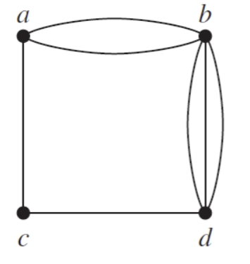

| Property | Value |
|----------|-------|
| Multiple Edges | Yes |
| Loops | No |
| Directed Edges | No |
| Undirected Edges | Yes |

Therefore, this graph is a multigraph.

## Question 2

> 
> Describe the type of the following graph.
> 
> 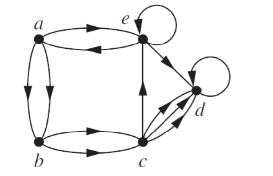

| Property | Value |
|----------|-------|
| Multiple Edges | Yes |
| Loops | Yes |
| Directed Edges | Yes |
| Undirected Edges | No |

Therefore, this graph is a directed multigraph.

## Question 3

> 
> For each graph in Questions 1 and 2 that is not simple, find a set of edges to remove to make it simple. Keep the size of the set as small as possible
> 

#### Graph 1

Graph 1 has the following parallel edges:

- (a, b) and (a, b)
- (b, d) and (b, d)

Therefore, we can remove one of the edges from each pair to make the graph simple. The set of edges to remove is:

- {(a, b), (b, d)}

#### Graph 2

Graph 2 has the following parallel edges:

- (a, b) and (a, b)
- (b, c) and (b, c)
- (c, d) and (c, d)

Graph 2 has the following loops:

- (e, e)
- (d, d)

Therefore, we can remove one of the edges from each pair and one of the loops to make the graph simple. The set of edges to remove is:

- {(a, b), (b, c), (c, d), (e, e), (d, d)}

## Question 4

> 
> Draw the acquaintanceship graph that represents that Tom and Patricia, Tom and Hope, Tom and Sandy, Tom and Amy, Tom and Marika, Jeff and Patricia, Jeff and Mary, Patricia and Hope, Amy and Hope, and Amy and Marika know each other, but none of the other pairs of people listed know each other.
> 

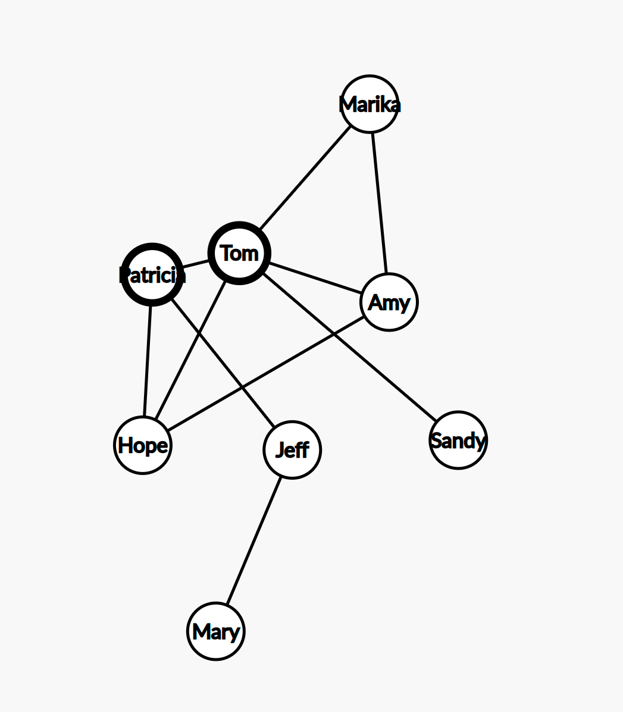

## Question 5

> 
> Construct the call graph for a set of seven telephone numbers 555-0011, 555-1221, 555-1333, 555-8888, 555-2222, 555-0091, and 555-1200 if there were three calls from  555-0011 to 555-8888 and two calls from 555-8888 to 555-0011, two calls from 555-2222 to 555-0091, two calls from 555-1221 to each of the other numbers, and one call from 555-1333 to each of 555-0011, 555-1221, and 555-1200.
> 

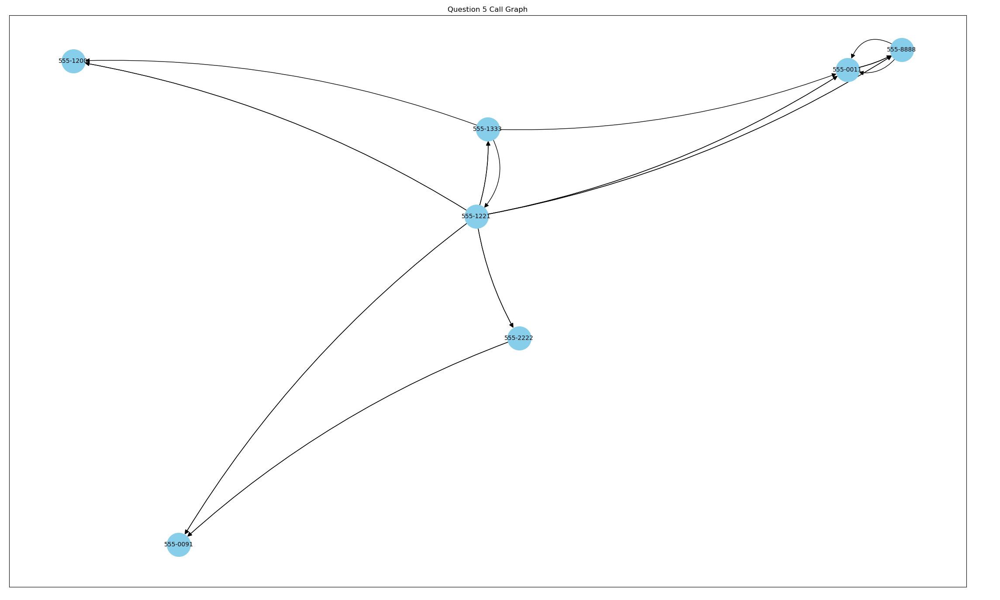

## Question 6

#### a) Explain how graphs can be used to model electronic mail messages in a network. Should the edges be directed or undirected? Should multiple edges be allowed? Should loops be allowed?

Electronic mail messages in a network can be modeled using a graph where the vertices represent the users and the edges represent the messages sent between the users. The edges should be directed because the messages are sent from one user to another. Multiple edges should be allowed because a user can send multiple messages to another user. Loops should not be allowed because a user cannot send a message to themselves.

#### b) Describe a graph that models the electronic mail sent in a network in a particular week.

The graph would have vertices representing the users and edges representing the messages sent between the users. Each edge would be labeled with the number of messages sent between the users. The graph would be directed, allow multiple edges, and not allow loops.

## Question 7

> 
> Find the number of vertices, the number of edges, and the degree of each vertex in the following undirected graph. Identify all isolated and pendant vertices.
>
> 
> 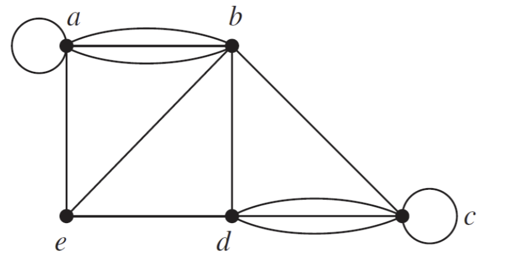

- Number of vertices: 5 (a, b, c, d, e)
- Number of edges: 13
  - (a, b)
  - (a, b)
  - (a, b)
  - (a, a)
  - (e, b)
  - (e, a)
  - (e, d)
  - (b, d)
  - (b, c)
  - (c, c)
  - (d, c)
  - (d, c)
  - (d, c)
- Degree of each vertex:
  - a: 4
  - b: 4
  - c: 4
  - d: 5
  - e: 3
- Isolated vertices: None

## Question 8

> 
> Is it possible to have 3 vertices with vertex degrees equal to 17 and the remaining vertex degrees are even in an undirected graph? Provide formal arguments to justify your answer.
> 

No, it is not possible to have 3 vertices with vertex degrees equal to 17 and the remaining vertex degrees are even in an undirected graph.

For the sake of contradiction, let's assume that it is possible to have 3 vertices with vertex degrees equal to 17 and the remaining vertex degrees are even in an undirected graph.

The sum of the degrees of all vertices in an undirected graph is equal to twice the number of edges. Therefore, the sum of the degrees of all vertices in the graph must be even.

Let's denote the degrees of the 3 vertices with degree 17 as a, b, and c. The sum of the degrees of these 3 vertices is 17 + 17 + 17 = 51, which is odd.

This contradicts the fact that the sum of the degrees of all vertices in the graph must be even. Therefore, it is not possible to have 3 vertices with vertex degrees equal to 17 and the remaining vertex degrees are even in an undirected graph. $\blacksquare$

## Question 9

> 
> Determine the number of vertices and edges and find the in-degree and out-degree of each vertex for the following directed multigraph.
> 
> 
> 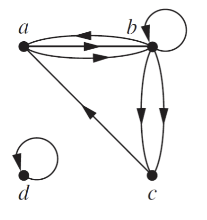

- Number of vertices: 4 (a, b, c, d)
- Edges:
  - (a, b)
  - (a, b)
  - (b, a)
  - (b, b)
  - (b, c)
  - (b, c)
  - (c, a)
  - (d, d)
- in-degree and out-degree of each vertex:
  - a: in-degree = 2, out-degree = 1
  - b: in-degree = 2, out-degree = 4
  - c: in-degree = 2, out-degree = 0
  - d: in-degree = 1, out-degree = 1

## Question 10

> 
> Show that in a simple graph with at least two vertices there must be two vertices that have the same degree.
> 

Assume FTSC that there exists a simple grpah $G$ with at least 2 vertices such that no two vertices have the same degree.

In a simple graph with $n$ vertices, the possible degrees of the vertices are $0, 1, 2, ..., n-1$. Since there are $n$ vertices and $n-1$ possible degrees, by the Pigeonhole Principle, there must be at least two vertices with the same degree.

This contradicts our assumption that no two vertices have the same degree. Therefore, there must be two vertices that have the same degree in a simple graph with at least two vertices. $\blacksquare$

## Question 11

> 
> Recall that Hall’s theorem provides a necessary and sufficient condition for complete matching in a bipartite graph $G=( V_1 ∪ V_2, E)$. Answer the following questions about this theorem with detailed reasoning.

#### A. 

> According to this theorem, if $|A| ≤ |N(A)|$ for every $A ⊆ V_1$, then there is a complete matching. In the proof it only considered two cases; **case 1**: every set of $j$ vertices has at least $j+1$ neighbors and **case 2**: there exists a set of $j$ vertices that have $j$ neighbors. Why doesn't the proof need to consider the case that every $j$ vertices have less than $j$ neighbors?

The proof of Hall's theorem does not need to consider the case where every $j$ vertices have less than $j$ neighbors because if every $j$ vertices have less than $j$ neighbors, then it is impossible to have a complete matching. In a bipartite graph, a complete matching requires that every vertex in one part has at least one neighbor in the other part. If every $j$ vertices have less than $j$ neighbors, then there are not enough neighbors to form a complete matching, and the condition for Hall's theorem is not satisfied.

#### B. 

> In case 1, what problem will you face if instead of removing 1 element out of $j$ elements,
you remove 2 elements?

If instead of removing 1 element out of $j$ elements, you remove 2 elements in case 1, you may face the problem of not being able to apply the induction hypothesis on the rest of the graph. The induction hypothesis in the proof of Hall's theorem relies on the fact that after removing 1 element out of $j$ elements, you can apply the induction hypothesis on the rest of the graph. If you remove 2 elements, the remaining graph may not satisfy the conditions of the induction hypothesis, and you may not be able to prove the existence of a complete matching.

#### C.

> In case 2, we match a set of $j$ vertices with $j$ neighbors and remove the matched vertices, then we say we should be able to apply IH on the rest of the graph. Otherwise, we show a contradiction. Why can’t we apply the same technique to case 1?
> 

In case 2, we match a set of $j$ vertives with $j$ neighbor and remove the matched vertices, then we say we should be able to apply the inductoin hypothesis on the rest of the graph. Otherwise, we show a contradiction. We cannot apply the same technique to case 1 because in case 1, we are removing only 1 element out of $j$ elements, and the remaining graph may not satisfy the conditions of the induction hypothesis. In case 2, we are removing all $j$ vertices and their neighbors, which simplifies the graph and allows us to apply the induction hypothesis on the rest of the graph. Removing only 1 element in case 1 does not simplify the graph enough to apply the induction hypothesis directly.

## Question 12

> 
> Suppose that a new company has five employees: Zamora, Agraharam, Smith, Chou, and Macintyre. 
> 
> Each employee will assume one of six responsibilities: planning, publicity, sales, marketing, development, and industry relations. 
> 
> Each employee is capable of doing one or more of these jobs: Zamora could do planning, sales, marketing, or industry relations; Agraharam could do planning or development; Smith could do publicity, sales, or industry relations; Chou could do planning, sales, or industry relations; and Macintyre could do planning, publicity, sales, or industry relations
> 
> 
> 

#### A. 

> Model the capabilities of these employees using a bipartite graph. 
> 
> 

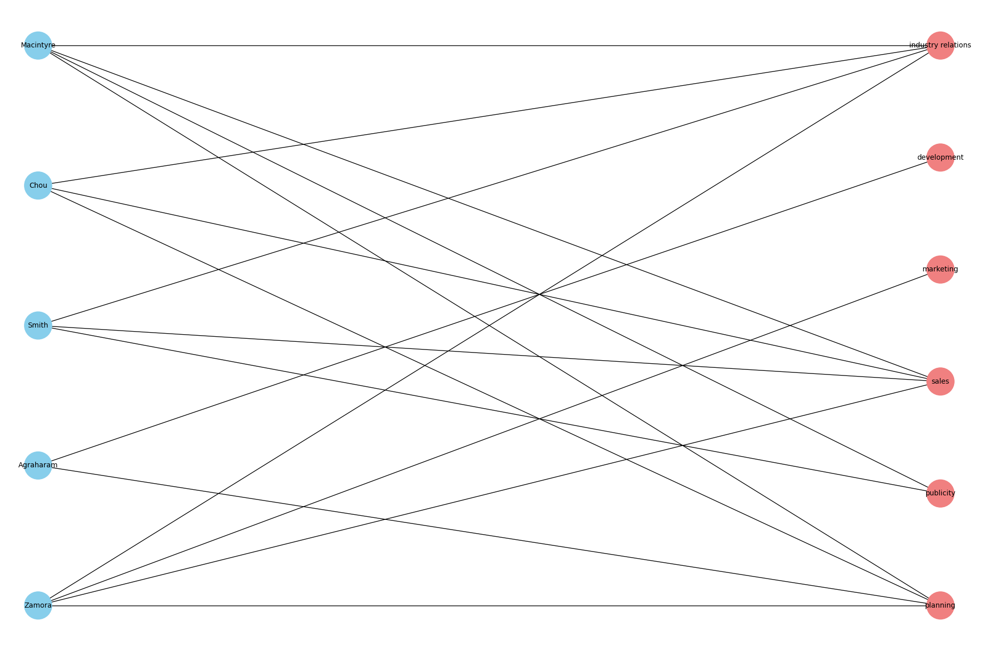

#### B. 

> Find an assignment of responsibilities such that each employee is assigned one responsibility. 

Possible assignment of responsibilities:

- Agraharam: planning
- Smith: publicity
- Macintyre: sales
- Chou: industry relations
- Zamora: marketing
- Unassigned: development

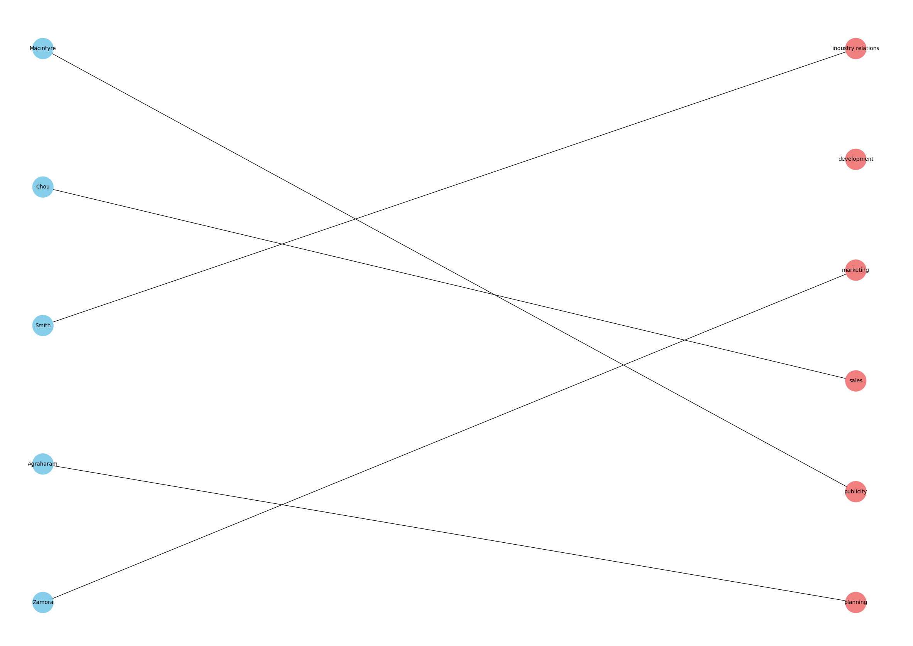

#### C. 

> Is the matching of responsibilities you found in part B a complete matching from employees to responsibilities? Is it a maximum matching?
> 

The matching found in part B is a complete matching from employees to responsibilities because every employee is assigned to a unique responsibility, $|M| = 5 = |V_1|$.

However, it is not a maximum matching because there are unassigned responsibilities (development) that could be assigned to employees.

## Question 13

> 
> Use an adjacency list to represent the following graph.
> 
> 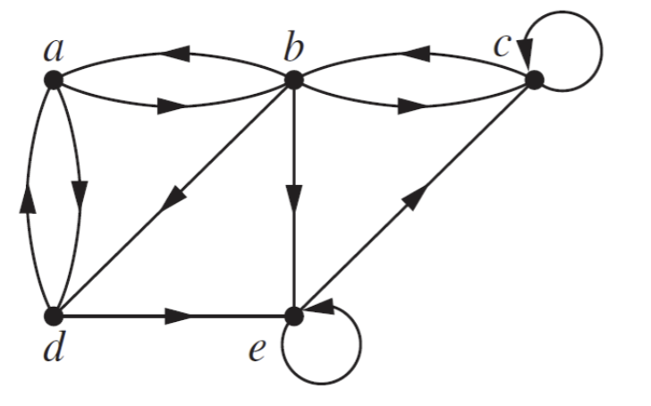

| Initial Vertex | Teminal Vertices |
|--------|-------------------|
| a      | b, d              |
| b      | a, c, e, d        |
| c      | c, b             |
| d      | a, e            |
| e      | e, c           |

## Question 14

> 
> Determine whether the following pair of graphs is isomorphic. Exhibit an isomorphism or provide a rigorous argument that none exists.
> 
> 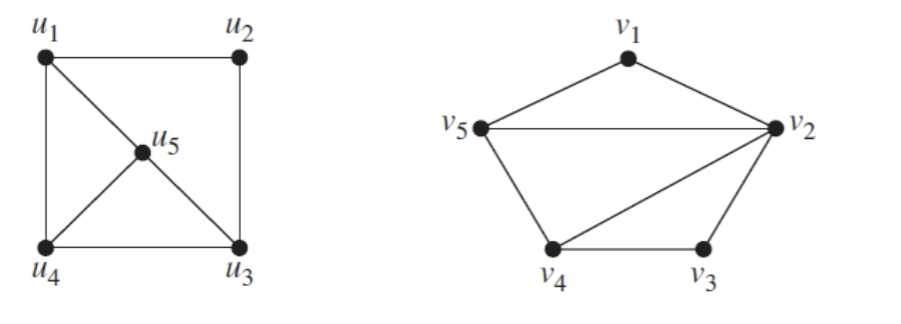

The simples graphs $G_1 = (V_1, E_1)$ and $G_2 = (V_2, E_2)$ are isomorphic if there exists a bijection $f: V_1 \to V_2$ such that for every pair of vertices $u, v \in V_1$, $(u, v) \in E_1$ if and only if $(f(u), f(v)) \in E_2$.

Such a function $f$ is called an isomorphism.

- Both graphs have 5 vertices and 7 edges
- The degree sequence of $U$ is (3, 2, 3, 3, 3)
- The degree sequence of $V$ is (2, 4, 2, 3, 3)

Since the degree sequence of $U$ and $V$ are different, the graphs are not isomorphic $\blacksquare$

## Question 15

> 
> Determine whether the following pair of graphs is isomorphic. Exhibit an isomorphism or provide a rigorous argument that none exists.
> 
> 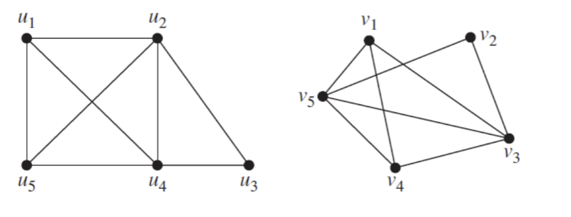

- Both graphs have 5 vertices and 8 edges
- The degree sequence of $U$ is (3, 4, 2, 4, 3)
- The degree sequence of $V$ is (3, 2, 4, 3, 4)
- There is a circuit of length 6 in $U$: $u_1 \to u_4 \to u_3 \to u_2 \to u_5 \to u_1$
- There is no circuit of length 6 in $V$
- Therefore, the graphs are not isomorphic $\blacksquare$