## Question 1

> 
> Determine whether the following graph is strongly connected and if not, whether it is weakly
connected. 
> 
> 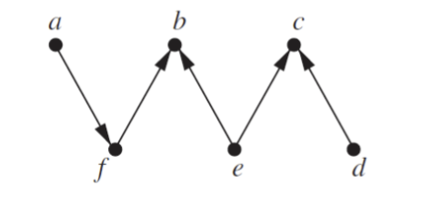
>


The graph is not strongly connected. There is no path from b, c, or d to a. You cannot reach vertex 'a' from vertices 'b', 'c', or 'd' by following the directed edges.

However, the graph is weakly connected. If we ignore the direction of the edges, there's a path between every pair of vertices.

## Question 2

> 
> Determine whether the following graph is strongly connected and if not, whether it is weakly connected

> 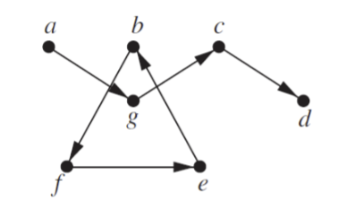
>

This graph is not strongly connected.

The graph is not weakly connected either, since there is no path from vertex 'a' to vertex 'f', for instance.


## Question 3

> 
> In Exercises 3–6 determine whether the given graph has an Euler circuit. Construct such a circuit when one exists. If no Euler circuit exists, determine whether the graph has an Euler path and construct such a path if one exists.
> 
> 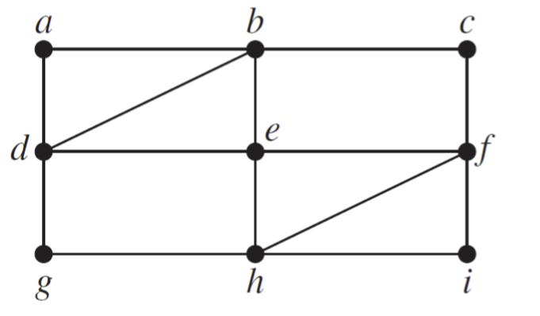
>


The given graph does have a Euler circuit. A graph has a Euler circuit if and only if all vertices have an even degree.

One possible Euler circuit for this graph is `a - b - e - d - g - h - f - c - i - f - a`


The graph does not have a Euler path. A graph has an Euler path if and only if exactly two vertices have an odd degree, and all other vertices have an even degree.


## Question 4

> 
> 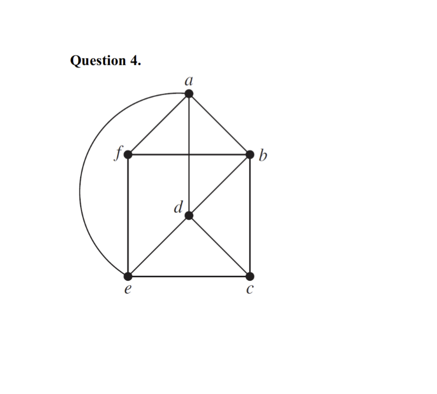
> 


The graph does not have a Euler circuit. A graph has a Euler circuit if and only if all vertices have an even degree. The degree of f is 3, so the graph does not have a Euler circuit.

The graph only has one vertex with an odd degree, so it does not have an Euler path either. A graph has an Euler path if and only if exactly two vertices have an odd degree, and all other vertices have an even degree.


## Question 5

> 
> 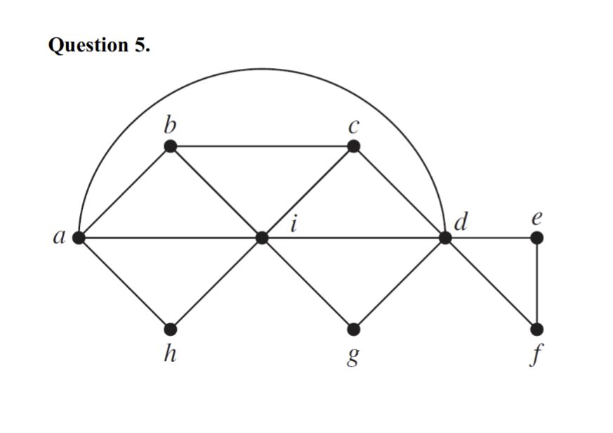
> 

This graph has all even degree vertices except b and c. So, it does not have an Euler circuit.

The graph has two vertices with an odd degree, so it does have an Euler path. One possible Euler path is `b - a - h - i - g - d - e - f - d - c - b`


## Question 6

> 
> 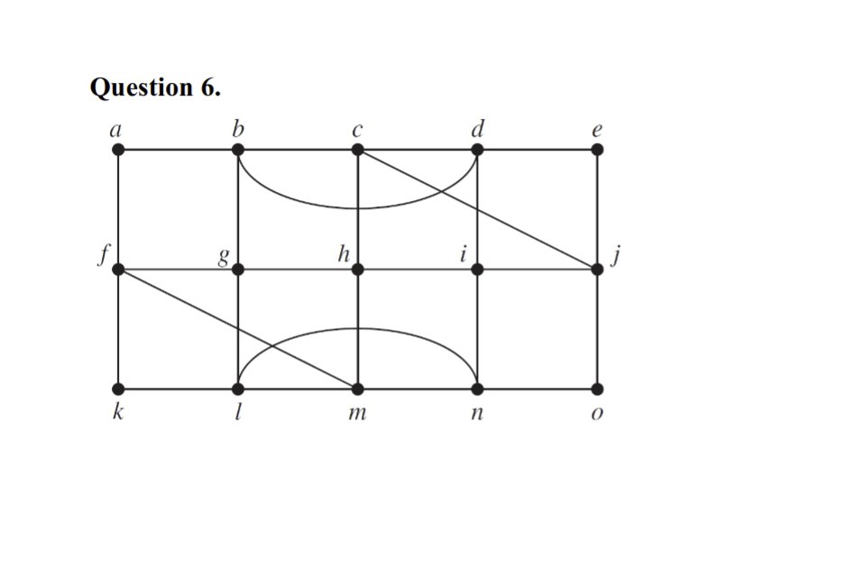
> 


The graph does have an Euler circuit. All vertices have even degree - Each vertex in the graph has a degree of 2 or 4. A graph has an Euler circuit if and only if all of its vertices have even degree.
Here's one possible Euler circuit:

`a - b - c - d - e - j - o - n - i - d - h - c - g - f - k - l - m - h - i - j - f - a`

The graph does not have an Euler path. A graph has an Euler path if and only if exactly two vertices have an odd degree, and all other vertices have an even degree.

## Question 7

> Find the length of a shortest path between a and z in the given weighted graph
> 
> 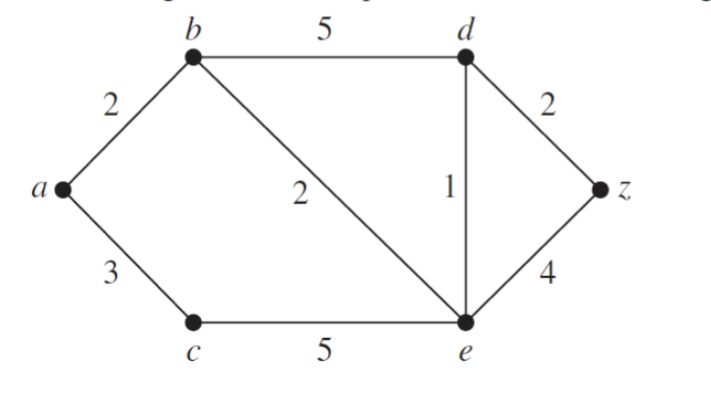
> 


To find the shortest path between a and z in the given weighted graph, you can use Dijkstra's algorithm

1. Initialize distances from the source vertex 'a' to all other vertices as infinite and distance to itself as 0. Create an empty priority queue pq. Every item of pq is a pair (weight, vertex). Initialize pq with source vertex 'a' and its distance as 0.
2. Set the initial node as a and update distances to its neighbors: $d(b) = 2$, $d(c) = 3$
3. Choose the vertex with the smallest distance from the priority queue. In this case, it is vertex 'b' with distance 2. Update distances to its neighbors: $d(d) = d(b) + 5 = 2 + 5 = 7$, $d(e) = d(b) + 2 = 2 + 2 = 4$ 
4. Choose the vertex with the smallest distance from the priority queue. In this case, it is vertex 'c` with distance 3. Update distances to its neighbors: $d(e) = d(c) + 5 = 3 + 5 = 8$
5. Choose the vertex with the smallest distance from the priority queue. In this case, it is vertex 'e' with distance 4. Update distances to its neighbors: $d(d) = d(e) + 1 = 4 + 1 = 5$, $d(z) = d(e) + 4 = 4 + 4 = 8$
6. Choose the vertex with the smallest distance from the priority queue. In this case, it is vertex 'd' with distance 5. Update distances to its neighbors: $d(z) = d(d) + 2 = 5 + 2 = 7$

The shortest path from 'a' to 'z' is `a - b - d - z` with a length of 7.


## Question 8

> Find the length of a shortest path between a and z in the given weighted grap
> 
> 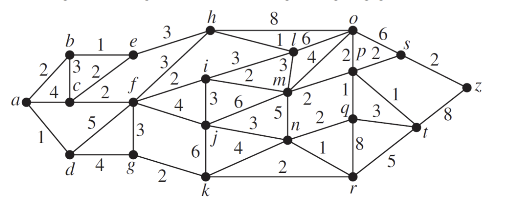
> 

1. d
2. b
3. e
4. c
5. g
6. f
7. h
8. k
9. i
10. j
11. m
12. o
13. p
14. n
15. q
16. s
17. t
18. z

The shortest path from 'a' to 'z' is `a - d - g - k - j - m - n - q - t - z` with a length of 22.

## Question 9

> 
> Extend Dijkstra’s algorithm for finding the length of a shortest path between two vertices in a weighted simple connected graph so that a shortest path between these vertices is constructed.
> 

```python
def dijkstra(graph, start, end):
    # Initialize distances from the source vertex to all other vertices as infinite and distance to itself as 0
    distances = {vertex: float('infinity') for vertex in graph}
    distances[start] = 0

    # Create an empty priority queue pq. Every item of pq is a pair (weight, vertex). Initialize pq with source vertex and its distance as 0
    pq = [(0, start)]

    # Initialize dictionary to store the previous vertex in the shortest path
    previous_vertices = {vertex: None for vertex in graph}

    while len(pq) > 0:
        current_distance, current_vertex = heapq.heappop(pq)

        # If the current distance is greater than the distance in the distances dictionary, skip
        if current_distance > distances[current_vertex]:
            continue

        for neighbor, weight in graph[current_vertex].items():
            distance = current_distance + weight

            # If the distance to the neighbor is less than the current distance, update the distance and previous vertex
            if distance < distances[neighbor]:
                distances[neighbor] = distance
                previous_vertices[neighbor] = current_vertex
                heapq.heappush(pq, (distance, neighbor))

    path = []
    while end:
        path.append(end)
        end = previous_vertices[end]
    return path[::-1]
```

## Question 10

> 
> Is a shortest path between two vertices in a weighted graph unique if the weights of edges are distinct?
> 


A shortest path between two vertices in a weighted graph is not necessarily unique even if the weights of edges are distinct. There can be multiple paths with the same minimum weight between two vertices in a weighted graph. The uniqueness of the shortest path depends on the structure of the graph and the weights of the edges. If there are multiple paths with the same minimum weight, any of these paths can be considered as a shortest path between the two vertices.


## Question 11

> 
> Draw the given planar graph without any crossings.
> 
> 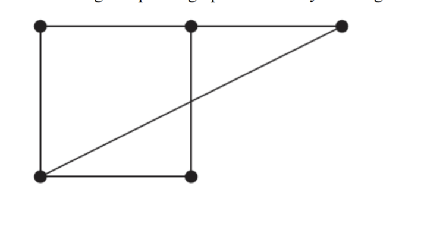
>


1. Identify the vertices and edges. This graph has 4 vertices forming a square and an additional diagonal edge.
2. Rearrange the vertices in a way that avoids edge crossings. One simple method is to draw it in a triangular configuration where each vertex is connected to all others without crossing lines.


```
    a
   / \
  /   \
 b-----c
  \   /
   \ /
    d
```

## Question 12

> 
> Draw the given planar graph without any crossings.
> 
> 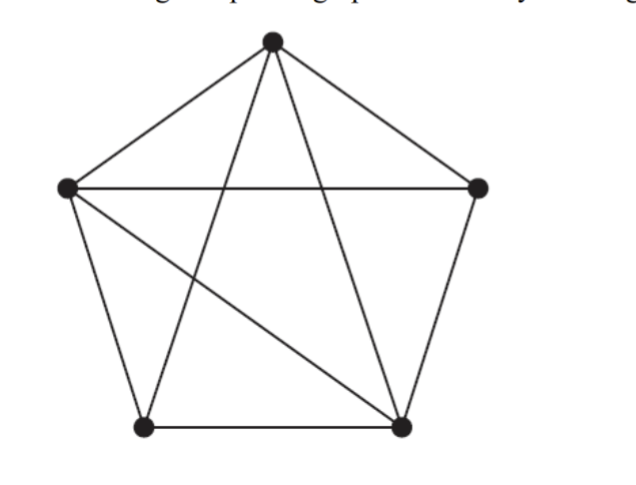

![alt text)(q12_solution.png)


## Question 13

> 
> Determine whether the given graph is planar. If so, draw it so that no edges cross.
>
> 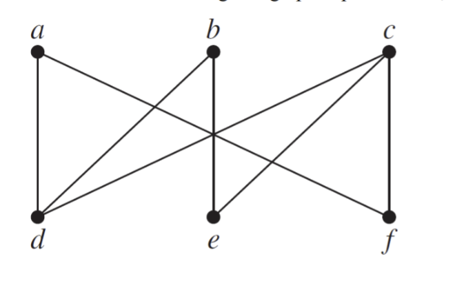

The graph is not planar.

- Kuratowski's Theorem: A graph is non-planar if and only if it contains a subgraph that is a subdivision of $K_5$ (the complete graph on five vertices) or $K_{3,3} (the complete bipartite graph on two sets of three vertices)
- Finding a $K_{3,3}$ Subdivision: 
  - In the given graph, we can find a subdivision of $K_{3,3}$ by identifying two sets of vertices such that each vertex in one set is connected to every vertex in the other set.
  - Let one set of vertices be {a, c, e}.
  - Let the other set of vertices be {b, d, f}.
  - Notice that every vertex in the first set is connected to every vertex in the second set, either directly or through a path (e.g., a-d-b, c-e-d, e-b).


Since the graph contains a subdivision of $K_{3,3}$, it is non-planar.


## Question 14

> 
> Determine whether the given graph is planar. If so, draw it so that no edges cross.
> 
> 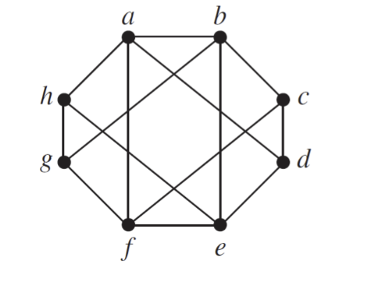
> 

Finding a $K_{3,3}$ Subdivision:

- Let one set of vertices be {a, c, e}.
- Let the other set of vertices be {b, d, f}.
- Notice that every vertex in the first set is connected to every vertex in the second set, either directly or through a path:
  - a is connected to b, d, and f.
  - c is connected to b, d, and f.
  - e is connected to b, d, and f.

Since the graph contains a subdivision of $K_{3,3}$, it is non-planar.


## Question 15

> 
> Suppose that a connected planar graph has eight vertices, each of degree three. Into how many regions is the plane divided by a planar representation of this graph?
>

The number of regions in a planar graph can be calculated using Euler's formula: $V - E + F = 2$, where $V$ is the number of vertices, $E$ is the number of edges, and $F$ is the number of regions.

Given that the graph has eight vertices, each of degree three, the number of edges can be calculated as $E = \frac{3V}{2}$ (since each edge is counted twice). Substituting the values into Euler's formula:

$8 - \frac{3(8)}{2} + F = 2$

$8 - 12 + F = 2$

$F = 6$

Therefore, the plane is divided into 6 regions by a planar representation of this graph.


## Extra Credit

> Show that the problem of finding a circuit of minimum total weight that visits every vertex of a weighted graph at least once can be reduced to the problem of finding a circuit of minimum total weight that visits each vertex of a weighted graph exactly once. Do so by constructing a new weighted graph with the same vertices and edges as the original graph but whose weight of the edge connecting the vertices u and v is equal to the minimum total weight of a path from u to v in the original graph
>

To show that the problem of finding a circuit of minimum total weight that visits every vertex of a weighted graph \( G \) at least once (Problem A) can be reduced to the problem of finding a circuit of minimum total weight that visits each vertex exactly once (Problem B), follow these steps:

1. **Constructing \( G' \):**
    - Let \( G = (V, E) \) be the original graph.
    - Construct \( G' = (V, E') \), where \( E' \) consists of edges connecting every pair of vertices in \( V \).
    - The weight of an edge \((u, v) \in E'\) in \( G' \) is the minimum total weight of a path from \( u \) to \( v \) in \( G \).

2. **Solving Problem A using Problem B:**
    - Find a Hamiltonian circuit of minimum total weight in \( G' \) (Problem B).
    - The solution to Problem B in \( G' \) represents the minimum weight circuit in \( G \) that visits every vertex at least once by using the shortest paths between vertices.

This reduction shows that solving Problem A can be transformed into solving Problem B.
