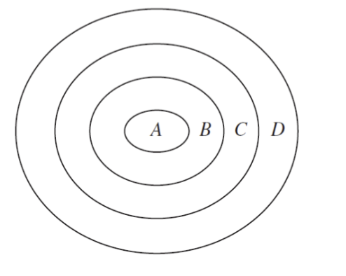
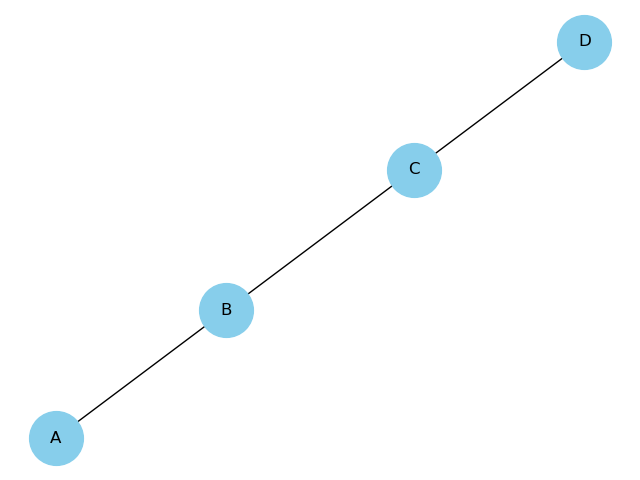
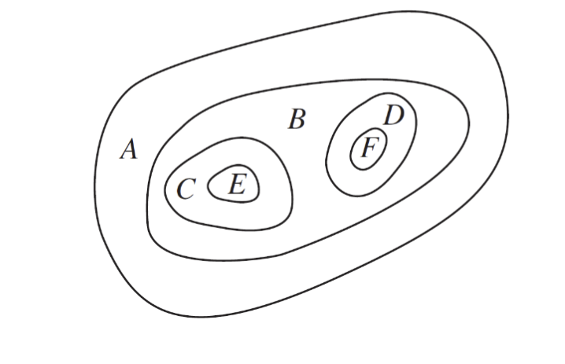
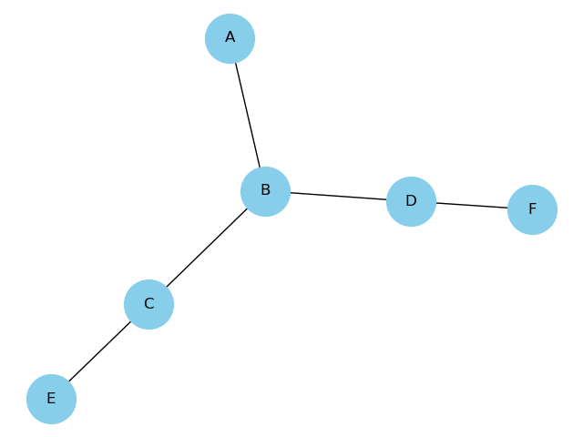
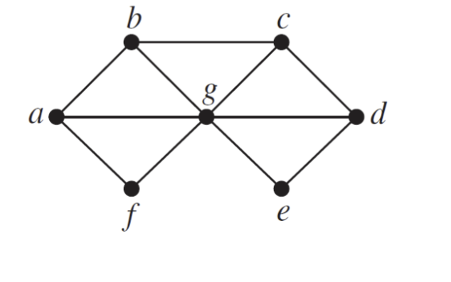
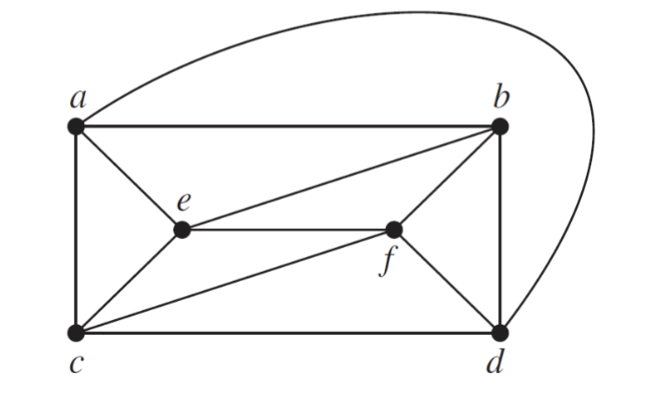
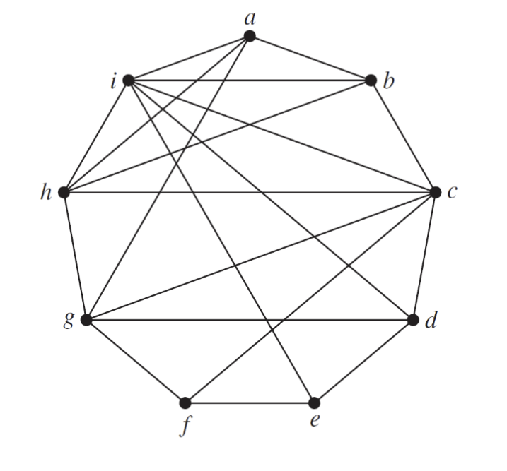
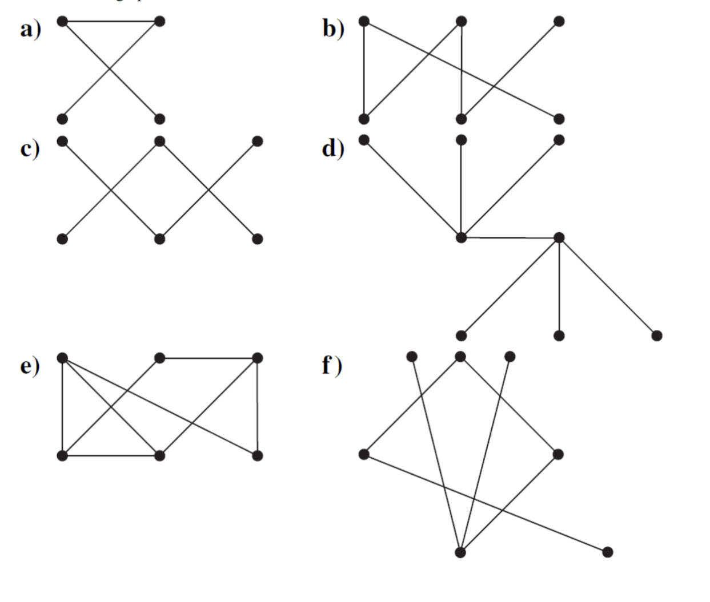
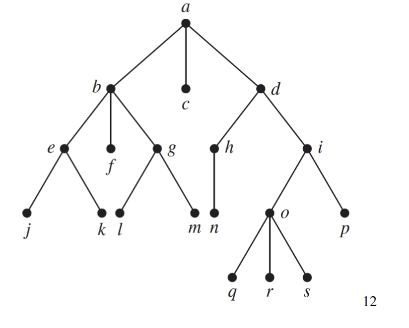

## Question 1

> 
> In Questions 1–2 construct the dual graph for the map shown. Then find the number of colors needed to color the map so that no two adjacent regions have the same color
> 
> 
>

Since the dual graph of the concentric circles is a path graph (a straight line), you only need two colors to color it so that no adjacent regions have the same color.

## Question 2

> 
> 
> 

You can color the graph (and therefore the original map) with two colors. Here's one possible coloring:

- A: Blue
- B: Red
- C: Blue
- D: Blue
- E: Red
- F: Red

## Question 3

> 
> In Questions 3–5 find the chromatic number of the given graph.
> 
> 
> 

The chromatic number of a graph is the smallest number of colors needed to color the vertices of so that no two adjacent vertices share the same color.   

| vertex | adjacent vertices | invalid colors  | color |
|--------|-------------------|-----------------|-------|
| a      | b, f, g           |                 | 1     |
| b      | a, c, g           | 1               | 2     |
| f      | a, g              | 1               | 2     |
| c      | b, d, g           | 2               | 1     |
| d      | c, e, g           | 1               | 2     |
| e      | d, g              | 2               | 1     |
| g      | a, b, c, d, e, f  | 1, 2            | 3     |

We have successfully colored all vertices with 3 colors, and no adjacent vertices share the same color.  Therefore, the chromatic number of this graph is 3.

## Question 4

> 
> 
> 

| vertex | adjacent vertices | invalid colors  | color |
|--------|-------------------|-----------------|-------|
| a      | c, e, b, d        |                 | 1     |
| b      | a, e, f, d        | 1               | 2     |
| d      | b, f, c, a        | 1, 2            | 3     |
| c      | a, e, f, d        | 1, 3            | 2     |
| e      | a, c, f, b        | 1, 2            | 3     |
| f      | b, c, e, d        | 1, 2, 3         | 4     |

We have successfully colored all vertices with 4 colors, and no adjacent vertices share the same color.  Therefore, the chromatic number of this graph is 4.

## Question 5

> 
> 
> 

| vertex | adjacent vertices | invalid colors  | color |
|--------|-------------------|-----------------|-------|
| a      | i, h, g, b        |                 | 1     |
| b      | a, i, h, c        | 1               | 2     |
| c      | b, i, h, g, f, d  | 2               | 1     |
| d      | c, i, g, e        | 1               | 2     |
| e      | d, i, f           | 2               | 1     |
| f      | e, c, g           | 1               | 2     |
| g      | f, d, a, h        | 1, 2            | 3     |
| h      | g, c, b, a, i     | 1, 2, 3         | 4     |
| i      | a, b, c, d, e, h  | 1, 2, 4         | 3     |

We have successfully colored all vertices with 4 colors, and no adjacent vertices share the same color.  Therefore, the chromatic number of this graph is 4.

## Question 6

> 
> Which graphs have a chromatic number of 1?
> 

A graph has a chromatic number of 1 if and only if it consists of isolated vertices -- i.e., it is an empty graph.

## Question 7

> 
> What is the least number of colors needed to color a map of the United States? Do not consider adjacent states that meet only at a corner. Suppose that Michigan is one region. Consider the vertices representing Alaska and Hawaii as isolated vertices. Explain your reasoning.
> 

The United States can be represented as a planar graph with 50 vertices, one for each state.  The graph is planar because the states are contiguous and do not overlap.  The graph is connected because every state shares a border with at least one other state.  The graph is also simple because there are no loops or multiple edges between any two vertices. 

We can start coloring the graph using a state with many borders like Idaho. Let Idaho be color 1. On Idaho's border, we will alternate colors 3/2: Montana 3, Wyoming 2, Utah 3, Nevada 2, Oregon 3, Washington 2. 

Now, we must color California with color 1 since it borders both Oregon (3) and Nevada (2).  But then Arizona will border California (1), Nevada (2) and Utah (3), so we must color Arizona with color 4.

Since we know that in at least one case we will need 4 colors, and also that we will not need more than 4 colors by the Four Color Theorem, we can conclude that the least number of colors needed to color a map of the United States is 4. $\blacksquare$

## Question 8

> 
> Show that a simple graph that has a circuit with an odd number of vertices in it cannot be colored using two colors.
> 

Let $G$ be a simple graph with a circuit $C$ that has an odd number of vertices.  Suppose that $G$ can be colored with two colors.  Let $v_1, v_2, \ldots, v_{2n+1}$ be the vertices of $C$ in order.  Since $C$ is a circuit, $v_1$ and $v_{2n+1}$ are adjacent.  Since $G$ can be colored with two colors, $v_1$ and $v_{2n+1}$ must have different colors.  But $v_1$ and $v_{2n+1}$ are adjacent, so they must have the same color.  This is a contradiction, so $G$ cannot be colored with two colors. $\blacksquare$

## Question 9

> 
> How many different channels are needed for six stations located at the distances shown in the table, if two stations cannot use the same channel when they are within 150 miles of each other?

| | 1 | 2 | 3 | 4 | 5 | 6 |
|---|---|---|---|---|---|---|
| 1 | - | 85 | 175 | 200 | 50 | 100 |
| 2 | 85 | - | 125 | 175 | 100 | 160 |
| 3 | 175 | 125 | - | 100 | 200 | 250 |
| 4 | 200 | 175 | 100 | - | 210 | 220 |
| 5 | 50 | 100 | 200 | 210 | - | 100 |
| 6 | 100 | 160 | 250 | 220 | 100 | - |

We can construct a graph based on the distances:

- Station 1 is connected to stations 2, 5, and 6.
- Station 2 is connected to stations 1, 3, 4, 5, and 6.
- Station 3 is connected to stations 2 and 4.
- Station 4 is connected to stations 2, and 3.
- Station 5 is connected to stations 1, 2, and 6.
- Station 6 is connected to stations 1, 2, and 5.

We can color the graph using the greedy algorithm:

- Station 1: Channel 1
- Station 2: Channel 2
- Station 3: Channel 1
- Station 4: Channel 2
- Station 5: Channel 3
- Station 6: Channel 1
- Total channels: 3

Therefore, we need 3 channels for the six stations.

## Question 10

> 
> A zoo wants to set up natural habitats in which to exhibit its animals. Unfortunately, some animals will eat some of the others when given the opportunity. How can a graph model and a coloring be used to determine the number of different habitats needed and the placement of the animals in these habitats?
>
> 

To determine the number of habitats needed for zoo animals, model the problem as a graph where each animal is a vertex. Draw an edge between two vertices if the animals will eat each other. Color the graph such that no two adjacent vertices share the same color. The minimum number of colors needed is the chromatic number, which indicates the number of habitats required. Use graph coloring algorithms like greedy coloring to assign colors and determine the habitat placement. For instance, if the graph is a cycle, an even cycle needs two colors, while an odd cycle needs three.

## Question 11

> 
> Which of these graphs are trees?
> 
>
> 
>

A tree is a connected graph with no cycles. Graphs a and d are the only graphs in the image that satisfy both of these conditions.

## Question 12

> Answer these questions about the rooted tree illustrated.
> 
> 
> 

#### a) Which vertex is the root?

$a$

#### b) Which vertices are internal?

Internal Vertices: The internal vertices are those with children. These include vertices $a$, $b$, $d$, $e$, $g$, $h$, $i$, $o$.

#### c) Which vertices are leaves?

Leaves: The leaves are the vertices with no children. These include vertices $c$, $f$, $j$, $k$, $l$, $m$, $n$, $p$, $q$, $r$, $s$.

#### d) Which vertices are children of j?

$j$ has no children.

#### e) Which vertex is the parent of h?

$h$'s parent is $d$.

#### f) Which vertices are siblings of o?

The siblings of $o$ are $p$.

#### g) Which vertices are ancestors of m?

The ancestors of vertex $m$ are the vertices in the path from the root to $m$. These include $a$, $b$, and $g$.

#### h) Which vertices are descendants of b?

The descendants of vertex $b$ are the vertices in the subtree rooted at $b$. These include vertices $e$, $f$, $g$, $j$, $k$, $l$, and $m$.

## Question 13

> 
> Which complete bipartite graphs $K_{m,n}$, where $m$ and $n$ are positive integers, are trees?
> 

For $K_{m,n}$ to be a tree, it must be connected ($K_{m,n}$ is always connected if $m$ and $n$ are positive integers) and have no cycles ($K_{m,n}$ is a tree iff it has exactly $V - 1$ edges, where $V$ is the number of vertices).

$K_{m,n}$ has $m + n$ vertices and $m \cdot n$ edges.  For $K_{m,n}$ to be a tree, it must have $m + n - 1$ edges.  Therefore, $m \cdot n = m + n - 1$.  This equation simplifies to $(m - 1)(n - 1) = 2$

The only pairs of positive integers that satisfy this equation are $(m, n) = (2, 3)$ and $(m, n) = (3, 2)$.  Therefore, $K_{2,3}$ and $K_{3,2}$ are the only complete bipartite graphs that are trees. $\blacksquare$

## Question 14

> 
> How many vertices does a full 5-ary tree with 100 internal vertices have
> 

How many vertices does a full 5-ary tree with 100 internal vertices have?

- A full 5-ary tree has 5 children per internal vertex.
- Internal vertices are nodes with children.

Let $I$ be the number of internal vertices and $L$ be the number of leaf vertices.

The number of vertices in a full 5-ary tree is $I + L$.

The number of edges in a full 5-ary tree is $5I$, because each internal vertex contributes to 5 edges.

In a tree, the number of edges is $V - 1$, where $V$ is the total number of vertices. Thus, we have:
$$
5I = (I + L) - 1
$$
Since the tree is full, $L = 5I$. Substituting this into the equation:
$$
5I = (I + 5I) - 1
$$
$$
5I = 6I - 1
$$
$$
1 = I
$$

Given $I = 100$:
$$
L = 5 \times 100 = 500
$$
The total number of vertices is:
$$
V = I + L = 100 + 500 = 600
$$

Therefore, the full 5-ary tree with 100 internal vertices has $600$ vertices.

## Question 15

> 
> A complete m-ary tree is a full m-ary tree in which every leaf is at the same level. How many vertices and how many leaves does a complete m-ary tree of height h have?
> 

A complete $m$-ary tree is a full $m$-ary tree in which every leaf is at the same level. 

Let $h$ be the height of the tree. We want to find the number of vertices and leaves in a complete $m$-ary tree of height $h$.

- The tree has $h + 1$ levels, ranging from level $0$ (the root) to level $h$ (the leaves).
- The number of nodes at level $i$ is $m^i$.
- Summing over all levels gives the total number of vertices.

The total number of verticies is then $V = \sum_{i=0}^{h} m^i$. This is a geometric series, so:

$$
V = \frac{m^{h+1} - 1}{m - 1}
$$

The number of leaves is $m^h$. Therefore, for a complete $m$-ary tree of height $h$:

- The total number of vertices is: $V = \frac{m^{h+1} - 1}{m - 1}$
- The number of leaves is $L = m^h$
