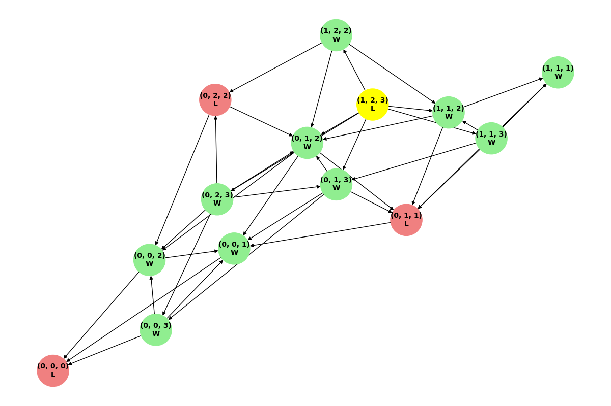
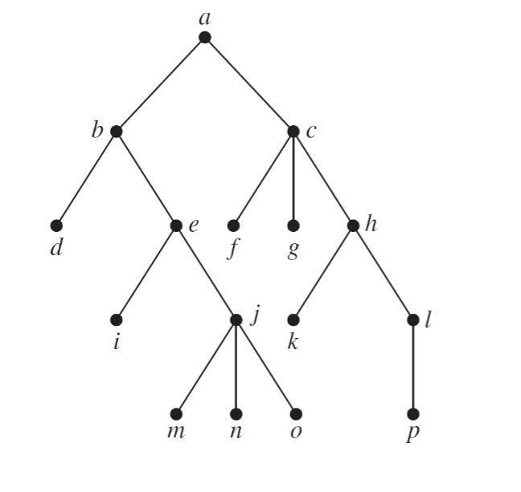
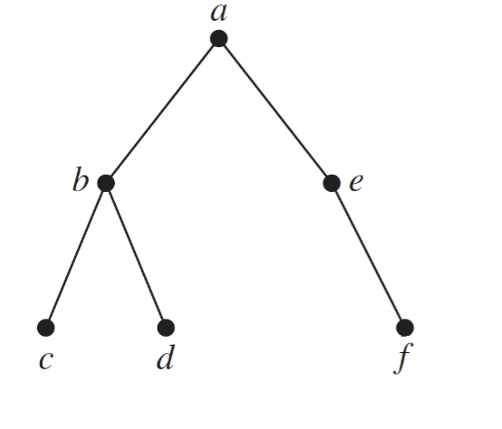
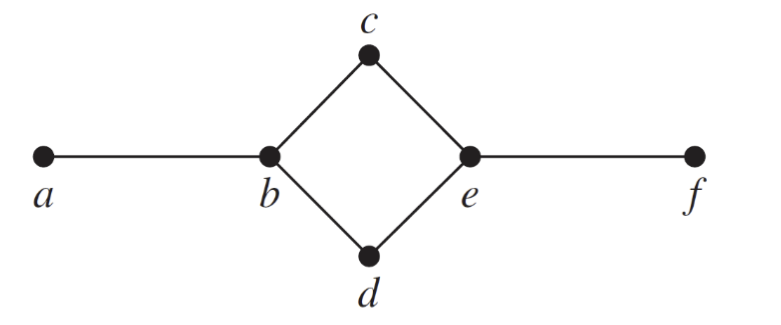
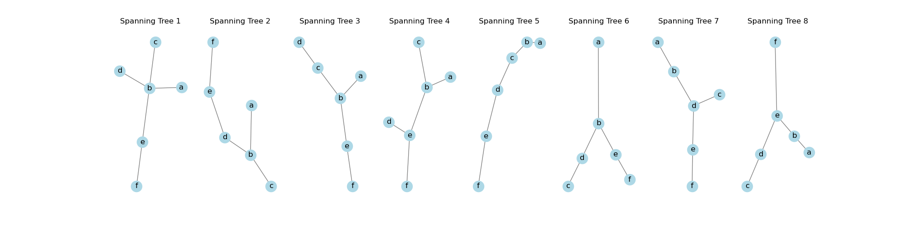
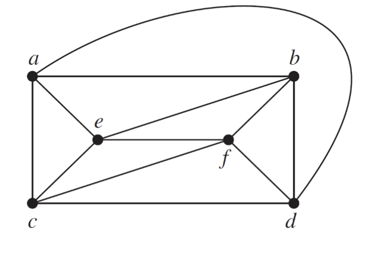
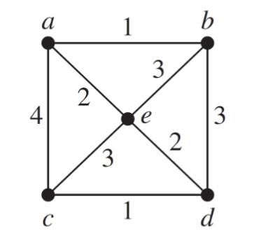

## Question 1

> 
> How many weighings of a balance scale are needed to find a lighter counterfeit coin among four coins? Describe an algorithm to find the lighter coin using this number of weighings. 
> 

The counterfeit coin can be found in two weighings. The algorithm is as follows:

1. Divide the four coins into two groups of two coins each.
2. Weigh the two groups against each other.
3. If the two groups weigh the same, the counterfeit coin is one of the two remaining coins. Weigh one of the remaining coins against a known good coin to find the counterfeit coin.
4. If one of the groups is lighter, weigh the two coins in the lighter group against each other. The lighter coin is the counterfeit coin.
5. If one of the groups is heavier, weigh the two coins in the heavier group against each other. The lighter coin is the counterfeit coin.
6. The counterfeit coin is found in two weighings.


## Question 2

> 
> Use Huffman coding to encode these symbols with given frequencies: `A: 0.10`, `B: 0.25`, `C: 0.05`, `D: 0.15`, `E: 0.30`, `F: 0.07`, `G: 0.08`. What is the average number of bits required to encode a symbol?
> 


Huffman Codes: {`G`: `000`, `A`: `001`, `B`: `01`, `C`: `1000`, `F`: `1001`, `D`: `101`, `E`: `11`}

Average number of bits required to encode a symbol = $0.10 * 2 + 0.25 * 2 + 0.05 * 4 + 0.15 * 3 + 0.30 * 2 + 0.07 * 4 + 0.08 * 4 = 2.55$


## Question 3

> 
> Draw a game tree for nim if the starting position consists of three piles with one, two, and three stones, respectively. When drawing the tree, represent by the same vertex the symmetric positions that result from the same move. Find the value of each vertex of the game tree.Who wins the game if both players follow an optimal strategy?
> 



The winner is the second player if both players follow an optimal strategy.


## Question 4

> 
> Provide the preorder traversal of the vertices of the following tree. Use the recursive algorithm and show the steps of the algorithm.
> 
> 
>


Preorder Traversal:


```
Visit a
  Visit b
    Visit d
    Visit e
      Visit i
  Visit c
    Visit f
      Visit j
        Visit m
        Visit n
        Visit o
          Visit p
      Visit g
    Visit h
      Visit l
```


Traversal Order: [`a`, `b`, `d`, `e`, `i`, `c`, `f`, `j`, `m`, `n`, `o`, `p`, `g`, `h`, `l`]


## Question 5

> 
> Provide the preorder traversal of the vertices of the following tree. Use an iterative process that goes through the boundary of the edges; Show the steps of the process.
> 
> 
>


Iterative Preorder Traversal Steps:

1. Visit a
1. Push e to stack
1. Push b to stack
1. Visit b
1. Push d to stack
1. Push c to stack
1. Visit c
1. Visit d
1. Visit e
1. Push f to stack
1. Visit f


Traversal Order: [`a`, `b`, `c`, `d`, `e`, `f`]


## Question 6

> 
> Draw all the spanning trees of the given simple graph
> 
> 
>




## Question 7

> 
> Use backtracking to try to find a coloring of the graphs shown below using three colors
> 
> 
>

```
Coloring vertex c with red
  Coloring vertex f with green
    Coloring vertex b with red
      Coloring vertex a with green
        Coloring vertex e with blue
          Coloring vertex d with blue
Graph coloring possible with three colors.
```


## Question 8

> 
> Use Prim’s algorithm to find a minimum spanning tree for the given weighted graph.
>
> 
>


1. Starting at node a
     - Initial edges: [(1, `a`, `b`), (4, `a`, `c`), (2, `a`, `e`)]
2. Selected edge (a, b) with weight 1
    - Adding edge (a, b) to MST
    - Visited nodes: {`b`, `a`}
    - Adding edge (b, d) with weight 3 to the priority queue
    - Adding edge (b, e) with weight 3 to the priority queue
    - Current MST edges: [(`a`, `b`, 1)]
3. Selected edge (a, e) with weight 2
    - Adding edge (a, e) to MST
    - Visited nodes: {`b`, `a`, `e`}
    - Adding edge (e, c) with weight 3 to the priority queue
    - Adding edge (e, d) with weight 2 to the priority queue
    - Current MST edges: [(`a`, `b`, 1), (`a`, `e`, 2)]
4. Selected edge (e, d) with weight 2
    - Adding edge (e, d) to MST
    - Visited nodes: {`d`, `b`, `a`, `e`}
    - Adding edge (d, c) with weight 1 to the priority queue
    - Current MST edges: [(`a`, `b`, 1), (`a`, `e`, 2), (`e`, `d`, 2)]
5. Selected edge (d, c) with weight 1
    - Adding edge (d, c) to MST
    - Visited nodes: {`d`, `b`, `a`, `c`, `e`}
    - Current MST edges: [(`a`, `b`, 1), (`a`, `e`, 2), (`e`, `d`, 2), (`d`, `c`, 1)]
6. Selected edge (b, d) with weight 3
    - Current MST edges: [(`a`, `b`, 1), (`a`, `e`, 2), (`e`, `d`, 2), (`d`, `c`, 1)]
7. Selected edge (b, e) with weight 3
    - Current MST edges: [(`a`, `b`, 1), (`a`, `e`, 2), (`e`, `d`, 2), (`d`, `c`, 1)]
8. Selected edge (e, c) with weight 3
    - Current MST edges: [(`a`, `b`, 1), (`a`, `e`, 2), (`e`, `d`, 2), (`d`, `c`, 1)]
9. Selected edge (a, c) with weight 4
    - Current MST edges: [(`a`, `b`, 1), (`a`, `e`, 2), (`e`, `d`, 2), (`d`, `c`, 1)]


Minimum Spanning Tree edges: [(`a`, `b`, 1), (`a`, `e`, 2), (`e`, `d`, 2), (`d`, `c`, 1)]


## Extra Credit

> 
> Let T be a rooted tree. We assume for simplicity that each internal node has exactly two children. The lowest common ancestor of any two nodes u and v is the node that is an ancestor of both u and v, and that is farthest away from the root of T . For any node u of T , let size(u) denote the number of leaves in the subtree of u, and let l(u) = ⌊log size(u)⌋. We will use the values l(u) to partition the tree T into a collection of pairwise disjoint paths. For any node u of T , let Pu be the subgraph of T consisting of all nodes v for which (i) l(v) = l(u), and (ii) l(w) = l(u) for all nodes w on the path in T between u and v. The root of Pu is the group parent of u. Prove that if two distinct nodes u and v have the same group parent, then either u is an ancestor of v, or v is an ancestor of u.
> 


To prove that if two distinct nodes \( u \) and \( v \) have the same group parent in the partitioning described, then either \( u \) is an ancestor of \( v \), or \( v \) is an ancestor of \( u \), follow these steps:

1. **Structure of \( P_u \)**:
   - Nodes \( u \) and \( v \) belong to the same subgraph \( P_u \) if:
     - \( l(v) = l(u) \)
     - \( l(w) = l(u) \) for all nodes \( w \) on the path in \( T \) between \( u \) and \( v \).

2. **Path Characteristics**:
   - Since \( P_u \) contains nodes with the same \( l \) value and these nodes form a contiguous path, the structure within \( P_u \) is linear.

3. **Conclusion Based on Tree Properties**:
   - In a tree, a linear path structure implies a parent-child (ancestor-descendant) relationship.
   - Therefore, within \( P_u \), for any two distinct nodes \( u \) and \( v \), either \( u \) is an ancestor of \( v \), or \( v \) is an ancestor of \( u \).


Given the definition and properties of the partitioning, if two distinct nodes \( u \) and \( v \) have the same group parent, they are part of the same path \( P_u \) in the tree \( T \). This path's linear nature ensures that \( u \) and \( v \) must have an ancestor-descendant relationship. Thus, either \( u \) is an ancestor of \( v \), or \( v \) is an ancestor of \( u \). $\blacksquare$
