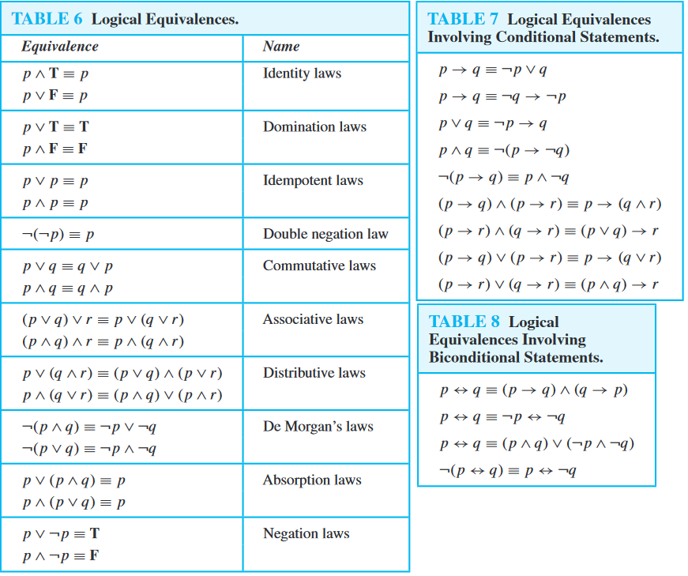
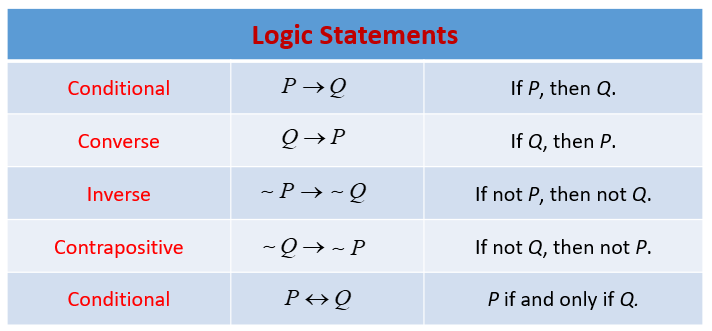

[TOC]

# Propositional Logic

## Laws of Propositional Logic



--------------------------
## Truth Tables

Values are `True` in all cases except where `True` is implying `False`


### Formatting

### Row Construction

If there are `n` simple propositions, then there are `2^n` rows

### Column Construction

```
!(p or q) and r

p | q | r | p or q | !(p or q) | !(p or q) and r 
```

### Values in the Table

For the first proposition, make the first half `True` and the second half `False`

For the second proposition, 2 `True`s then 2 `False`s -> alternate

Lastly, alternate `True`s and `False`s

## Inverse, Converse, Contrapositive



**Initial Proposition**: p -> q

**Inverse**: !p -> !q

**Converse**: q -> p

**Contrapositive**: !q -> !p


Original and contrapositive are the same logically.

> you can prove `a -> b` by proving `!b -> !a`


However, the inverse and converse are not the same logically

> You cannot prove `!a -> !b` by proving `b -> a`


## Contraposition

If you know `p -> q`, then you also know:
- if `q` is `False`, `p` is `False`
- if `p` is `True`, `q` is `True`

## More on Propositions

- If a statement contains a variable, it is not a proposition because we don't know the value of the variables
- "This is not a statement" 
    - Paradox: looks like a statement, but can't be `True` or `False`


## Operators

`p <--> q`

> true when `p` and `q` match

`p -> q`

> `True` when NOT `p` is `True` and `q` is `False`

`p and q`

> `True` when `p` and `q` are BOTH `True`

`p or q`

> `True` when `p` or `q` are `True`

`p if and only if q`

`p xor q`

> `True` when `p` and `q` are different


### Precedence of Operators


1. negation
2. conjunction
3. disjunction
4. conditional
5. biconditionals

## Bit Operations

- Computers store information in bits
- A bit is off or on, which we represent as 0 or 1
- We can think of it as a `Boolean`
- A string of bits is a "bit string"
    - Most computer languages let you use Boolean operators on bit strings

x = 01000101, y = 101011001

> In C, `z = x | y` stores the bitwise `or` of these two strings (bytes)
>
> z = 101011001


01 1011 0100
11 0001 1101
-------------
11 1011 1111 bitwise OR
01 0001 0100 bitwise AND
10 1010 1001 bitwise XOR


## Associative Logical Operators

`(5 + 3) + 2` = `5 + (3 +2)` because of the fact that **addition is associate**

### Or 

Or is associative: `(p or q) or v` = `p or (q or v)`

### And

And is not associative: `(p and q) and v != 

### Exclusive Or

Exclusive Or is associative: `(p xor q) xor v` = `p xor (q xor v)`

## Non-Associative Logical Operators

### Conditional

Conditional is not associative: `(p -> q) -> r != `p -> (q -> r)`

### Biconditional

Biconditional is not associative: `(p <--> q) <--> r != `p <--> (q <--> r)`

### Negation

Negation is not associative: `!(p and q) != !p and !q`

----------------------------------------------

## Applications of Propositional Logic


### Translating Enligsh Statements to Formal Logic

> You cannot ride the rollercoaster if you are under 4 feet tall unless you are older than 16 years

**Step 1**: assign the variables

r: ride the rollerocaster
u: under 4 feet talll
o: older than 16

**Step 2**: write in terms of variables

`(u and !o) -> !r`

#### Example 1 - DM

1. The DM is stored in the buffer or it is retransmitted
2. The DM is not stored in the buffer
3. If the DM is stored, then it is retransmitted

We want to know if we can satisfy the spec. We can if the spec is ***consistent***. This means there's an assignment that makes all the criteria true.

```
b or r
!b
b -> r
```

Build a truth table, then find a case wherein all the conditions are True. If one is found, it is a consistent spec.

#### Example 2 - Knight and Knaves

1. Knights always tell the truth
2. Knaves always lie


D says "At least one of us is a knave"

D: D is a knight
P: P is a knight

`D -> !D or !P` and `!D -> D or P`

Create a Truth Table, if there is at least one case wherein both of these statements are satisfied, the statement is consistent.


In general, you can apply this truth table strategy intuitievly by testing varying scnearios in which different variables have varying truth values

### Logic Circuits

.....

#### Inverter

#### OR Gate 

#### AND Gate

------------------------------

## Categories of Propositions

### Tautologies

A proposition that always evaluates to `True`, no matter what the truth values of the propositional variables that occur in it are

`p or !p`

Every value in the table is `True`

### Contradiction

A proposition that always evaluates to `False`, no matter what the truth values of the propositional variables that occur in it are

`p and !p`

Every value in the Truth table is `False`

### Contingency

A proposition that is neither a tautology nor a contradiction

`p or q`

### Determining if Contradiction or Tautology

If you can find one case which is `True`, you know it is not a contradiction

If you can find one case which is `False`, you know it is not a tautology.

## Satisfiable Proposition

A prop is **satisfiable** if there is an assignment of truth values to its variables that makes it `True`

In other words: 
    - a prop is **satisfiable** iff it is not a contradiction
    - a prop is **unsatisfiable** iff its negation is true for all assignments of truth values to the variables
        - i.e., iff its negation is a tautology 

**Solution**: A particular assignment of truth values to the variables that makes a compound proposition true

To show that a proposition is unsatisfiable, we can show that all cases are `False` in the truth table. However, it's often easier to show that the negation of the proposition is a tautology by simplifying the terms and showing that the negation is a tautology.

### Example

Show `(p or q) -> !p` is satisfiable

Make the hypothesis `False`, gaurenteeing the statement is `True` overall, and satisfying the proposition


## Logical Equivalence

Compound propositions that have the same truth value in all possible cases are called **logically equivalent**.

This can also be defnined like: The compound propositions `p` and `q` are logically equivalent if `p <-> q` is a tautology

A statement is always logically equivalent to itself and to its contrapositive.

**Logically Equivalent** Compound propositions `p` and `q` are logically equivalent if


`p -> q` and `!p or q` equivalent? Yes, because in all cases, their Truth matches.


You can use logical equivalences to simplify compound propositions. You can simplify a compound proposition by replacing it with a logically equivalent compound proposition. You can simplify one side of a logical equivalence to obtain the other side. These methods allow you to simplify compound propositions to make them easier to understand and to prove.

### Note about The &equiv; Symbol vs &harr; Symbol vs the ⇔ (biconditional) Symbol

The symbol `&equiv;` is not a logial connective.

p &equiv; q is not a compound proposition, but rather is the statement that p &harr; q is a tautology.

The symbol ⇔ is sometimes used instead of &equiv; to denote logical equivalence.

### Conditional-Disjunction Equivalence

`p -> q` is equivalent to `!p or q`


## Biconditionals

p <--> q is logically equivalent to (p -> q) ^ (q -> p)

> p if and only if q
> 
> p is necessary and sufficient for q
> 
> p is equivalent to q
> 
> p iff q


----------------------------------------------

## De Morgan's Laws


1 - `!(p and q) = !p or !q`

2 - `!(p or q) = !p and !q`

*applies to `!(p or q or r or z ....)` like `!p and !q and !r and !z ....`*

### Examples


> The defendants who've paid their fine or scheduled an appeal are OK. We want to repor tthe others

p: is paid fine
s: is scheduled appeal


The mistake:

```
if (not pr or not s):
    report them
```

The correction:


```
if not(p or s):
    report them
```


