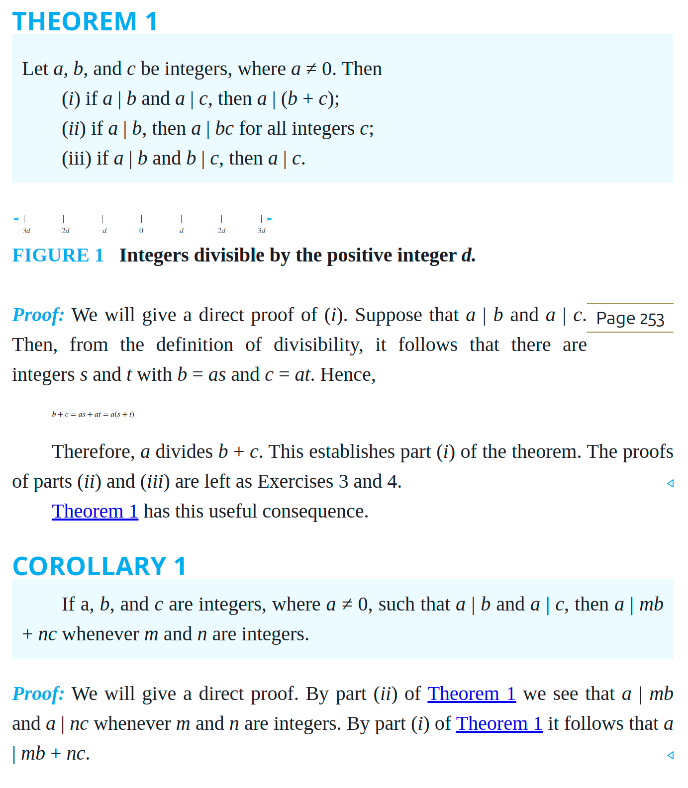
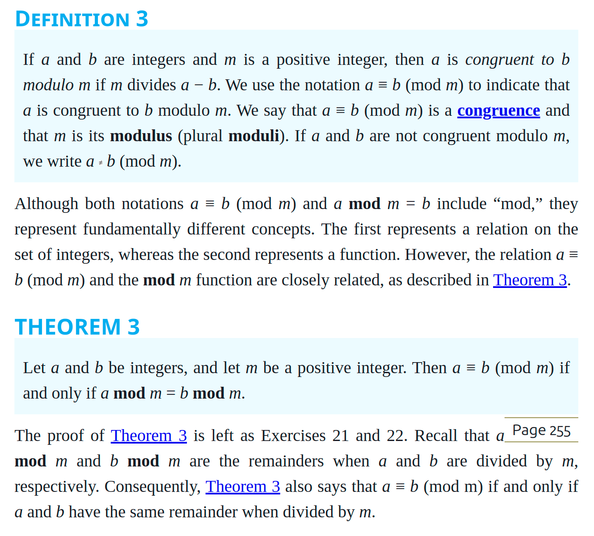
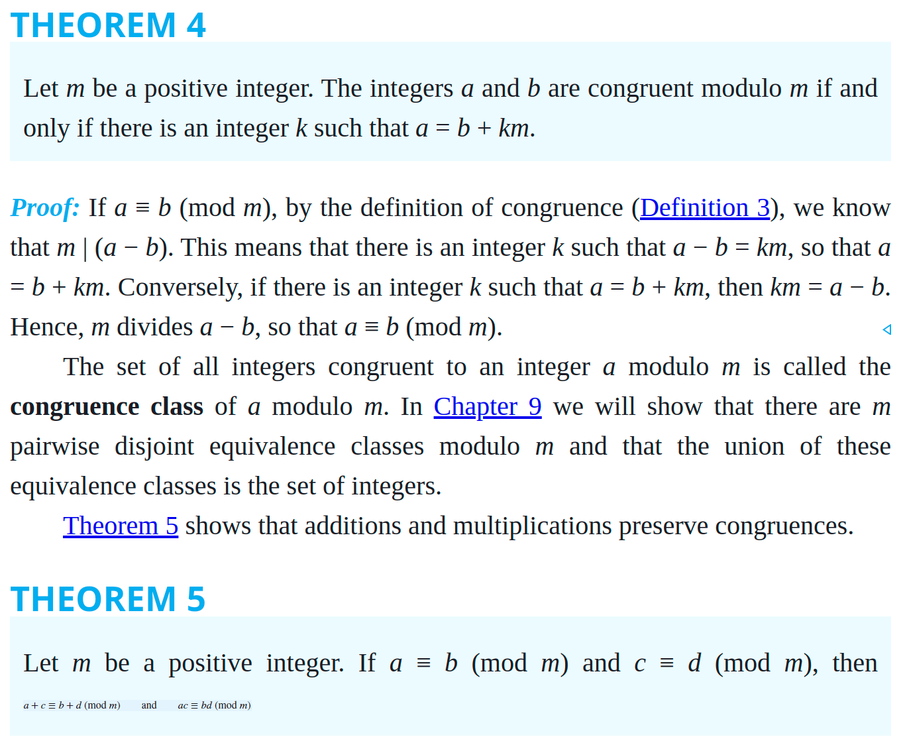
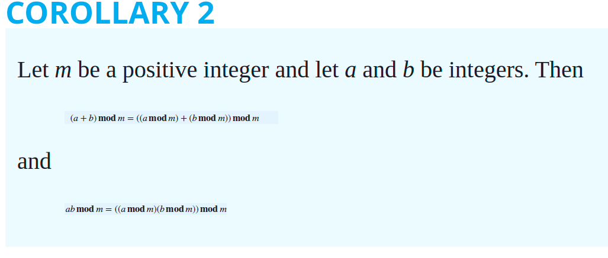
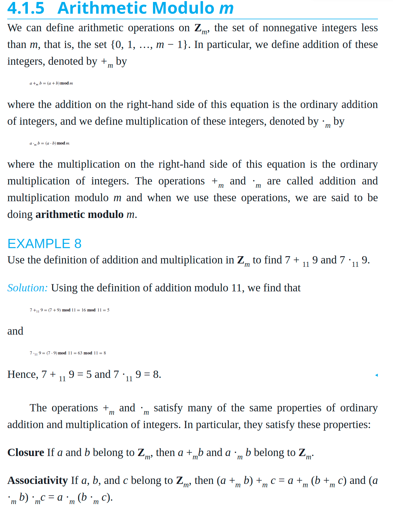

# Chapter 4.1 - Divisibility and Modular Arithmetic

## Division

- if a, b &isin; Z and a =/= 0, then we say that a *divides* b, denoted by a | b, if Ec &isin; Z such that b = ac
- If a divides b, we call a a *factor* or *divisor* of b

Remark: We can express a | b using quantifiers as ∃c(ac = b), where the universe of discourse is the set of integers.

### Divisor Theorems

- If a | b, then a = bn for some integer n
- Let a, b, c, &isin; Z, and a=/=0
    - if a | b and a | c, then a | (b + c)
    - if a | b , then a | bc
    - if a | b, and b | c, then a | c
- This means if a | b and a | c then a divides a linear combination of b and c
    - a linear combiation of two numbers is the sum of multiples of the numbers
    - so, if a | b and a | c, then a | (bn + cm)An, m &isin; Z

### The Division Algorithm

- Let a &isin; Z and d &isin; Z+, then there exists a unique q, r &isin; Z, such that 0<=r<=d and a = dq + r
    - d is called the divisor
    - a is called the dividence
    - q is called the quotient
    - r is called the remainder
- q = quotient
    - given by floor/integer division
    - `div`
    - q = a div d
    - can be negative
- r = remainder
    - given by mod
    - `mod`
    - r = a mod d
    - cannot be negative

### Modular arithmetic

- Given any integer m > 1, we can think of `mod` as a function that maps Z to the set of {0,1,2,...,m-1}
- If we add any two numbers in the set {0,1,2,...,m-1} and then take the mod m we stay in the set {0,1,...,m-1}

#### Examples

- m = 7

....

## Congruences

- if a, b, &isin; Z and m &isin; Z+, then a is *congruent* to b *module* m iff a mod m = b mod m
    - w e write a is congruent to b (mod m)
- a = cm + r and b = dm + r
- a - b = cm + r - (dm +r) =
- cm - dm =
- (c - d)m
- c - d is an integer
- I.e., if their remainders are the same, when take their differnce, the reaminders go away, so we get c - d times the modulo

- suppose m | (a - b) such that (a - b) = cm
- say a mod m = r
- ....

-----------

- a is congruent to b * modm
- m | (a - b)
- Ek &isin; Z such that a - b = km
- a = b + km

..............

Closure If a and b belong to Zm, then a +mb and a ·m b belong to Zm.

Associativity If a, b, and c belong to Zm, then (a +m b) +m c = a +m (b +m c) and (a ·m b) ·mc = a ·m (b ·m c).

Commutativity If a and b belong to Zm, then a +m b = b +m a and a ·m b = b ·m a.

Identity elements The elements 0 and 1 are identity elements for addition and multiplication modulo m, respectively. That is, if a belongs to Zm, then a +m 0 = 0 +m a = a and a ·m 1 = 1 ·m a = a.

Additive inverses If a ≠ 0 belongs to Zm, then m − a is an additive inverse of a modulo m and 0 is its own additive inverse. That is, a +m (m − a) = 0 and 0 +m 0 = 0.

Page 258
Distributivity If a, b, and c belong to Zm, then a ·m (b +m c) = (a ·m b) +m (a ·m c) and (a +m b) ·m c = (a ·m c) +m (b ·m c).
