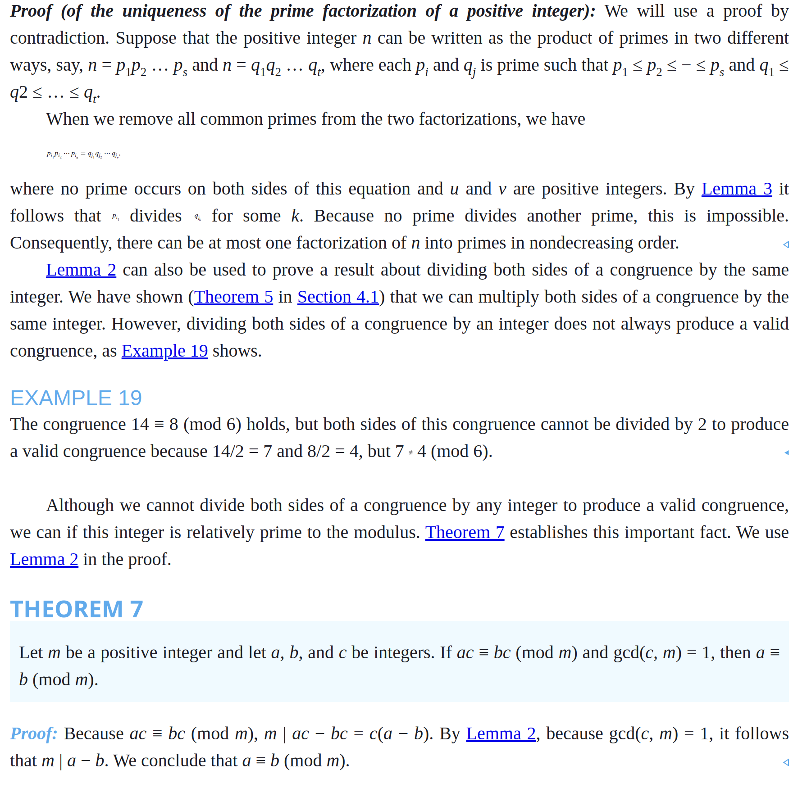

# Notes - Chapter 4.3 - Primes and Greatest Common Divisors


- A prime is an integer greater than 1 that is divisible by no positive integers other than 1 and itself.
- There are infinitely many primes.
- The Fundamental Theorem of Arithmetic states that every integer greater than 1 can be written uniquely as a prime or as a product of two or more primes in nondecreasing order.
- Finding large primes is important for cryptography.
  - The length of time required to factor large integers into their prime factors is the basis for the strength of many cryptographic algorithms.
    - The length is proportional to the square root of the number of digits in the integer.
  - RSA encryption is based on the difficulty of factoring large numbers.


## Primes

- Every integer greater than 1 is divisible by at least two integers: 1 and itself.
- 1 is not prime, because it has only one positive factor
- An integer n is composite iff there exists an integer a such that a | n and 1 < a < n.


### Proving Primes

> If n is a composite integer, then n has a prime divisor less than or equal to $\sqrt{n}$.

That also implies:

> If n is a prime integer, then n has no prime divisor less than or equal to $\sqrt{n}$.

**Proof:**
- Let n be a composite integer.
- Then n = ab, where a and b are integers such that 1 < a < b < n.
- If both a and b are greater than $\sqrt{n}$, then $ab > \sqrt{n} \cdot \sqrt{n} = n$, which is a contradiction.

### Trial Division - Brute Force Algorithm

- To determine if n is prime, divide n by all integers from 2 to $\sqrt{n}$.
- If n is divisible by any of these integers, then n is composite.
- If n is not divisible by any of these integers, then n is prime.

### Prime Factorization - Algorithm

- To find the prime factorization of n, divide n by the smallest prime number, 2.
- If n is divisible by 2, then divide n by 2 and repeat.
- If n is not divisible by 2, then divide n by the smallest odd prime number, 3.
- If n is divisible by 3, then divide n by 3 and repeat.
- If n is not divisible by 3, then divide n by the next odd prime number, 5.
- Continue until n is completely factored.

#### The Sieve of Eratosthenes 

A method for finding all primes less than a given number.

  - Write down the numbers from 2 to the given number.
  - Circle the first number, 2, and cross out all multiples of 2.
  - Circle the next number that is not crossed out, 3, and cross out all multiples of 3.
  - Continue until all numbers have been circled or crossed out.
  - The circled numbers are the primes.

### Infinitely Many Primes Proof

**Proof:**
- Assume there are finitely many primes.
- Let p be the largest prime.
- Consider the number n = p! + 1.
- n is not divisible by any prime less than or equal to p.
- Therefore, n is either prime or divisible by a prime greater than p.
- In either case, there is a prime greater than p, which is a contradiction.

Because there are infinitely many primes, given any positive integer there are primes greater than this integer. There is an ongoing quest to discover larger and larger prime numbers; for almost all the last 300 years, the largest prime known has been an integer of the special form 2p − 1, where p is also prime. (Note that 2n − 1 cannot be prime when n is not prime; see Exercise 9.) Such primes are called Mersenne primes, after the French monk Marin Mersenne, who studied them in the seventeenth century. The reason that the largest known prime has usually been a Mersenne prime is that there is an extremely efficient test, known as the Lucas–Lehmer test, for determining whether 2p − 1 is prime. Furthermore, it is not currently possible to test numbers not of this or certain other special forms anywhere near as quickly to determine whether they are prime.

### The Prime Number Theorem

> The number of primes less than or equal to x is approximately $\frac{x}{\ln x}$.

I.e., The ratio of π(x), the number of primes not exceeding x, and x/ln x approaches 1 as x grows without bound. (Here ln x is the natural logarithm of x.)

You can find a great deal of computational data relating to π(x) and functions that estimate π(x) using the web.

We can use the prime number theorem to estimate the probability that a randomly chosen number is prime. (See Chapter 7 to learn the basics of probability theory.) The prime number theorem tells us that the number of primes not exceeding x can be approximated by x/ln x. Consequently, the odds that a randomly selected positive integer less than n is prime are approximately (n/ln n)/n = 1/ln n. Sometimes we need to find a prime with a particular number of digits. We would like an estimate of how many integers with a particular number of digits we need to select before we encounter a prime. Using the prime number theorem and calculus, it can be shown that the probability that an integer n is prime is also approximately 1/ln n. For example, the odds that an integer near 101000 is prime are approximately 1/ln 101000, which is approximately 1/2300. (Note that if we choose only odd numbers, we double our chances of finding a prime.)

Using trial division with Theorem 2 gives procedures for factoring and for primality testing. However, these procedures are not efficient algorithms; many much more practical and efficient algorithms for these tasks have been developed. Factoring and primality testing have become important in the applications of number theory to cryptography. This has led to a great interest in developing efficient algorithms for both tasks. Clever procedures have been devised in the last 30 years for efficiently generating large primes. Moreover, in 2002, an important theoretical discovery was made by Manindra Agrawal, Neeraj Kayal, and Nitin Saxena. They showed there is a polynomial-time algorithm in the number of bits in the binary expansion of an integer for determining whether a positive integer is prime. Algorithms based on their work use O((log n)6) bit operations to determine whether a positive integer n is prime.

However, even though powerful new factorization methods have been developed in the same time frame, factoring large numbers remains extraordinarily more time-consuming than primality testing. No polynomial-time algorithm for factoring integers is known. Nevertheless, the challenge of factoring large numbers interests many people. There is a communal effort on the Internet to factor large numbers, especially those of the special form kn ± 1, where k is a small positive integer and n is a large positive integer (such numbers are called Cunningham numbers). At any given time, there is a list of the “Ten Most Wanted” large numbers of this type awaiting factorization.

#### PRIMES AND ARITHMETIC PROGRESSIONS   

Every odd integer is in one of the two arithmetic progressions 4k + 1 or 4k + 3, k = 1, 2, …. Because we know that there are infinitely many primes, we can ask whether there are infinitely many primes in both of these arithmetic progressions. The primes 5, 13, 17, 29, 37, 41, … are in the arithmetic progression 4k + 1; the primes 3, 7, 11, 19, 23, 31, 43, … are in the arithmetic progression 4k + 3. Looking at the evidence hints that there may be infinitely many primes in both progressions. What about other arithmetic progressions ak + b, k = 1, 2, …, where no integer greater than one divides both a and b? Do they contain infinitely many primes? The answer was provided by the German mathematician G. Lejeune Dirichlet, who proved that every such arithmetic progression contains infinitely many primes. His proof, and all proofs found later, are beyond the scope of this book. However, it is possible to prove special cases of Dirichlet’s theorem using the ideas developed in this book. For example, Exercises 54 and 55 ask for proofs that there are infinitely many primes in the arithmetic progressions 3k + 2 and 4k + 3, where k is a positive integer. (The hint for each of these exercises supplies the basic idea needed for the proof.)

We have explained that every arithmetic progression ak + b, k = 1, 2, …, where a and b have no common factor greater than one, contains infinitely many primes. But are there long arithmetic progressions made up of just primes? For example, some exploration shows that 5, 11, 17, 23, 29 is an arithmetic progression of five primes and 199, 409, 619, 829, 1039, 1249, 1459, 1669, 1879, 2089 is an arithmetic progression of ten primes. In the 1930s, the legendary and prolific mathematician Paul Erdős conjectured that for every positive integer n greater than two, there is an arithmetic progression of length n made up entirely of primes. In 2006, Ben Green and Terence Tao were able to prove this conjecture. Their proof, considered to be a mathematical tour de force, is a nonconstructive proof that combines powerful ideas from several advanced areas of mathematics.


### Twin Primes

> A pair of primes that differ by 2 are called twin primes.

#### The Twin Prime Conjecture

> There are infinitely many twin primes.

The strongest result proved concerning twin primes is that there are infinitely many pairs p and p + 2, where p is prime and p + 2 is prime or the product of two primes


## Greatest Common Divisors and Least Common Multiples

- The greatest common divisor (gcd) of two integers a and b, where a and b are not both zero, is the largest integer that divides both a and b.
  - The greatest common divisor of two integers, not both zero, exists because the set of common divisors of these integers is nonempty and finite
  - One way to find the greatest common divisor of two integers is to find all the positive common divisors of both integers and then take the largest divisor
- The least common multiple (lcm) of two integers a and b is the smallest positive integer that is a multiple of both a and b.
  - The least common multiple exists because the set of integers divisible by both a and b is nonempty (because ab belongs to this set, for instance), and every nonempty set of positive integers has a least element (by the well-ordering property, which will be discussed in Section 5.2)

### Relatively Prime

> Two integers a and b are relatively prime if their greatest common divisor is 1.

### Pairwise Relatively Prime

> A set of integers is pairwise relatively prime if every pair of integers in the set is relatively prime.

### Using Prime Factorizations

- To find the greatest common divisor of two integers a and b, find the prime factorizations of a and b.
- The greatest common divisor is the product of the common prime factors, each raised to the smallest power that appears in the prime factorizations of a and b.
- For example, the greatest common divisor of 120 and 500:
  - $120 = 2^3 \cdot 3 \cdot 5$
  - $500 = 2^2 \cdot 5^3$
  - gcd(120, 500) = $2^{min(3, 2)} \cdot 5^{min(1, 3)} = 2^2 \cdot 5 = 20$
- To find the least common multiple of two integers a and b, find the prime factorizations of a and b.
- The least common multiple is the product of all prime factors, each raised to the largest power that appears in the prime factorizations of a and b.
- For example, the least common multiple of 120 and 500:
  - lcm(120, 500) = $2^{max(3, 2)} \cdot 3 \cdot 5^3 = 2^3 \cdot 3 \cdot 5^3 = 6000$

> Let a and b be integers, not both zero. Then $ab = gcd(a, b) \cdot lcm(a, b)$.


### Euclidean Algorithm

- The Euclidean algorithm is an efficient method for finding the greatest common divisor of two integers.
- Let a = bq + r, where a and b are integers and b ≠ 0, then gcd(a, b) = gcd(b, r).
  - Suppose that d divides both a and b. Then it follows that d also divides a − bq = r (from Theorem 1 of Section 4.1). Hence, any common divisor of a and b is also a common divisor of b and r.
  - Likewise, suppose that d divides both b and r. Then d also divides bq + r = a. Hence, any common divisor of b and r is also a common divisor of a and b.
  - Consequently, gcd(a, b) = gcd(b, r).


```python
def gcd(a, b):
    while b != 0:
        a, b = b, a % b
    return a
```


### GCDs as Linear Combinations

> Let a and b be integers, not both zero. Then there exist integers x and y such that gcd(a, b) = ax + by.


- The first method proceeds by working backward through the divisions of the Euclidean algorithm, so this method requires a forward pass and a backward pass through the steps of the Euclidean algorithm. We will illustrate how this method works with an example. The main Page 286advantage of the second method, known as the extended Euclidean algorithm, is that it uses one pass through the steps of the Euclidean algorithm to find Bézout coefficients of a and b, unlike the first method, which uses two passes.

### Extended Euclidean Algorithm

> The extended Euclidean algorithm is an efficient method for finding the greatest common divisor of two integers and the integers x and y such that ax + by = gcd(a, b).

```python
def extended_gcd(a, b):
    if b == 0:
        return a, 1, 0
    else:
        d, x, y = extended_gcd(b, a % b)
        return d, y, x - (a // b) * y
```

- The extended Euclidean algorithm is an efficient method for finding the greatest common divisor of two integers and the integers x and y such that ax + by = gcd(a, b).
- The extended Euclidean algorithm is used in the RSA encryption algorithm.
- The extended Euclidean algorithm is also used in the Chinese remainder theorem.


> If a, b, and c are positive integers such that gcd(a, b) = 1 and a | bc, then a | c.

**Proof:**
- Because gcd(a, b) = 1, there exist integers x and y such that ax + by = 1.
- Because a | bc, there exists an integer k such that bc = ak.
- Multiplying both sides of the equation ax + by = 1 by c, we have acx + bcy = c.
- Substituting bc = ak into the equation acx + bcy = c, we have akx + bcy = c.
- Because bc = ak, we have akx + aky = c.
- Factoring out an a, we have a(kx + ky) = c.
- Because kx + ky is an integer, a | c.
- Therefore, if a, b, and c are positive integers such that gcd(a, b) = 1 and a | bc, then a | c.


> If p is a prime and p | a1a2 … an, where each ai is an integer, then p | ai for some i.

### Proof of the Fundamental Theorem of Arithmetic



**Proof:**
- Let n be an integer greater than 1.
- We will prove that n can be written uniquely as a product of primes in nondecreasing order.
- We will use induction on n.
- The base case is n = 2.
  - 2 is prime, so it can be written as a product of primes in nondecreasing order.
  - The product is 2.
  - The product is unique because 2 is prime.
  - Therefore, the base case holds.
  - Assume that the statement is true for all integers less than n.
  - We will prove that the statement is true for n.
  - If n is prime, then n can be written as a product of primes in nondecreasing order.
  - The product is n.
  - The product is unique because n is prime.

> Let m be a positive integer and let a, b, and c be integers. If ac ≡ bc (mod m) and gcd(c, m) = 1, then a ≡ b (mod m).

**Proof:**
- Because ac ≡ bc (mod m), m | ac − bc = c(a − b). By Lemma 2, because gcd(c, m) = 1, it follows that m | a − b. We conclude that a ≡ b (mod m).