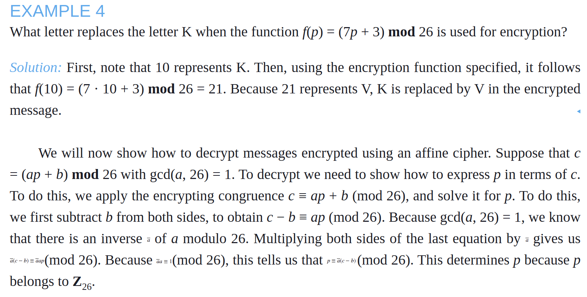
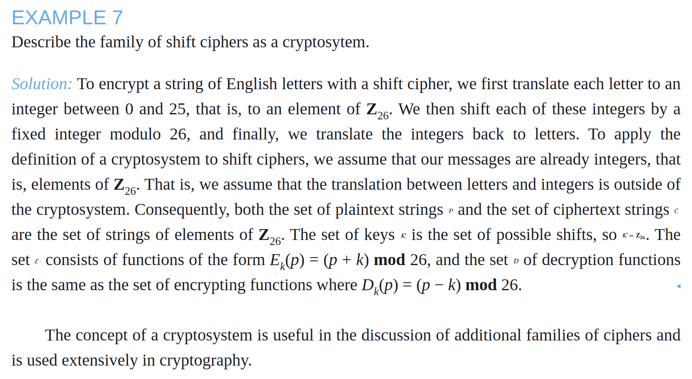
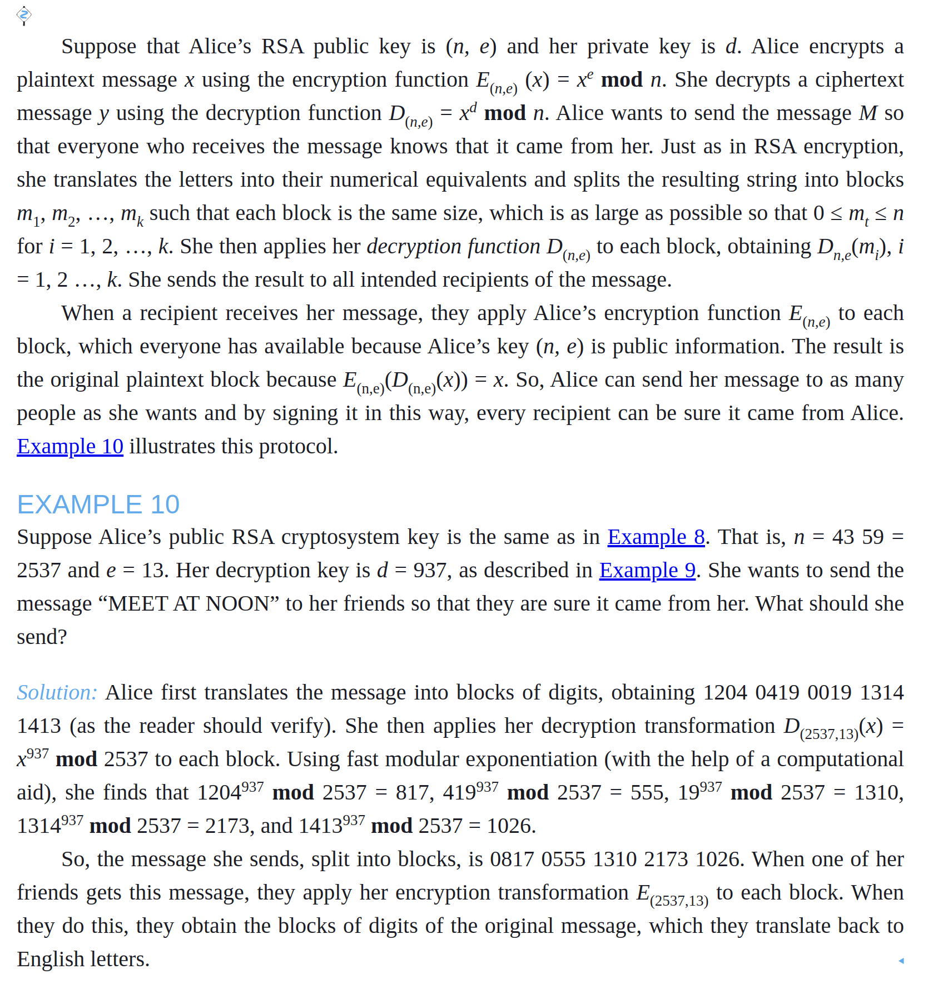

# Notes - Chapter 4.6 - Cryptography


## Classical Cryptography

- **Cryptography** is the study of secure communication.
- **Encryption** is the process of converting plaintext into ciphertext.
- **Cryptanalysis** is the study of breaking encryption methods.
  - **Frequency analysis** is a common cryptanalysis technique where you analyze the frequency of letters in a ciphertext to determine the key.
    - The function mapping the most frequent letter in the ciphertext to the most frequent letter in the plaintext (and second most common to second most common, and so on) is the key.

### Ceasar's Ciphers

- Ceasar's cipher is an example of a simple encryption method where you shift each letter by a fixed number of positions.
  - $f(p) = (p + k) \mod 26$ where $p$ is the position of the plaintext letter in the alphabet and $k$ is the shift.
  - To recover a message, you need $f^{-1}(c)$ where $c$ is the position of the ciphertext letter in the alphabet.
    - $f^{-1}(c) = (c - k) \mod 26$
  - Here, $k$ is the key.


### Affine Ciphers

- An *Affine cipher* is a more complex encryption method where you use the formula $f(p) = (ap + b) \mod 26$ where $a$ and $b$ are the keys.
  - To recover a message, you need $f^{-1}(c)$ where $c$ is the position of the ciphertext letter in the alphabet.
    - $f^{-1}(c) = a^{-1}(c - b) \mod 26$
  - 
  - Here, $a$ and $b$ are the keys


### Block Ciphers

- **Block ciphers** are encryption methods that encrypt blocks of plaintext at a time, as opposed to encrypting one letter at a time (monoalphabetic/character ciphers) or one bit at a time (stream ciphers).


#### Transposition Ciphers

- **Transposition ciphers** are block ciphers that encrypt by rearranging the order of the letters in the plaintext.
  - For example, the **rail fence cipher** writes the plaintext in a zig-zag pattern and then reads off the ciphertext in rows.
- First split the plaintext into blocks of a fixed size, *m*
- If not divisible by *m*, add padding
- Then rearrange the blocks in a specific order to create the ciphertext.
- To decrypt, we transpose its letters use the permutation $σ^{-1}$ of the permutation $σ$ used to encrypt the message.
  - Similar to `pytorch`'s `torch.permute` function.
  - ```python
    >>> import numpy as np
    >>> x = np.arange(1, 11)
    >>> print(np.array2string(x, separator=', '))
    [1,  2,  3,  4,  5,  6,  7,  8,  9, 10] # original sequence
    >>> permute_key = [1, 0, 3, 2, 5, 4, 7, 6, 9, 8] # transposition cipher key
    >>> print(np.array2string(x[permute_key], separator=', '))
    [2,  1,  4,  3,  6,  5,  8,  7, 10,  9] # transposed sequence
    >>> print(np.array2string(x[permute_key][permute_key], separator=', '))
    [1,  2,  3,  4,  5,  6,  7,  8,  9, 10] # transposed using same key gives original sequence
    ```


### Cryptosystems

- A **cryptosystem** is a system for encrypting and decrypting messages.
- A cryptosystem consists of:
  - **Plaintext**: The original message
  - **Ciphertext**: The encrypted message
  - **Encryption algorithm**: The method used to encrypt the message
  - **Decryption algorithm**: The method used to decrypt the message
  - **Key**: The secret value used to encrypt and decrypt the message
- As a Tuple: $(P, C, E, D, K)$





## Public Key Cryptography

- **Public key cryptography** is a type of encryption where the encryption key is public and the decryption key is private.
- In private key cryptography, the encryption and decryption keys are the same or can be easily derived from each other.
  - Both parties must keep the key secret.
- To avoid the need to share keys and to protect a line of communication, public key cryptography was developed in the 1970s, when the concept of public key cryptosystems was introduced.
- **Public key cryptosystems** use two keys: a public key and a private key.
  - The public key is used to encrypt messages, and the private key is used to decrypt them.
  - You cannot derive the private key from the public key because the method of doing so is computationally infeasible.
    - While these problems are computationally challenging and are considered "hard" in the cryptographic sense (requiring exponential time to solve with current algorithms for large instances), they are not framed within the same complexity theory framework as NP-hard problems. NP-hard problems are a subset of NP problems, and they have specific properties related to reductions and decision problems that are distinct from the cryptographic hardness properties of problems like discrete logarithm or elliptic curve discrete logarithm.
    - The process of deriving a private key from a public key involves solving the discrete logarithm problem or the elliptic curve discrete logarithm problem, depending on the cryptographic scheme used (e.g., RSA, ECC). These problems are known to be difficult to solve efficiently, especially when the sizes of the keys are large (e.g., using sufficiently large prime numbers or elliptic curve parameters).
    - In summary, deriving a private key from a public key is computationally hard due to the inherent difficulty of solving the underlying mathematical problems in cryptography, but it doesn't fall under the category of NP-hardness as defined in complexity theory.
      - The distinction between computational hardness in cryptography and NP-hardness in complexity theory is important because the former is based on the practical difficulty of solving specific problems in cryptography, while the latter is a theoretical framework for classifying problems based on their computational complexity.
- The discrete logarithm problem is the basis for the security of the Diffie-Hellman key exchange and the Digital Signature Algorithm (DSA).
  - It can be summarized as follows: given a prime number *p*, a primitive root *g* modulo *p*, and an integer *y*, find the integer *x* such that *g*<sup>*x*</sup> ≡ *y* (mod *p*).
  - The difficulty of solving the discrete logarithm problem is the foundation of the security of many cryptographic protocols and systems, including public key encryption schemes like RSA and digital signature algorithms like DSA.
  - It takes a long time because there is no shortcut for solving the problem, and the best known algorithms for solving it are computationally intensive and require exponential time to run
    - Algorithms exist such as the baby-step giant-step algorithm, Pollard's rho algorithm, and the index calculus algorithm, but they are not efficient for large instances of the problem.
    - These algorithms still have time complexity that grows exponentially with the size of the input, making them impractical for solving large instances of the problem -- such as numbers used in cryptographic applications.
- In these systems, everyone can share their public key, but only the intended recipient has the private key to decrypt the message.
- Besides RSA, there are several other commonly used public key cryptosystems that are now used for many applications. These other public key cryptosystems will play an important role in the future when advances in computing may make the RSA cryptosystem obsolete, as often happens in cryptography. We will explain why this may be so shortly.

### Weaknesses of Public Key Cryptography

Although public key cryptography has the advantage that two parties who wish to communicate securely do not need to exchange keys, it has the disadvantage that encryption and decryption can be extremely time-consuming. For many applications, this makes public key cryptography impractical. In such situations, private key cryptography is used instead. However, public key cryptography may still be used in the key exchange process.

### The RSA Cryptosystem

The RSA cryptosystem is a widely used public key cryptosystem that is based on the difficulty of factoring large numbers. The RSA cryptosystem is named after its inventors, Ron Rivest, Adi Shamir, and Leonard Adleman, who introduced it in 1977.


- In the RSA cryptosystem, each individual has
  - an encryption key $(n, e)$, where $n = pq$
  - the modulus is the product of two large primes $p$ and $q$, say with 300 digits each
  - an exponent $e$ that is relatively prime to $(p − 1)(q − 1)$
- To produce a usable key, two large primes must be found. 
  - This can be done quickly on a computer using probabilistic primality tests, referred to earlier in this section. 
  - However, the product of these primes n = pq, with approximately 600 digits, cannot, as far as is currently known, be factored in a reasonable length of time. 
    - As we will see, this is an important reason why decryption cannot, as far as is currently known, be done quickly without a separate decryption key.


> *Remark*: With the steady increase of the speed of computers, the recommended size of the primes p and q used to produce a RSA public key has increased. But the larger n is, the slower RSA encryption and decryption become. When considering this tradeoff, the number of years a message needs to be remain secret is important. A more important consideration is that the development of quantum computing threatens the security of the RSA cryptosystem, because factorization algorithms have been developed for quantum computers that could then be used to quickly factor large primes. So, once quantum computing becomes practical, perhaps in the next 20 to 30 years, other public key cryptosystems that cannot be broken using quantum computing will need to be used.


#### RSA Encryption Method

- It is possible to rapidly construct a public key by finding two large primes p and q, each with more than 300 digits, and to find an integer e relatively prime to (p − 1)(q − 1). 
- When we know the factorization of the modulus n, that is, when we know p and q, we can quickly find an inverse d of e modulo (p − 1)(q − 1). 
  - This is done by using the Euclidean algorithm to find Bézout coefficients s and t for d and (p − 1)(q − 1)
    - which shows that the inverse of d modulo (p − 1)(q − 1) is s mod (p − 1)(q − 1).
- Knowing $d$ lets us decrypt messages sent using our key. 
- However, no method is known to decrypt messages that is not based on finding a factorization of n, or that does not also lead to the factorization of n


1. **Key Generation**: 
   - Choose two large primes $p$ and $q$.
   - Compute $n = pq$ and $\phi(n) = (p − 1)(q − 1)$.
   - Choose an integer $e$ such that $1 < e < \phi(n)$ and $e$ is relatively prime to $\phi(n)$.
   - Compute $d$ such that $ed ≡ 1 \mod \phi(n)$.
   - The public key is $(n, e)$ and the private key is $(n, d)$.
2. **Encryption**:
   - To encrypt a message $m$, translate each plaintext letter into a number $m$ such that $0 ≤ m < n$.
   - Divide the message into blocks of size less than $n$.
   - For each block $m$, compute the ciphertext $c$ as $c ≡ m^e \mod n$.
   - The ciphertext is the encrypted message.
3. **Decryption**:
   - The plaintext message can be quickly recovered from a ciphertext message when the decryption key d, an inverse of e modulo (p − 1)(q − 1), is known. [Such an inverse exists because gcd(e, (p − 1)(q − 1)) = 1.] To see this, note that if de ≡ 1 (mod (p − 1)(q − 1)), there is an integer k such that de = 1 + k(p − 1)(q − 1). It follows that
     - $c^d ≡ (m^e)^d ≡ m^{ed} ≡ m^{1 + k(p − 1)(q − 1)} ≡ m · m^{k(p − 1)(q − 1)} ≡ m · (m^{(p − 1)})^{k(q − 1)} ≡ m \mod n$
     - By Fermat’s Little Theorem, $m^{p − 1} ≡ 1 \mod p$ and $m^{q − 1} ≡ 1 \mod q$, so $m^{(p − 1)(q − 1)} ≡ 1 \mod p$ and $m^{(p − 1)(q − 1)} ≡ 1 \mod q$. Therefore, $m^{(p − 1)(q − 1)} ≡ 1 \mod n$, and $c^d ≡ m \mod n$. 
   - To decrypt a ciphertext $c$, compute the plaintext $m$ as $m ≡ c^d \mod n$.
   - Translate each number $m$ back into a plaintext letter.
   - The plaintext is the decrypted message.

---------


Factorization is believed to be a difficult problem, as opposed to finding large primes p and q, which can be done quickly. The most efficient factorization methods known (as of 2017) require billions of years to factor 600-digit integers. Consequently, when p and q are 300-digit primes, it is believed that messages encrypted using n = pq as the modulus cannot be decrypted in a reasonable time unless the primes p and q are known.

Although no polynomial-time algorithm is known for factoring large integers, active research is under way to find new ways to efficiently factor integers. Integers that were thought, as recently as several years ago, to be far too large to be factored in a reasonable amount of time can now be factored routinely. Integers with more than 230 digits have been factored using team efforts. When new factorization techniques are found, it will be necessary to use larger primes to ensure the secrecy of messages. Unfortunately, messages that were considered secure earlier can be saved and subsequently decrypted by unintended recipients when it becomes feasible to factor the n = pq in the key used for RSA encryption. (Note that the RSA system will be insecure once quantum computing is available.)


## Cryptographic Protocols

- **Cryptographic protocols** are sets of rules that govern the secure exchange of information between two parties.
- **Key exchange protocols** are cryptographic protocols that allow two parties to securely exchange encryption keys.
  - **Diffie-Hellman key exchange** is a key exchange protocol that allows two parties to securely exchange encryption keys over an insecure channel.
    - The security of the Diffie-Hellman key exchange is based on the difficulty of solving the discrete logarithm problem.
    - The protocol works as follows:
      - Alice and Bob agree on a prime number *p* and a primitive root *g* modulo *p*.
      - Alice chooses a secret integer *a* and sends *g*<sup>*a*</sup> mod *p* to Bob.
      - Bob chooses a secret integer *b* and sends *g*<sup>*b*</sup> mod *p* to Alice.
      - Alice computes the shared secret key as (*g*<sup>*b*</sup>)<sup>*a*</sup> mod *p*.
      - Bob computes the shared secret key as (*g*<sup>*a*</sup>)<sup>*b*</sup> mod *p*.
      - The shared secret key is used to encrypt and decrypt messages between Alice and Bob.
    - To analyze the security of this protocol, note that the messages sent in steps (1), (2), and (3) are not assumed to be sent securely. We can even assume that these communications were in the clear and that their contents are public information. So, p, a,  mod p, and mod p are assumed to be public information. The protocol ensures that k1, k2, and the common key  mod  mod p are kept secret. To find the secret information from this public information requires that an adversary solves instances of the discrete logarithm problem, because the adversary would need to find k1 and k2 from  mod p and mod p, respectively. Furthermore, no other method is known for finding the shared key using just the public information.
- **Digital signature protocols** are cryptographic protocols that allow a sender to sign a message in such a way that the recipient can verify the sender's identity and the integrity of the message.
  - 


## Homomorphic Encryption

- Soon after RSA was introduced, the question was proposed whether there was a cryptosystem that allowed arbitrary computations to be run on encrypted data that would produce the encryption of the unencrypted output produced by this unencrypted input.
- **Homomorphic encryption** is a type of encryption that allows computations to be performed on encrypted data without decrypting it.
- So, the search began for a fully homomorphic cryptosystem that allows arbitrary computations to be run remotely on encrypted data.
- Before we discuss progress towards fully homomorphic encryption, we will show that the RSA cryptosytem is not fully homomorphic, although it allows some computations to be done on encrypted data.
- RSA is Partially Homomorphic
  - The RSA cryptosystem is partially homomorphic, meaning that some computations can be performed on encrypted data.
  - For example, if we have two ciphertexts c1 and c2 that are the encryptions of plaintexts m1 and m2, respectively, then the product of c1 and c2 is the encryption of the product of m1 and m2.
  - This property is used in secure multiparty computation, where multiple parties can perform computations on encrypted data without revealing the data to each other.
  - However, RSA is not fully homomorphic, meaning that arbitrary computations cannot be performed on encrypted data.