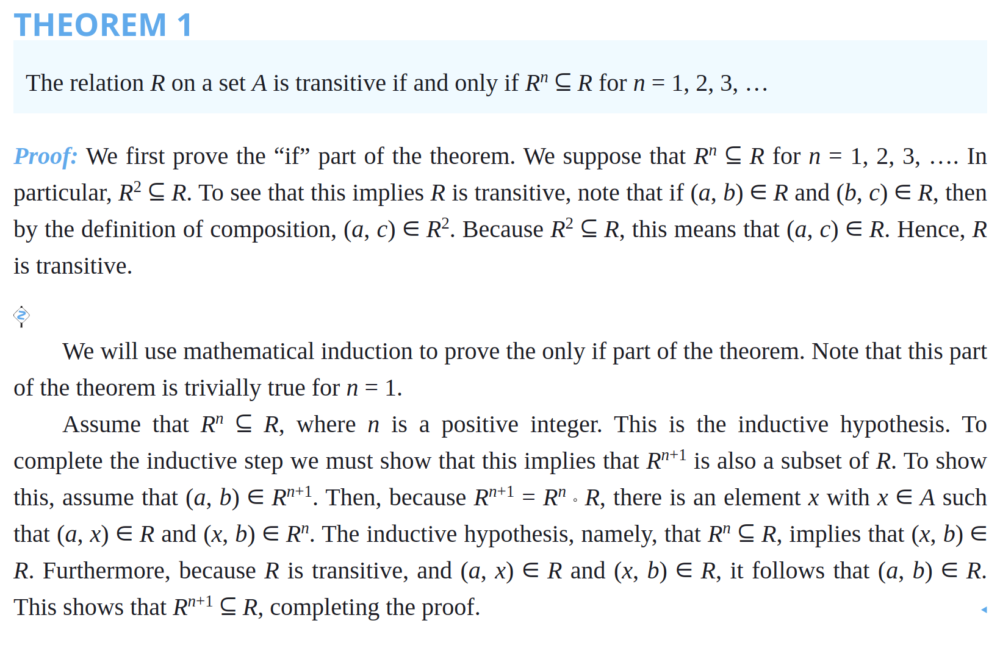
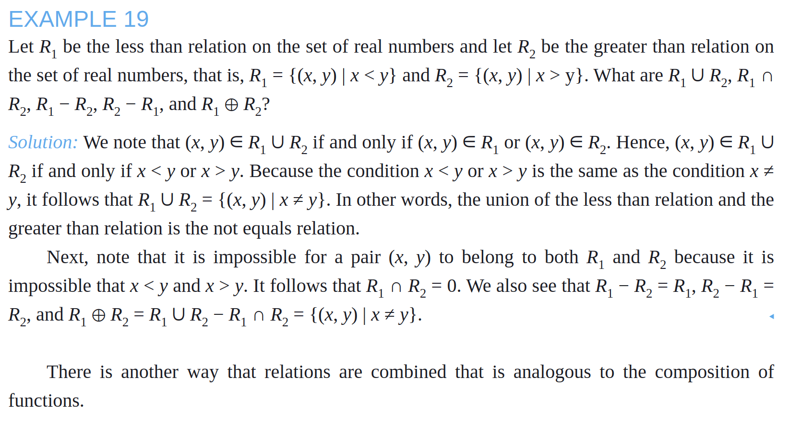
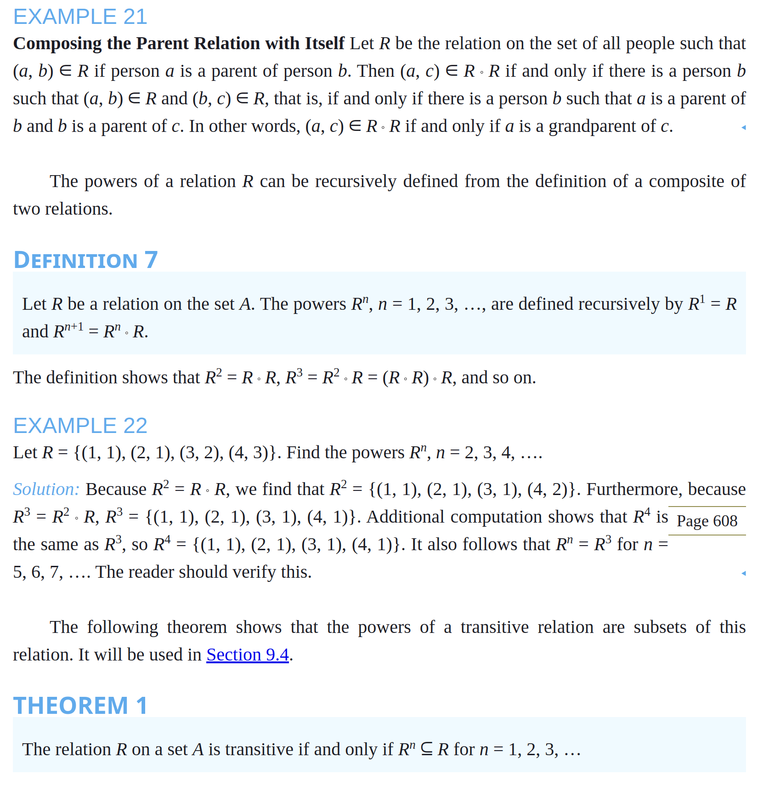

# Notes - Chapter 9 - Relations

## 9.1 - Relations and Their Properties

- The most direct way to express a relationship between elements of two sets is to use ordered pairs made up of two related elements. 
  - For this reason, sets of ordered pairs are called binary relations.
- > Let A and B be sets. A binary relation from A to B is a subset of A × B.
- In other words, a binary relation from A to B is a set R of ordered pairs, where the first element of each ordered pair comes from A and the second element comes from B. 
- We use the notation a R b to denote that (a, b) ∈ R and a !R b to denote that (a, b) ∉ R. 
- When (a, b) belongs to R, a is said to be related to b by R

### Functions as Relations

- A function from A to B is a relation from A to B that satisfies the following two conditions:
  1. For each a ∈ A, there is a b ∈ B such that a is related to b.
  2. If a is related to b and a is related to c, then b = c.
- Because the graph of f is a subset of A × B, it is a relation from A to B. 
- Moreover, the graph of a function has the property that every element of A is the first element of exactly one ordered pair of the graph.
- Conversely, if R is a relation from A to B such that every element in A is the first element of exactly one ordered pair of R, then a function can be defined with R as its graph.
  - This can be done by assigning to an element a of A the unique element b ∈ B such that (a, b) ∈ R.
- Relations are a generalization of graphs of functions; they can be used to express a much wider class of relationships between sets. 
  - (Recall that the graph of the function f from A to B is the set of ordered pairs (a, f(a)) for a ∈ A.)

### Relations on a Set

- A relation on a set A is a relation from A to A.
  - I.e., a subset of A × A.

### Properties of Relations

- A relation R on a set A is called
  - **reflexive** if aRa for every a ∈ A
    - I.e., every element in the set is related to itself.
    - The "divides" relation on the set of positive integers is reflexive because n | n for every positive integer n.
  - **irreflexive** if aRa is false for every a ∈ A
    - I.e., no element from the set is related to itself.
  - **symmetric** if aRb implies bRa for all a, b ∈ A
    - I.e., if a is related to b, then b is related to a.
  - **antisymmetric** if aRb and bRa imply a = b for all a, b ∈ A
    - I.e., if a is related to b and b is related to a, then a = b (only symmetric when it's an element relating to itself)
    - The terms symmetric and antisymmetric are not opposites, because a relation can have both of these properties or may lack both of them (see Exercise 10). A relation cannot be both symmetric and antisymmetric if it contains some pair of the form (a, b) in which a ≠ b.
      - For example, the relation "is equal to" is both symmetric and antisymmetric because a = b implies b = a and a = b.
      - Or, {(1, 1), (2, 2)}, which is both symmetric and antisymmetric 
    - *Remark*: Although relatively few of the 2n2 relations on a set with n elements are symmetric or antisymmetric, as counting arguments can show, many important relations have one of these properties. 
    - Is the “divides” relation on the set of positive integers symmetric? Is it antisymmetric?
      - *Solution*: This relation is not symmetric because 1 | 2, but 2  1. However, it is antisymmetric. To see this, note that if a and b are positive integers with a | b and b | a, then a = b
  - **transitive** if aRb and bRc imply aRc for all a, b, c ∈ A
    - I.e., if a is related to b and b is related to c, then a is related to c - the relation "passes through" b.
    - Is the “divides” relation on the set of positive integers transitive?
      - *Solution*: Suppose that a divides b and b divides c. Then there are positive integers k and l such that b = ak and c = bl. Hence, c = a(kl), so a divides c. It follows that this relation is transitive.
    - The Relation R on a set A is transitive if and only if R^n ⊆ R for n = 1, 2, 3, ...

> How many reflexive relations are there on a set with n elements?

*Solution*: A relation R on a set A is a subset of A × A. Consequently, a relation is determined by specifying whether each of the n2 ordered pairs in A × A is in R. However, if R is reflexive, each of the n ordered pairs (a, a) for a ∈ A must be in R. Each of the other n(n − 1) ordered pairs of the form (a, b), where a ≠ b, may or may not be in R. Hence, by the product rule for counting, there are 2n(n−1) reflexive relations [this is the number of ways to choose whether each element (a, b), with a ≠ b, belongs to R].

Formulas for the number of symmetric relations and the number of antisymmetric relations on a set with n elements can be found using reasoning similar to that in Example 16 (see Exercise 49). However, no general formula is known that counts the transitive relations on a set with n elements. Currently, T(n), the number of transitive relations on a set with n elements, is known only for0 ≤ n ≤ 18. For example, T(4) = 3, 994, T(5) = 154, 303, and T(6) = 9, 415, 189.

### Combining Relations

- Because relations from A to B are subsets of A × B, two relations from A to B can be combined in any way two sets can be combined
- The **union** of two relations R and S from A to B is the set of ordered pairs (a, b) such that a is related to b by R or a is related to b by S.
- The **intersection** of two relations R and S from A to B is the set of ordered pairs (a, b) such that a is related to b by both R and S.
- The **difference** of two relations R and S from A to B is the set of ordered pairs (a, b) such that a is related to b by R but not by S.
- The **symmetric difference** of two relations R and S from A to B is the set of ordered pairs (a, b) such that a is related to b by R or by S but not by both.
- The **complement** of a relation R from A to B is the set of ordered pairs (a, b) such that a is related to b by R.
  - The complement of R is the relation from A to B that consists of all ordered pairs in A × B that are not in R.
  - The complement of R is denoted by R'.
  - The complement of a relation is not a standard operation on relations, but it is useful in some contexts.
- The **composition** of two relations R from A to B and S from B to C is the relation from A to C that consists of ordered pairs (a, c) such that there is an element b ∈ B for which a is related to b by R and b is related to c by S.
  - Computing the composite of two relations requires that we find elements that are the second element of ordered pairs in the first relation and the first element of ordered pairs in the second relation
  - The composition of R and S is denoted by S ◦ R.
  - The composition of relations is not commutative, in general.
    - That is, S ◦ R is not necessarily equal to R ◦ S.
  - The composition of relations is associative.
    - That is, if R is a relation from A to B, S is a relation from B to C, and T is a relation from C to D, then T ◦ (S ◦ R) = (T ◦ S) ◦ R.
  - The composition of relations is a generalization of the composition of functions.
    - If f is a function from A to B and g is a function from B to C, then the composition of f and g is the function from A to C that assigns to each element a of A the element g(f(a)) of C.
    - The composition of functions is denoted by g ◦ f.
    - The composition of functions is associative and is not commutative, in general.
    - The composition of functions is a special case of the composition of relations.
  - 

