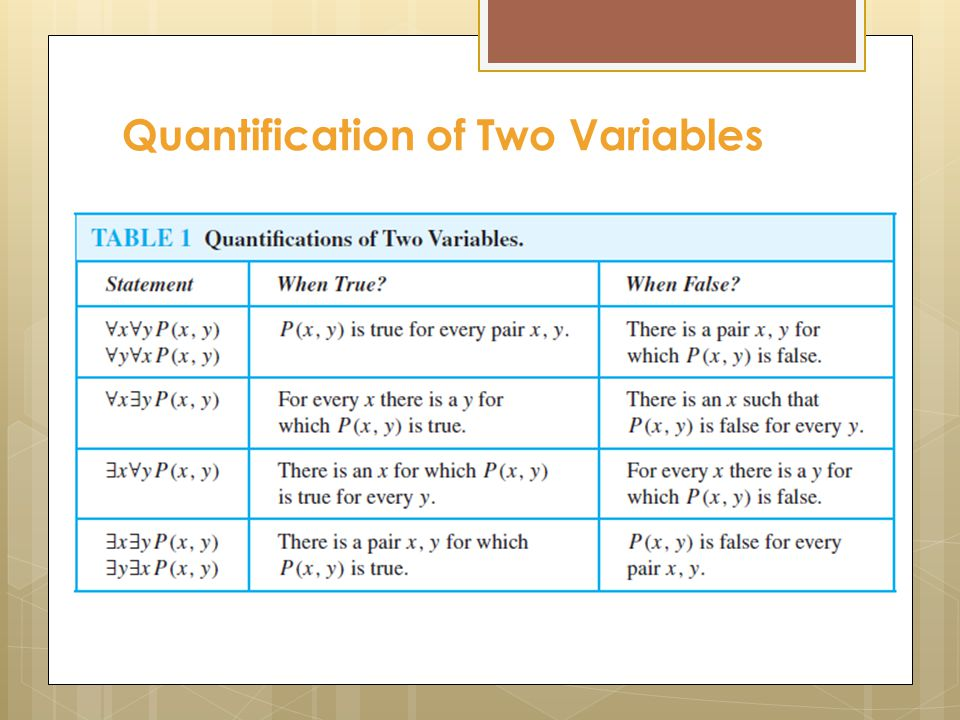

# Predicates and Quantifiers

## Predicates

**Predicate** (aka, propositional function) A statemenet that includes at least one variable and will evaluate to either true or false when the variables are assigned values.

Examples: "Q(x): x is a student in 144"

The statement "x is greater than 3" has two parts:
    - The variable x is the subject of the statement
    - The predicate "is greater than 3" is the property of the subject

**Domain**: the domain of a variable in a predicate is the set of all possible values for the variable (e.g., all integers, all real numbers, {0, 5 , 7})

### Propositional Functions

The statement `P(x)` is said to be the value of the propositional function `P` at `x`.

Once a value is assigned to `x`, the propositional function becomes a proposition, and has a truth value.

### Predicates with Multiple Variables

`P(x, y)`: "x is less than y"

The property is a relationship between the two variables.

------------------------------------

## Quantifiers

### Universal 

> "For every" or "for all"

easy ot prove false, hard to prove true

### Existential 

> "There exists"

Ex P(x) is true when at least one domain member causes P(x) to evaluate to true.

easy to prove true, hard to prove false
###

> "There exists a unique"

## Quanitfiers with Multiple Variables

`ExEy P(x, y)` = "There exissts an x and a y such that P(x,y) = T

`ExAy P(x, y)` = There exists an x such that for every y P(x, y) = T

`AxEy P(x, y)` = For every x ther exists a y such that P(x, y) = T

`AxAy P(x, y)` = For very x and for every y P(x, y) = T

### Quantified Statements to Express Mathematical Expressions

"The sum of two positive integers is alwyas positive" = 

`AxAy(((x>0) and (y>0)) -> (x + y > 0))` where the domain is all integers

### Varying the Domain and Predicates

- if the domain is wider, you have to add more conditions

### DeMorgan for Multiple Quantifiers

~ExP(x) = Ax !P(x)

This idea carries through for multiple quantifiers

`!ExAyp(x,y) = Ax!AyP(x,y)`

Push the negation through: `!AxEyP(x, y) = ExAy!p(x, y)`

### "Everyone Else..."

"Everyone in the class painted a portrait of someone else in the class" 

It's a mistake to write AxEyM(x, y) where M(x,y) = x painted a portrait of y because it doesnt account for **someone else** (self-portraits would make it evalaute to True even when it's not actually true)

Sp, we write `AxEy((x != y) and M(x, y))`

"Everyone in the class painted a portrait of everyone else in the class" cannot be `AxAy((x != y) and M(x, y))` because x and y are pulling from the same set, so eventually x and y will be equal and therefore it will always evaluate in sum to False (except when the set is empty -- AKA, it is vacuously true)

So, we write `AxAy((x != y) -> M(x, y)` where M(x,y): x painted a portrait of y

### Expressing "There exists unique (`E!x`)" Manually

`ExAy(P(x) and (P(y) -> (x = y)))` There exists one value x where for every value in the set, if the other value is also true, then it equal x, otherwise it is false.

or

`ExAy(P(x) and (x != y) -> !P(y))` = "There exists a value x, where for every other variable in the set, if the variable is not equal to x, it is false"

### Moving Quantifiers

You may move a quantifier through a logical statement except you...

1. Cant cross another quantifier
2. Cant move a quantifier across a variable with the same name

`Ax(P(x) -> Ey D(y,x))` = `AxEy(P(x) -> D(y, x))`

*Exception*: You can move quantifiers over each other if they are the same type of quantifier

### Prenux Normal Form (PNF)

All quantifiers on the left side

**To simplify out quantifiers to get into PNF**:
- We first change the variables names so that no quantifier has the same variable name
- There exists an exception with conditionals where you must first convert the conditional into a conjunction becuase there is a "hidden" negation implicit in a conditional

### Binding Variables

The variable that is bound by a quantifier is the one that is in the scope of the quantifier. 

The variable that is not bound by a quantifier is free.

The part of a logical expression to which a quantifier applies is called the scope of the quantifier.

