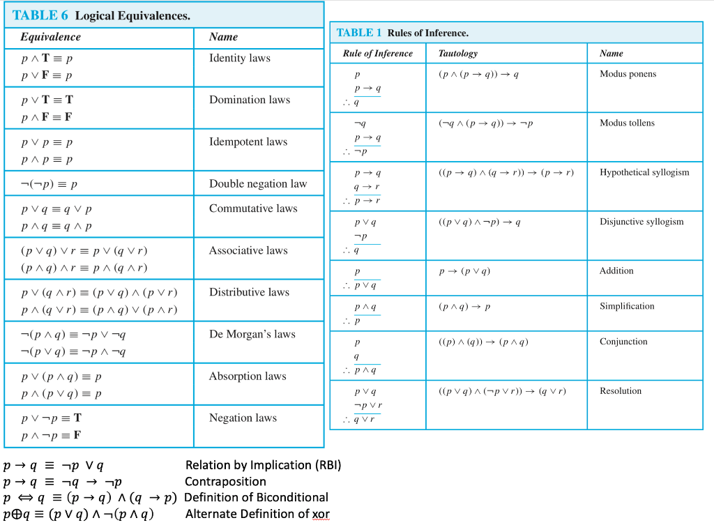

# Rules of Inference

[TOC]

--------------------------------



*Note*: The triangle of three dots is read as "therefore"

## Valid Argument

```Latex
p -> q
q -> r
-----------
therefore p -> r
```

The argument is valid in this notation if anytime the propositions above the dotted line are true, the proposition below the dotted line are true

In a truth table, we therefore only need to look at rows wherein the propositions above the dotted line (`p -> q` and `q -> r`) are `True`

### Invalid Argument

To show an arg is not valid, just show one case where all propositions in the hypothesis are true, but the conclusion is `False`

## Valid vs Sound

- p, q, r, s, c is *valid* `iff` `p and q and r and s -> c` is a tautology
- An argument is *sound* `iff` it is valid and all the premises are true

## Common Rules of Inference

| name | premises | conclusion |
|------|----------|------------|
| modus ponens | p, p-> q | q |
| modus tollens | !q, p -> q | !p |
| hypothetical syllogism | p -> q, q -> r | p -> r |
| disjunctive syllogism | p or q, !p | q |
| addition | p | p or q |
| simplification | p and q | p |
| conjunction | p, q | p and q |
| resolution | p or q, !p or r | q or r |


## Rules of Inference with Quantifiers

- To apply the rules of inference in these cases, we must remove the quantifier by plugging in a value from the domain for the variable
- We may either plug in an *arbitrary* element of the domain that has no special properties, or a *particular* element that has some special properties

### Universal Instantiation

`AxP(x)` therefore P(c) for any arbitrary or particular c from the domain of x

### Universal Generalization

c is an arbitrary element of D

P(c) therefore `AxP(x)`

### Existential Instantiation

`ExP(x)` therefore `P(c)` for some particular c


1. `ExP(x) and ExQ(x)` Premise
2. `ExP(x)` Simplication from (1)
3. `P(c)` Existential instantiation from (2)

### Existential Generalization

`P(c)` therefore `ExP(x)`


## Specious Reasoning

**Specious Reasoning**: An unsupported or improperly

### Common Fallacies

- Affirming the Conclusion: `p -> q, q therefore p`
- Denying the Hypothesis: `p -> q, !p therefore !q`
- Begging the Question (aka Circular Reasoning): `..., p, ... therefore p`
    - It is technically valid, it's jhust not a good proof


