- [Functions](#functions)
  - [Domains and Codomains](#domains-and-codomains)
  - [Not Functions](#not-functions)
    - [Example of Not Well-Defined Function](#example-of-not-well-defined-function)
    - [Equal Functions](#equal-functions)
    - [Real and Intger Valued Functions](#real-and-intger-valued-functions)
  - [Adding and Multiplying Functions](#adding-and-multiplying-functions)
  - [Image of Sets](#image-of-sets)
  - [Special Functions](#special-functions)
    - [Floor and Ceiling Functions](#floor-and-ceiling-functions)
      - [Floor Function](#floor-function)
      - [Ceiling Function](#ceiling-function)
    - [1-1 Functions](#1-1-functions)
    - [Onto Functions](#onto-functions)
    - [Bijection](#bijection)
    - [Proving/Disproving Injectivity and Surjectivity](#provingdisproving-injectivity-and-surjectivity)
    - [Inverse Function](#inverse-function)
      - [Expanded Notes on Inverse Functions](#expanded-notes-on-inverse-functions)
    - [Composition of Functions](#composition-of-functions)
      - [Commutativity of Composiitions](#commutativity-of-composiitions)
    - [Identity Functions](#identity-functions)
    - [Increasing Functions](#increasing-functions)
      - [Strictly Increasing](#strictly-increasing)
    - [Decreasing Functions](#decreasing-functions)
      - [Strictly Decreasing](#strictly-decreasing)
    - [Graphs of Functions](#graphs-of-functions)
    - [Factorial](#factorial)
    - [Partial Functions](#partial-functions)

# Functions

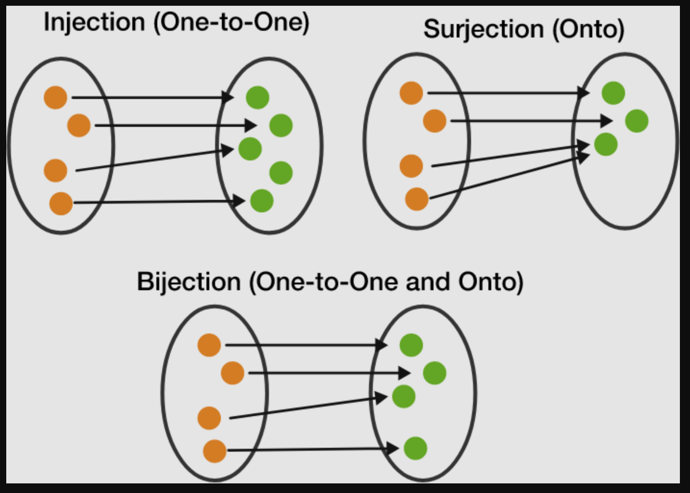

Let A and B be nonempty sets

A *function* or a *mapping* from A to B is an assignment of exactly one element of B to each element of A. We write f: A -> B

Can be thought of as a subset of A x B (Cartesian product of A and B)
- Each ordered pair (x,y), we can think of the function as mapping x to y
    - f(x) = y, so f subset A x B
- But a function 
- AxEy(x, y) &isin; f
    - But we need each elemnt of A to map to **exactly** one element in B
    - Thus, AxE!y(x, y) &isin; f

## Domains and Codomains

- if f is a function from A to B (f: A -> B)
- We say A is the *domain* of f and B is the *codomain* (or *target*) of f
- We say f(A) = {f(a) | a &isin; A} is the *range* (or *image*) of f
    - Note that f(A) is a subset of 
- If f: A -> B and f(a) = b, we call b the iamge of a and a the preimage of b

## Not Functions

- Takes elements of A and maps them to B but either
    - Doesnt map some elements of A
    - Maps some elements of A to more than one element of B
- We say f is *not well-defined*
- f(x) 1/x is not a function because we havent defined the domain and codamin
    - Likewise, if x is real numbers, it's still not a function ebcause f0 is not mapped
- Not everything in the codomain needs to be mapped, of course. but the domain needs to be entirely mapped

### Example of Not Well-Defined Function

A = {a, b, c}, B = {1, 2}
- f = {(a, 1), (c, 2)}
    - Not all elements of A mapped
- f = {(a, 1), (b, 2), (c, 1), (a, 2)}
    - Multiple elements of B mapped to elements of A 

### Equal Functions

- Two functinos f and f are *equal* iff they have the same domain and codomain and if f(x) = g(x) for every x in the domain
- If two functions are equal, we write `f = g`
- f(x) = x + 1 and g(x) = x + 1 are not necessarily equal if their domains are not both the same domain (e.g., real numbers)

### Real and Intger Valued Functions

- If the codomain of a function f is the real numbers, we say f is a *real-valued* function
- if the codomain of a function is the intergers, we say f is an integer-valued function
- if f1 and f2 are either real-valued or ineger-valued, we can defined the functions f1 + f2 and f1f2 as 
    - f1+f2(x) = f1(x) + f2(x)
    - f1f2(x) = f1(x)f2(x)

## Adding and Multiplying Functions

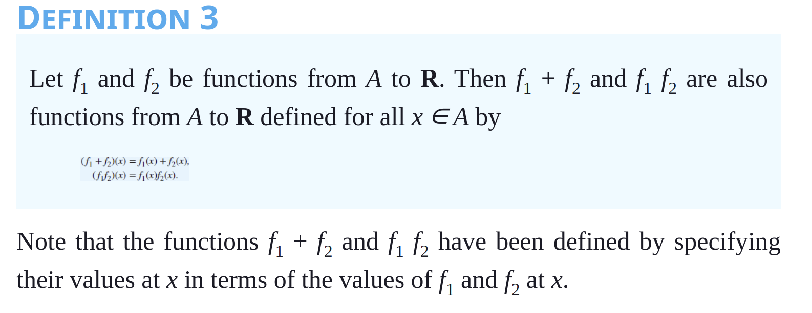

- If f1 and f2 are functions from A to B, we can define the functions f1 + f2 and f1f2 as 
  - (f1 + f2)(x) = f1(x) + f2(x)
  - (f1f2)(x) = f1(x)f2(x)
  - These are called the *sum* and *product* of f1 and f2, respectively
  - The domain of f1 + f2 and f1f2 is the intersection of the domains of f1 and f2
  - The codomain of f1 + f2 and f1f2 is the same as the codomain of f1 and f2
  - The range of f1 + f2 and f1f2 is the set of all sums and products of elements of the range of f1 and f2
  - If f1 and f2 are real-valued functions, then f1 + f2 and f1f2 are real-valued functions
  - If f1 and f2 are integer-valued functions, then f1 + f2 and f1f2 are integer-valued functions

## Image of Sets

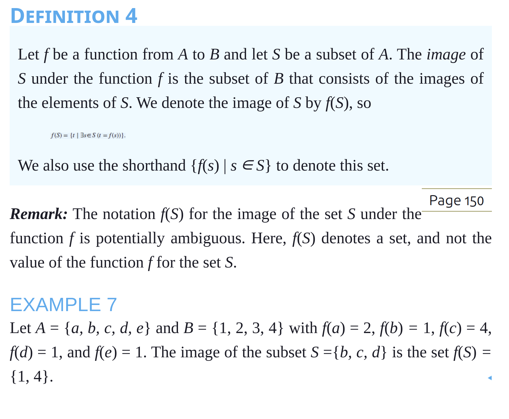

If f: A -> B, and S is subset of A, we can define the image of S under f, written as f(S) as the set {y &isin; B | Ex &isin; S s.t.f(x) = y}

## Special Functions

### Floor and Ceiling Functions

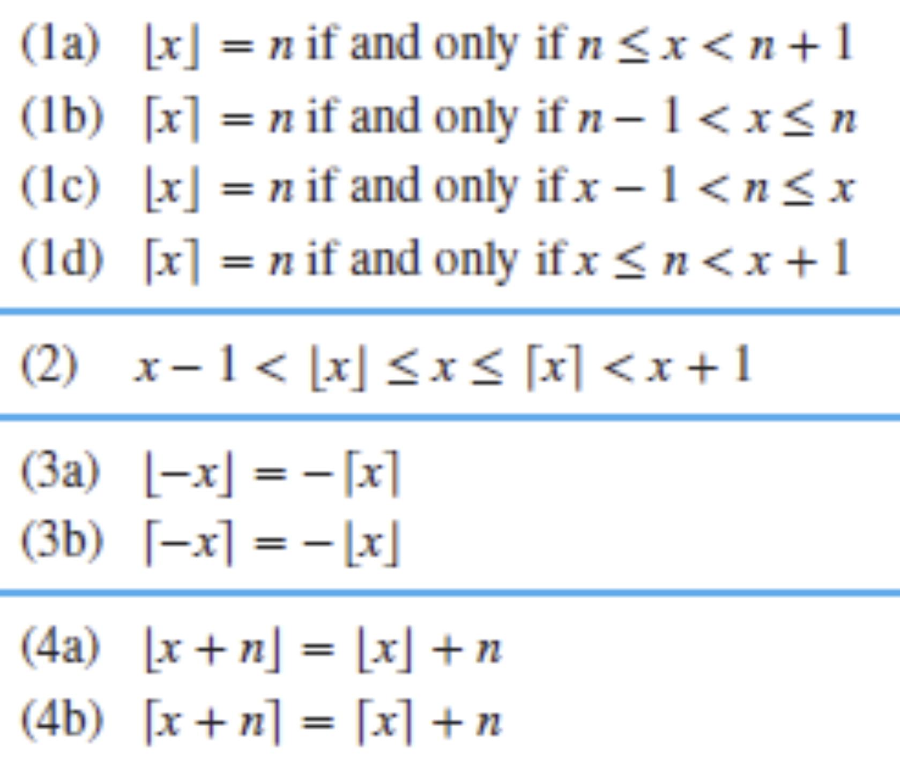

#### Floor Function

- The *floor function* is a function from R to Z that takes a real number x and returns the largest integer that is less than or equal to x
    - denoted [x]
    - [7.3] = 7
    - [5] = 5
    - [-5.5] = -6
        - Because -6 is less than or equal to -5.5

Helpful technique when dealing with floor/ceiling functions: consider them as n + epsilon, where n is the integer and epsilon is the decimal part of the number. Then, the floor function will return n, and the ceiling function will return n + 1:

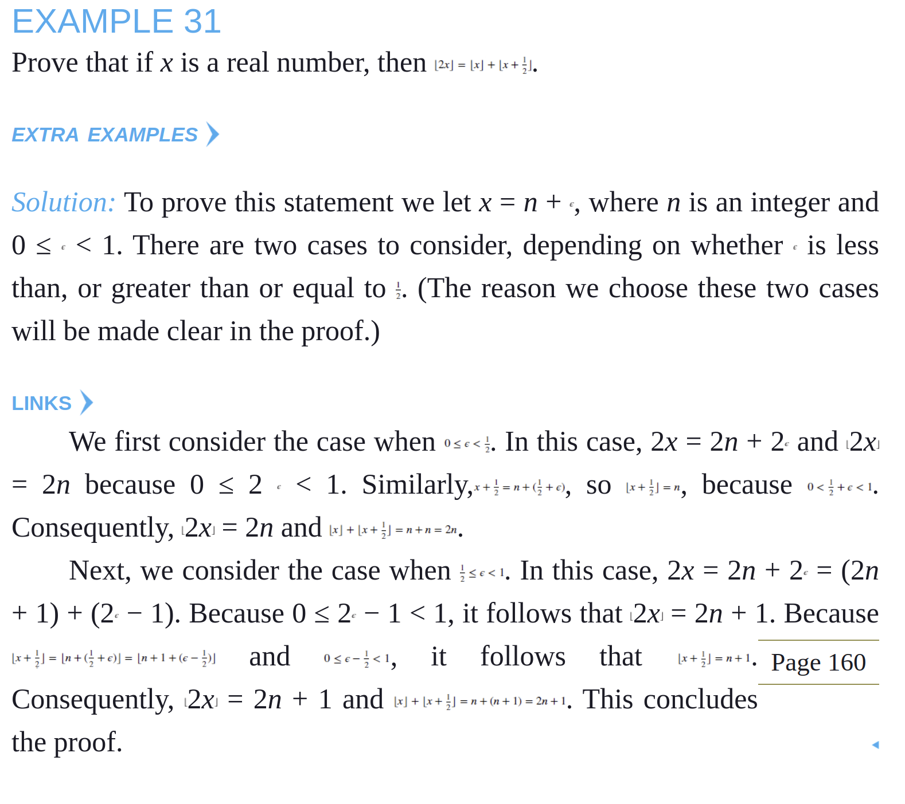

#### Ceiling Function

- The *ceiling function* does the opposite (greater than or equal to the input)
    - [-5.5] = -5

### 1-1 Functions

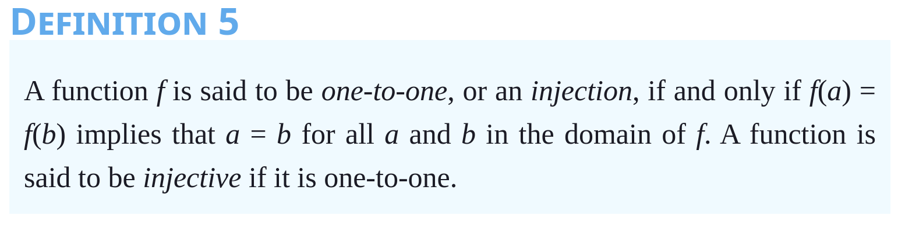

- a functoin is said to be one-to-one or an *injection* iff no two things map to the same thing
    - Ax,y &isin; (f(x) = f(y) -> x = y)
    - No two elements in A are maaped to the same elements in B
- Floor and Ceiling functions are not one-to-one, because multiple values of the input will map to the same output (because it's rounding)

From these definitions, it can be shown (see Exercises 26 and 27) that a function that is either strictly increasing or strictly decreasing must be one-to-one. However, a function that is increasing, but not strictly increasing, or decreasing, but not strictly decreasing, is not one-to-one. For example, the function f(x) = x^2 is not one-to-one because f(-1) = f(1) = 1, but f is increasing on the interval `[0, infinity)`. The function g(x) = x^3 is not one-to-one because g(-1) = g(1) = -1, but g is decreasing on the interval [-1, 0].

### Onto Functions

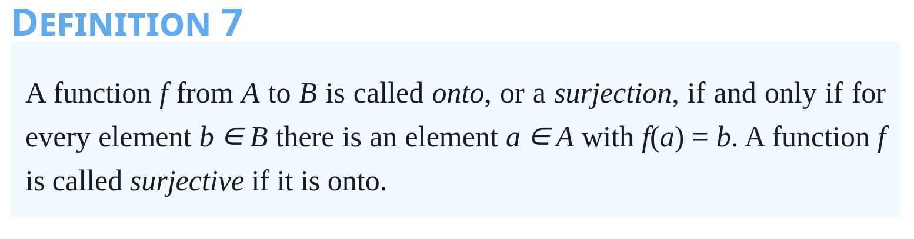

- A function is said to be *onto* or an *surjection* iff the image of f is B
    - In other words, every element of B is mapped to by some element of A
- Sometimes, we write f(A) = {f(x): x &isin; A}
    - using this notation , f is *onto* iff f(A) = B
- For example,
    - suppose f: R -> R
    - f(x) = x + 1 is onto
    - f(x) = |x| is not onto
    - g: R -> Z, g(x) = |x| is onto

### Bijection

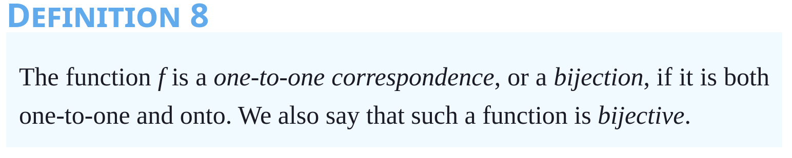

- A function is said to be a bijection or 1-1 correspondence iff if f is both 1-1 and onto

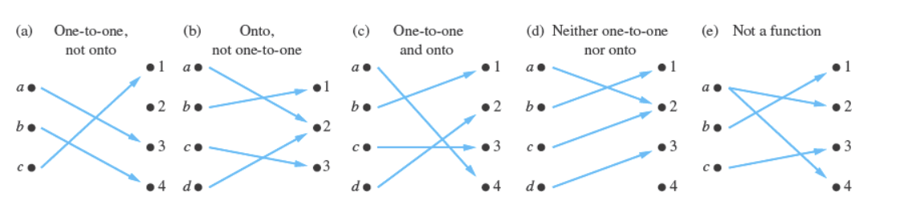

### Proving/Disproving Injectivity and Surjectivity

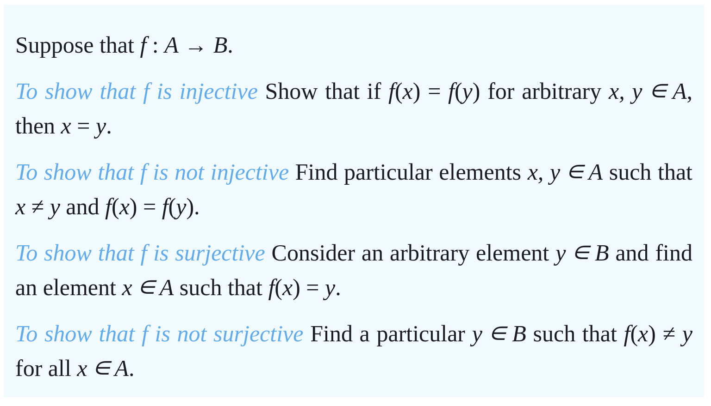

### Inverse Function

- If a function is a bijection, then we can define the *inverse* of f, written f^-1: B -> A as f^-1(b) = a <-> f()a = b
- A function has an inverse iff the function is a bijection (one-to-one and onto)
- *Remark*: Be sure not to confuse the function f−1 with the function 1/f, which is the function that assigns to each x in the domain the value 1/f(x). Notice that the latter makes sense only when f(x) is a nonzero real number.
- If a function f is not a one-to-one correspondence, we cannot define an inverse function of f. When f is not a one-to-one correspondence, either it is not one-to-one or it is not onto. If f is not one-to-one, some element b in the codomain is the image of more than one element in the domain. If f is not onto, for some element b in the codomain, no element a in the domain exists for which f(a) = b. Consequently, if f is not a one-to-one correspondence, we cannot assign to each element b in the codomain a unique element a in the domain such that f(a) = b (because for some b there is either more than one such a or no such a).
- A one-to-one correspondence is called invertible because we can define an inverse of this function. A function is not invertible if it is not a one-to-one correspondence, because the inverse of such a function does not exist.

#### Expanded Notes on Inverse Functions

- Not all functions have inverses. Functions that do not have inverses are typically those that fail the horizontal line test, meaning they are not one-to-one (injective). In other words, if a horizontal line intersects the graph of the function at more than one point, then the function is not one-to-one and does not have an inverse.
- Functions that are not one-to-one include:
    - Polynomial functions of degree greater than 1: These functions often fail the horizontal line test because they have multiple turning points.
    - Trigonometric functions: Sine, cosine, and tangent functions are periodic and repeat their values, so they are not injective over their entire domains.
    - Exponential functions such as f(x) = e^x 
        - These functions grow or decay very rapidly and are not one-to-one.
    - Logarithmic functions such as f(x)=log(x) with base greater than 1: These functions are the inverses of exponential functions and have restricted domains.
    - Piecewise-defined functions: Functions defined by different rules on different intervals may fail to be one-to-one over their entire domain.

### Composition of Functions

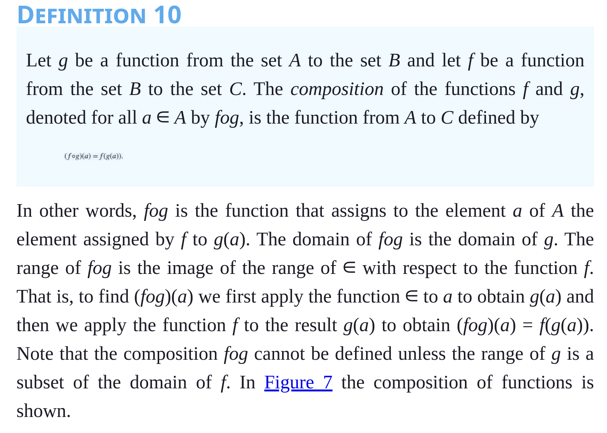

- Let f: A -> B and g: B -> C be functions
    - then we can define a function rom A to C called the *composition* of g and f, denoted g o f, as (g o f)(x) = g(f(x))
- Any function composed with its inverse will give you the identity function

#### Commutativity of Composiitions

- A composition is not commutative
- f o g =/= g o f
- Even if the domains and codomains ar teh same, composition of functions is still generally **not** commutative
- Example
    - f: Z -> Z, f(x) = 3x, g: Z -> Z, g(x) = 5 + x
    - f o g(1) = f(g(1))
    - g o f(1) = g(f(1))

### Identity Functions

- An *identity* function maps a set to itself and maps every element to itself
    - f: A -> A, f(x) = x
- Any function composed with its inverse will give you the identity function

----------------------

### Increasing Functions

- A function is said to be *increasing* iff 
    - Ax,y(x < y -> f(x) <= f(y))
- It can have "level" areas where it is not technically increasing, but it's also not decreasing

#### Strictly Increasing

- A function is said to be *strictly increasing* iff 
    - Ax,y(x < y -> f(x) < f(y))
- must be one-to-one

### Decreasing Functions

- A function is said to be *decreasing* iff 
    - Ax,y(x < y -> f(x) >= f(y))

#### Strictly Decreasing

- A function is said to be *strictly decreasing* iff 
    - Ax,y(x < y -> f(x) > f(y))
- must be one-to-one

### Graphs of Functions

- The *graph* of the function f is the set of ordered pairs {(a, b) | a &isin; A and f(a) = b}

### Factorial

- From Natural Numbers N to Z+
- n! = `1 * 2 * 3 ...*n if n =/= 0`
- special case: 0! = 1
    - not strictly increasing because of the case (0, 1)

### Partial Functions

- a *partial function* f from a set A to set B is an assignmet to each element a in a subset of A, called the *domain of definition* of f, of a unique element b in B
    - The sets A and B are called the *domain* and *codomain* of f. 
    - We say that f is *undefined* for elements in A that are not in the domain of definition of f

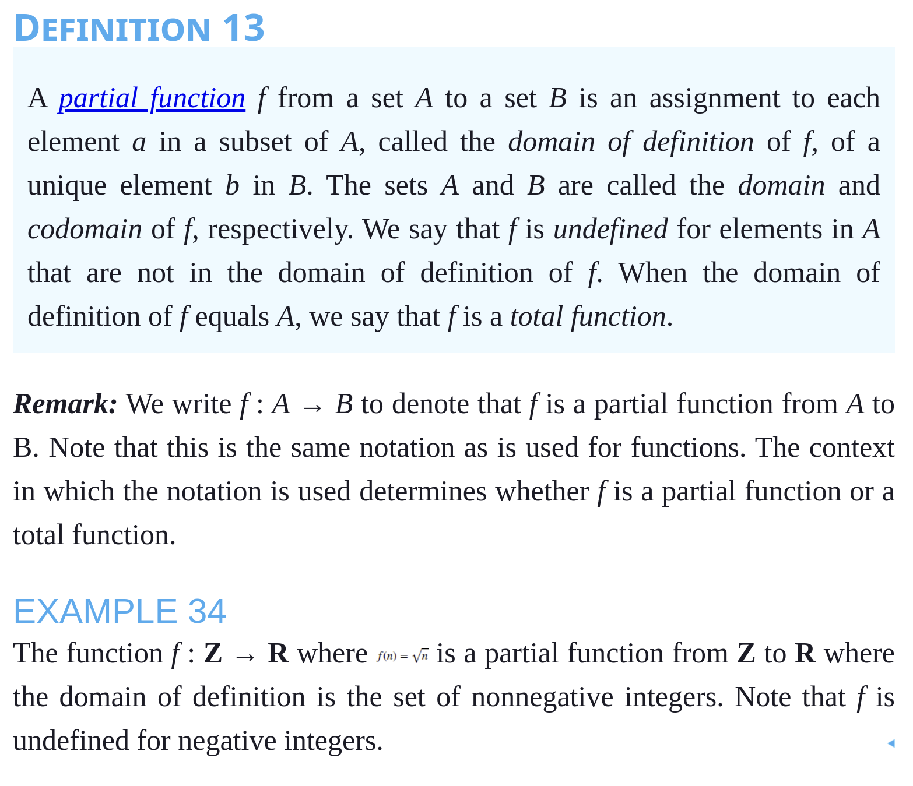

