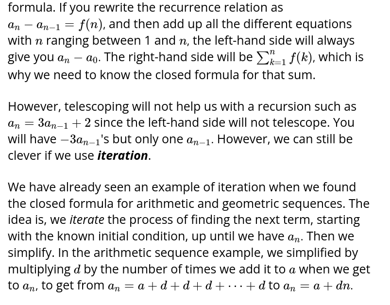
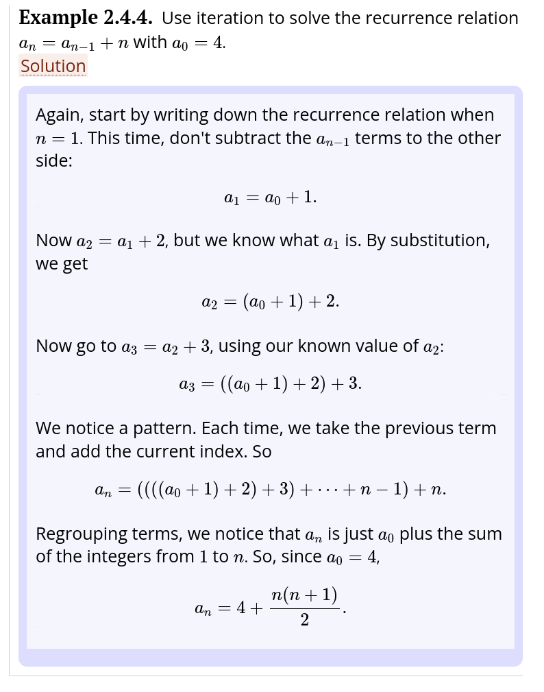
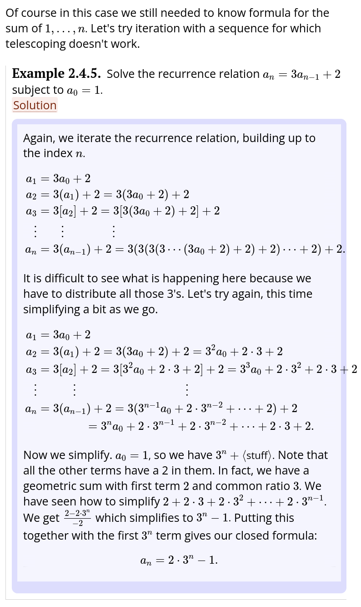
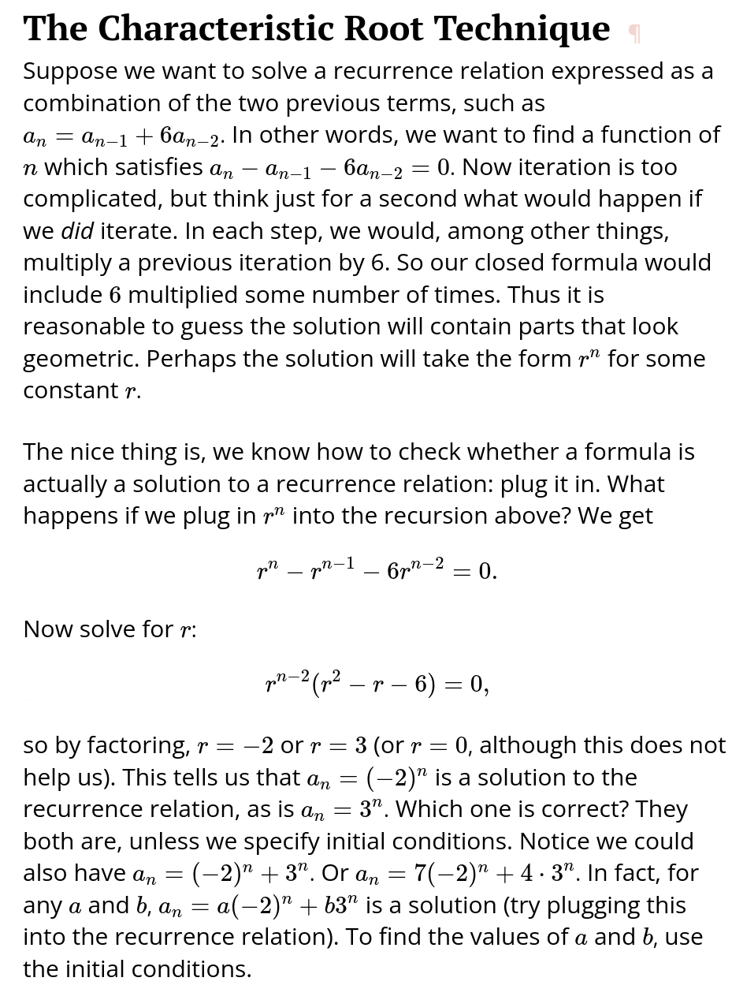
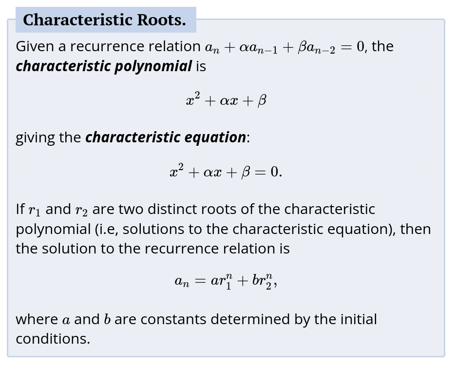
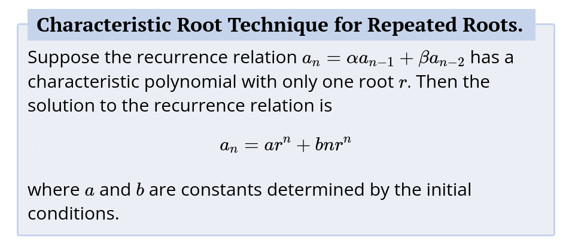
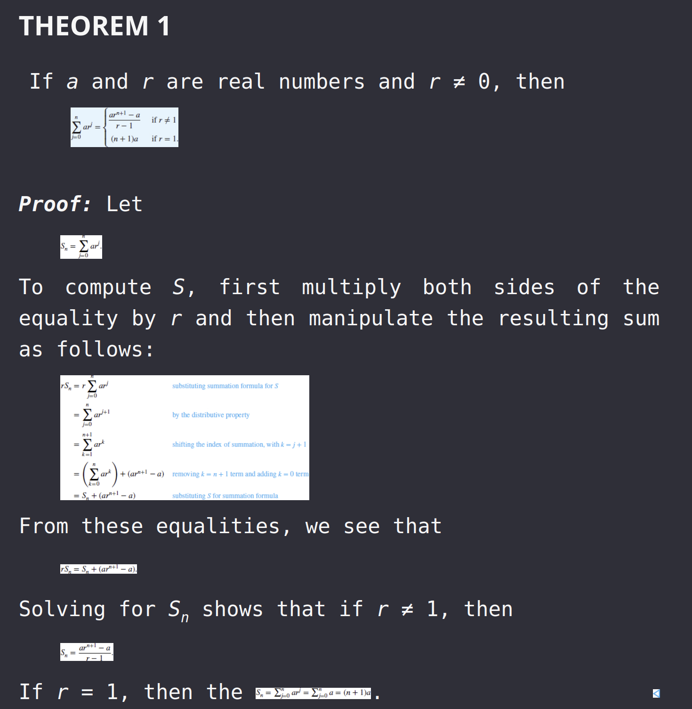
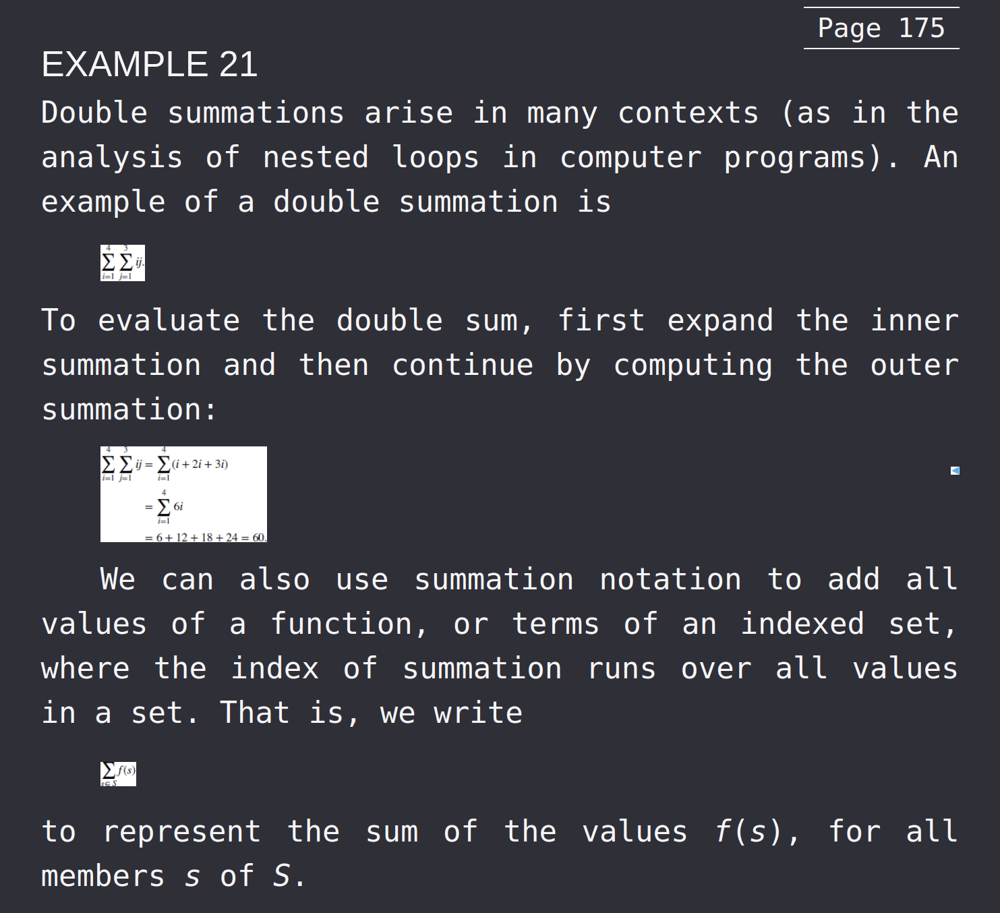
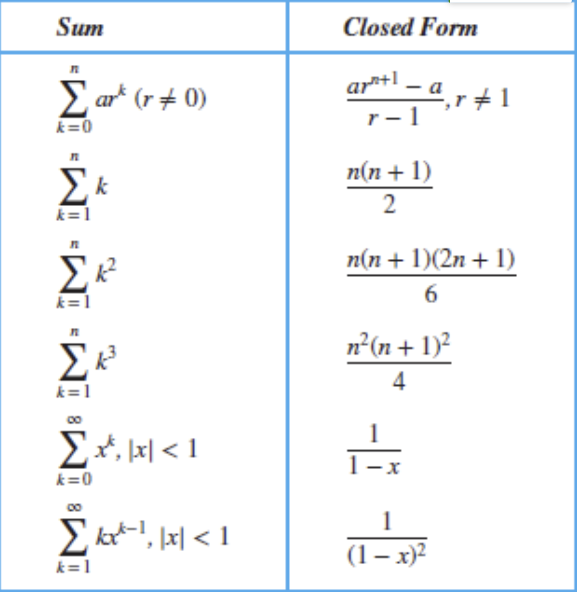
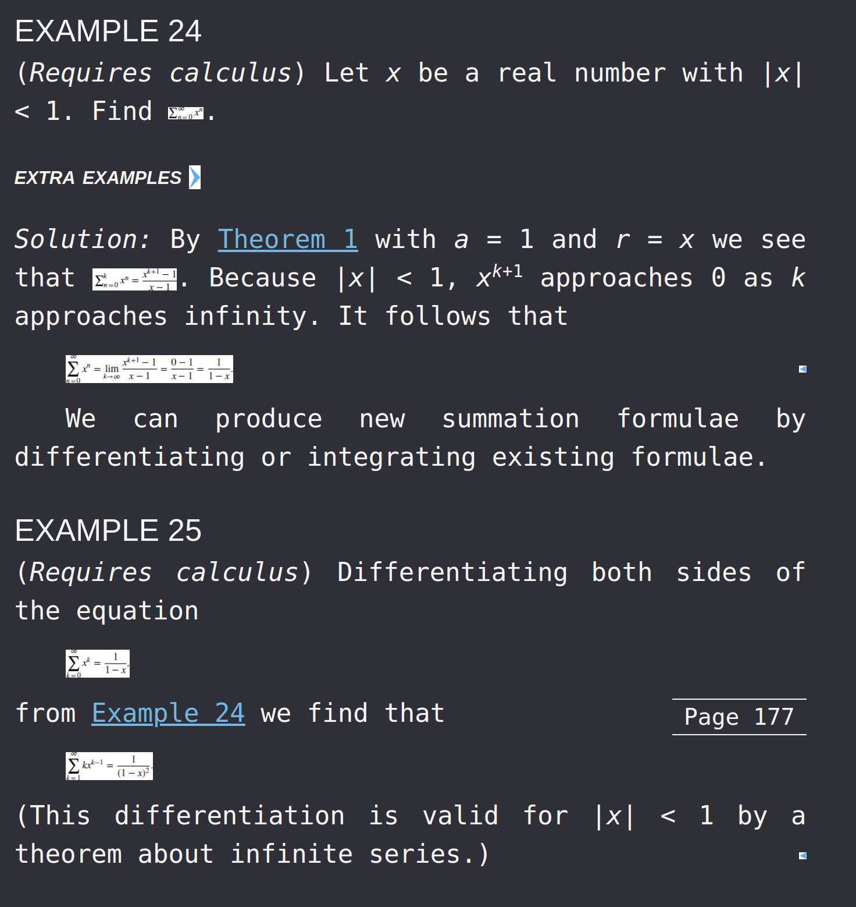

- [Sequences](#sequences)
  - [Special Sequences](#special-sequences)
    - [Geometric Sequences](#geometric-sequences)
    - [Arithmetic Sequences](#arithmetic-sequences)
    - [Strings](#strings)
      - [The Empty String](#the-empty-string)
    - [Recurrence Relation](#recurrence-relation)
      - [Example of Recurrence Relations](#example-of-recurrence-relations)
        - [Fibonacci Sequence](#fibonacci-sequence)
        - [Factorials](#factorials)
      - [Recurrence Relation Solutions](#recurrence-relation-solutions)
        - [Solving Technique - Iteration](#solving-technique---iteration)
        - [Solving Technique - The Characteristic Equation/Roots](#solving-technique---the-characteristic-equationroots)
          - [Proof/How it's Derived](#proofhow-its-derived)
          - [Formula/Applied](#formulaapplied)
- [Summations](#summations)
  - [Summation of Geometric Series](#summation-of-geometric-series)
  - [Pulling out a Term](#pulling-out-a-term)
  - [Change of Variable in Summations](#change-of-variable-in-summations)
  - [Closed Form for Summations](#closed-form-for-summations)
  - [Rules/Properties of Summations](#rulesproperties-of-summations)
  - [Closed Form of Geometric Series](#closed-form-of-geometric-series)
  - [Double Summations](#double-summations)
  - [Summation to Add all Values of a Functino](#summation-to-add-all-values-of-a-functino)
  - [Summation to Indicate the Sum of a Set](#summation-to-indicate-the-sum-of-a-set)
  - [Some Useful Summation Formulas/Identites](#some-useful-summation-formulasidentites)
  - [Sum of Infinite Series \& Applicatinos to Calculus](#sum-of-infinite-series--applicatinos-to-calculus)
  - [Cardinality of Sets](#cardinality-of-sets)
  - [Countable](#countable)
    - [Rationals](#rationals)
    - [Real Numbers](#real-numbers)

# Sequences

- A *sequence* is an ordered list of items from some set A.
- A sequence might include repeated items
- The list could be finite or infinite
- Mathematical Definition:
    - a function whose domain is {1,2,3,...,n} for a finite sequence and Z+ for an infinite sequence
- Each value `a_k` of a sequence is called a *term*
    - k is the *index*
- If we have a numeric sequence, it is sometimes specified with a formula
    - e.g., `a_i` = 2i
        - Sequence: 2, 4, 6, 8, 10, ...
    - called an *explicit formula*

## Special Sequences

### Geometric Sequences

- A *geometric sequence (geometric progression)* of numbers is a sequence, where after the initial term, every other term is foud by multipolying the previous term by a fixed value called the *common ratio*
    - can be finite or finintie
    - Examples:
        - 1, 1/2, 1/4, 1/8 is a decreasing geometric sequence where the common ratio is 1/2
        - 3, 9, 27, 81 is a finite, increasing geometric sequence

### Arithmetic Sequences

- after the initial term, every other term is found by adding a fixed value to the previous term
- the value added is called the *common difference*
- can be finite or infinite
- Examples
    - 1, 2, 3, 4 is an increasing arithmetic sequence where the common difference is 1
    - 8,6,4,2 is a decreasing arithmetic sequence where the common difference is 2

### Strings

- A *string* is a finite sequence
- The codomain of a string's sequence is called the *alphabet*
    - Technically, the alphabet must be a finite set of strings
- With strings, we usually write the elements adjacent to each other (as oposed to comma-spearated)

#### The Empty String

- In formal treatments, the empty string is denoted with ε or sometimes Λ or λ
- The empty string should not be confused with the empty language ∅, which is a formal language (i.e. a set of strings) that contains no strings, not even the empty string.
- The empty string has several properties: |ε| = 0.

### Recurrence Relation

- A *recurrence relation* for the sequence {`a_n`} is an equation that expresses `a_n` in terms of one or more of the previous terms of the sequence
- A sequence is called a *solution* of a recurrence relation if its terms satisfy the recurrence relation
- A recurrence relation is said to *recursively define* the {`a_n`} sequence
- Examples
    - {`a_n`} is defined by `a_n` = `a_n-1` + 5
        - Then the sequence 0,5,10,15,29,... is a solution of the recurrence
        - Also the sequence 2,7,12,17,.. is also a solution of the recurrence
- In order for a recurrence relation to define a particular sequence, you need to define an initial value
    - Example: {`a_n`} is defined by `a_n` = `a_n-1` + 5, `a_1`=3
    - Example: {`a_n`} is defined by `a_n` = `a_n-1` + `a_n-2`, `a_1`=3, `a_2`=5
        - We need two starting values for this example
- Since arithmetic sequences are defiend by describing each term as a constant plus a previous term, these are all recurrence relations
- Geometric sequences are also defined as recurrence relations, since each term is a constant time the previous term

#### Example of Recurrence Relations

##### Fibonacci Sequence

`fn = f_n-1 + f_n-2`

##### Factorials

`a_n = n * a_n-1`

#### Recurrence Relation Solutions

- We have solved the recurrence relation together with the initial conditions when we find an explicit formula, called a *closed formula*, for the terms of the sequence
- Example
    - suppose we have the recurrence `a_n =  2a_n-1 - a_n-1`
    - if `a_n = 0` is a solution for this recurrence, when we plug the formula `a_n = 0` into the recurrence relation, it becomes a tautology
    - try `a_n = 3n`
        - then `2a_n-1 - a_n-2` = `2(3(n-1)) - 3(n-2) = 3n = a_n`

    - there can be more than one solution because we didnt define any initial values
- Suppose we have a recurrence relations (including the initial conditions) and we want to find the closed formula:
    - Start by trying to write out the sequence solution (without simplifying) and trying to find patterns in the arithmetic used for each term `n`
- Backward substitution:
    - to do

##### Solving Technique - Iteration

##### Solving Technique - The Characteristic Equation/Roots

- The characteristic equation is a polynomial equation that is derived from the recurrence relation
- The roots of the characteristic equation are used to find the closed formula for the sequence

###### Proof/How it's Derived

###### Formula/Applied

---------------

# Summations

## Summation of Geometric Series

## Pulling out a Term

- We can pull out a term from a summation
- Example:
    - `Σ(3i + 2) = 3Σi + 2Σ1`
    - `Σ(3i + 2) = 3Σi + 2n`
    - `Σ(3i + 2) = 3(n(n+1)/2) + 2n`
    - `Σ(3i + 2) = 3n(n+1)/2 + 2n`
    - `Σ(3i + 2) = 3n(n+1)/2 + 4n/2`
    - `Σ(3i + 2) = 3n(n+1)/2 + 4n/2`
    - `Σ(3i + 2) = (3n(n+1) + 4n)/2`
    - `Σ(3i + 2) = (3n^2 + 3n + 4n)/2`
    - `Σ(3i + 2) = (3n^2 + 7n)/2`

## Change of Variable in Summations

- Often, we want ot have our limit be either 0 or 1
- We can do this by changing the variable in the summation
- Let's call our new variable `k`
- We want k=0 when i=2, so i = k + 2, which also means k = i - 2
    - The new upper limit is when i=4, which means k = 4 -2 = 2
    - We then replace i with k + 2

## Closed Form for Summations

- A *closed form* for a sum is a mathematical expression without the summation notation (or list of terms)

## Rules/Properties of Summations

- can factor out the coefficients, find the sum of the terms and then multiply that sum by the coefficient
- can distribute the summation sign

## Closed Form of Geometric Series

## Double Summations

- A *double summation* is a summation of a summation
- The inner summation is done first
- The outer summation is done second
- The inner summation is done for each value of the outer summation
  

  

## Summation to Add all Values of a Functino

- We can also use summation notation to add all values of a function, or terms of an indexed set, where the index of summation runs over all values in a set. That is, we write
- `Σf(i) = f(1) + f(2) + f(3) + ... + f(n)` where `i` is the index of summation and f(n) includes all members n of the set N

## Summation to Indicate the Sum of a Set

- We can use summation notation to indicate the sum of a set of numbers
- `Σa_i` = `a_1 + a_2 + a_3 + ... + a_n`
- `Σ`r &isin; {1, 2, 3} = 1 + 2 + 3

## Some Useful Summation Formulas/Identites

## Sum of Infinite Series & Applicatinos to Calculus

## Cardinality of Sets

- **Definition**: Two sets A and B have the same cardinality iff there is one-to-one corrspondence from A to B 
    - We write |A| = |B|
- A set is *finite* and has cardinality n iff there is a 1-1 and onto mapping from A to {1,2,3,..,n}
    - We write |A| = n
- If A and B are sets and there is a 1-1 function from A to B, then we say the cardinality of A is less than or equal to the cardinality o fB and we write |A| <= |B|
    - if |A| <= |B| and |A| =/= |B|, then we say the cardinality of A is less than the cardinlaity of B and we write |A| < |B|

## Countable

- **Definition**: We say a set is *countable* iff it is finite or has the same cardinlaity as Z+
    - If a set is countable and infnite we say it is *countably infinite*
- When showing a set A is countable:
    - We can give the function from A to Z+ as a formula
    - or list out the sequence of elements in A in such a way that it is clear how to continue the sequnece and that the sequence will contain all of A
        - just describing the even numbers as {2,4,6,...} demonstrates sufficiently that it is a countable set
        - describing integers as {0, 1, -1, 2, -2, 3, -3} demonstrates is a countable set because it is clear what the pattern is
            - We write it like this because we can't write {..., -1, 0, 1, ....}
                - Because a series needs a starting point
            - Given the definition (above) of *Cardinality of Sets*, The set of of all positive integers and the set of all integers has the same cardinality because there is technically a 1-1 correspondence between them
                - {0, 1, -1, 2, -2} can technically map onto {0, 1, 2, 3, 4} in a one-to-one fashion
                - And yet, counterintuitively, the set of positive integers is a proper subset of the set of all integers
    - or we can describe the function as a "program"
        - must be well defined
        - while it may run forever, given any element of A, that element must be listed after a finite number of steps

### Rationals

- Is any set "bigger" than the set of all positive integers?
- We can create a sequene that includes all the rational numbers by diagonalization
    - This sequence only gives us the set of all positive rational numbers (Q+), but it's easy to adjust to give all Q
    - Every rational number is on the matrix/graph
- Turn the matrix into a sequence
    - We can't go row by row, because we will never get to the end of the first row
    - Instead, we use diagonalization to list them sequentially (valid sequence)
    - If we come across a repeat number, we can simply not list/include them
- We take the sequence we found using the positive rational numbers matrix, and we do what we did with integers
    - {1/2, 2/1, 3/1} turns into {1/2, -1/2, 2/1, -2/1, 3/1, -3/1}
- Now, we have a sequence of all rational numbers which will "get to" every rational number eventually moving sequentially
    - Therefore, by the definition of *Countable* via cardinality, the set of rational numbers is countable

### Real Numbers
 

- Suppose R *is* countable
    - Then we can form a sequence that contains all the real numbers by the definition of cardinality
    - We form a matrix with each floating point number such that all the decimal point values are lined up in columns
        - so a number x = `0.d_1d_2d_3...` where d_1 is a digit
            - e.g., 0.123
            - x is a real number, therefore it must be in the sequence somewhere
                - Let's say it's at position j
                - But it can't be at position j, since the jth digit of that number is different than the jth digit of x
                    - Therefore, you've created a number that can't be on the list
                    - Furthermore, you've created an algorithm with the generic definition of x for arbitrarily generating numbers that are not in the set of real numbers

