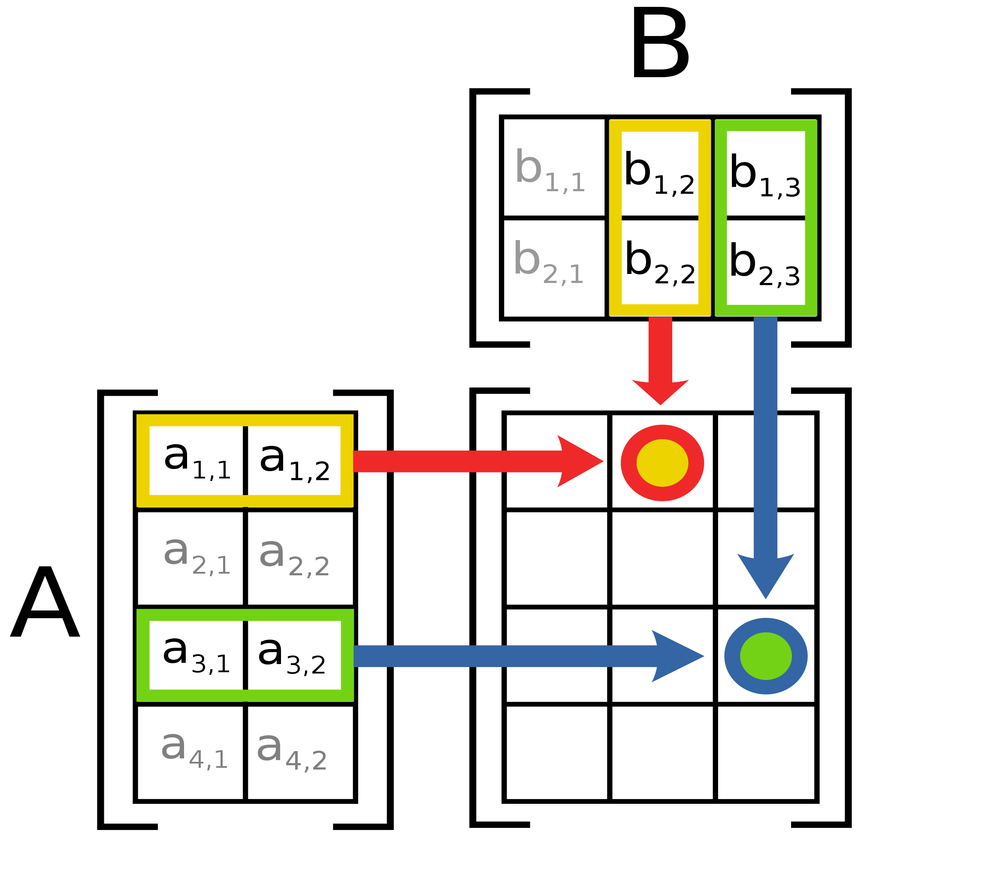
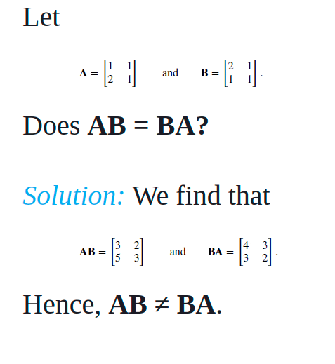
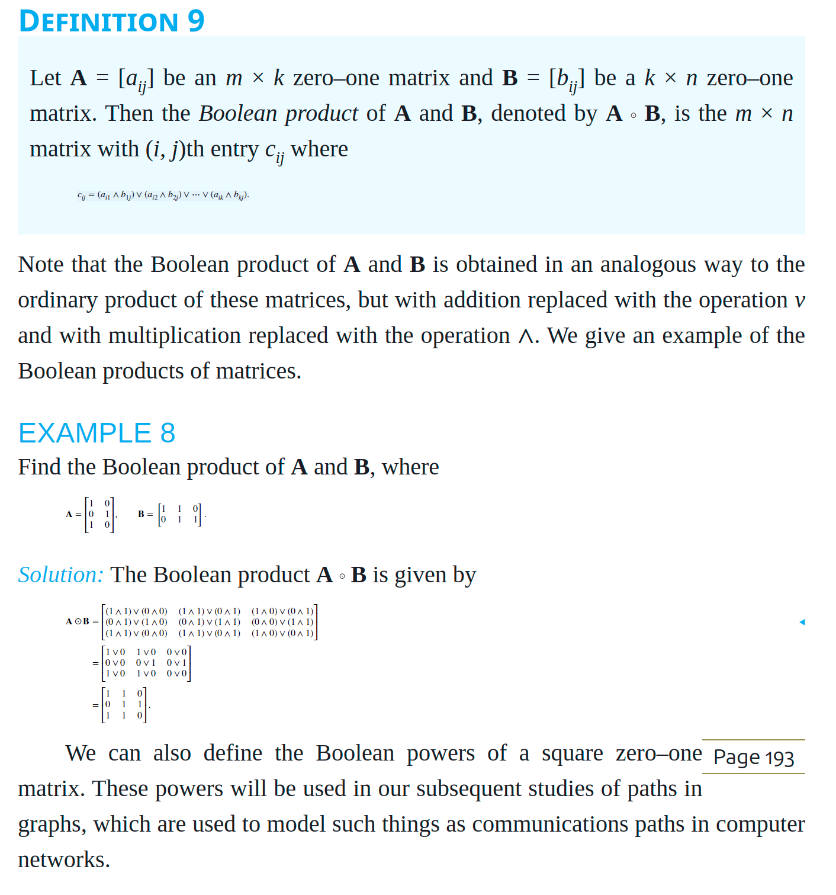
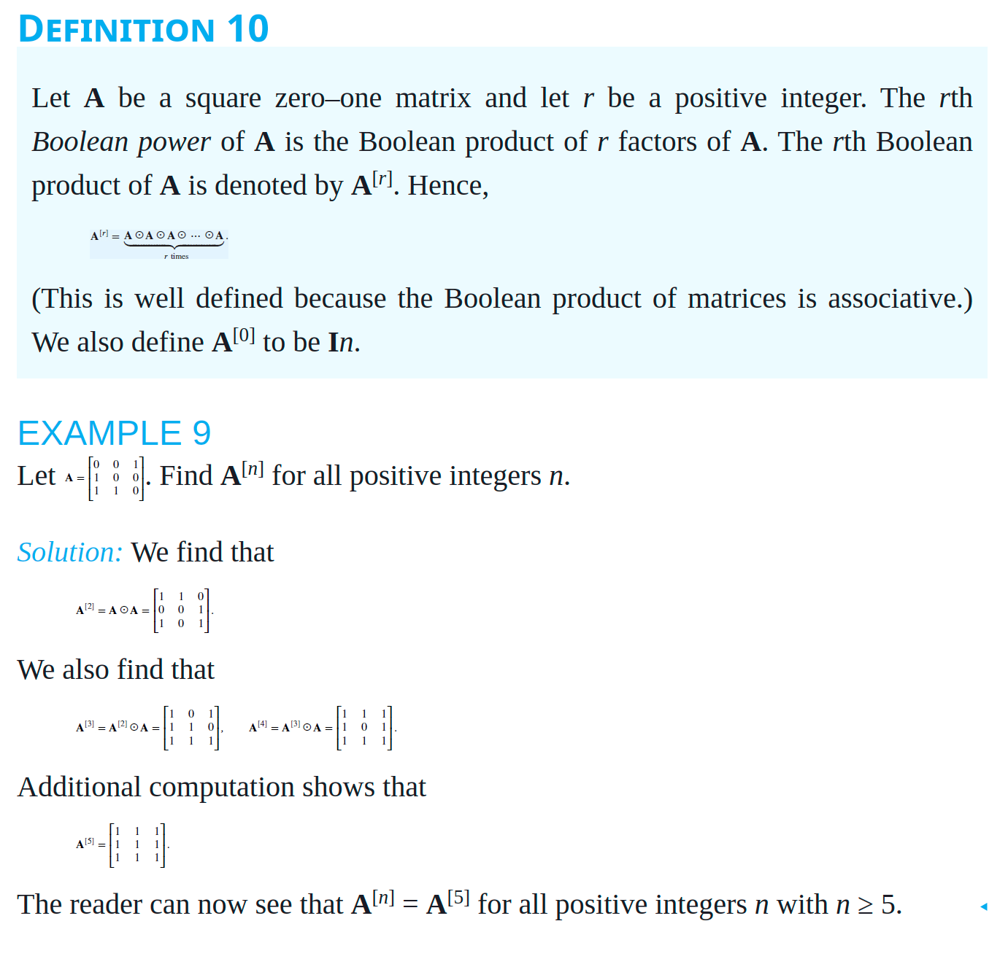

# Chapter 2.6 - Matrices

A matrix is a rectangular array of numbers. A matrix with m rows and n columns is called an m × n matrix. The plural of matrix is matrices. A matrix with the same number of rows as columns is called square. Two matrices are equal if they have the same number of rows and the same number of columns and the corresponding entries in every position are equal.

## Matrix Addition

Two matrices can be added if they have the same number of rows and columns. The sum of two matrices is found by adding the corresponding entries in the two matrices. For example, if

## Matrix Multiplication

Two matrices can be multiplied if the number of columns in the first matrix is equal to the number of rows in the second matrix. The product of two matrices is found by multiplying the rows of the first matrix by the columns of the second matrix. For example





- If the number of rows in the first matrix is m and the number of columns in the second matrix is n, then the product of the two matrices will have m rows and n columns.
  - The matrix is not defined when:
    - The number of *columns in the first matrix* is not equal to the *number of rows in the second* matrix.
    -  For instance, if A is 2 × 3 and B is 3 × 4, then AB is defined and is 2 × 4; however, BA is not defined, because it is impossible to multiply a3 × 4 matrix and a 2 × 3 matrix.
- In general, suppose that A is an m × n matrix and B is an r × s matrix. Then AB is defined only when n = r and BA is defined only when s = m. Moreover, even when AB and BA are both defined, they will not be the same size unless m = n = r = s. Hence, if both AB and BA are defined and are the same size, then both A and B must be square and of the same size. Furthermore, even with A and B both n × n matrices, AB and BA are not necessarily equal, as Example 4 demonstrates.



## Laws of Matrix Algebra

- Not commutative: A × B ≠ B × A
- Associative: A × (B × C) = (A × B) × C
- Distributive: A × (B + C) = A × B + A × C
- Identity: A × I = A
- Zero: A × 0 = 0 × A = 0
- Inverse: A × A^-1 = A^-1 × A = I
- Transpose: (A^T)^T = A

## Special Types of Matrices

- Symmetric: A^T = A
- Skew-symmetric: A^T = -A
- Diagonal: A = diag(a_1, a_2, ..., a_n)
- Upper triangular: a_ij = 0 for i > j
- Lower triangular: a_ij = 0 for i < j
- Scalar: A = kI
- Orthogonal: A^T = A^-1
- Idempotent: A^2 = A
- Nilpotent: A^k = 0 for some k
- Involuntary: A^2 = I
- Hermitian: A^H = A
- Unitary: A^H = A^-1
- Positive definite: x^T A x > 0 for all x ≠ 0
- Positive semidefinite: x^T A x ≥ 0 for all x
- Negative definite: x^T A x < 0 for all x ≠ 0
- Negative semidefinite: x^T A x ≤ 0 for all x
- Indefinite: x^T A x can be positive or negative
- Singular: det(A) = 0
- Nonsingular: det(A) ≠ 0


## Transposes and Powers of Matrices

### Identity Matrix

The identity matrix is a square matrix with 1s on the diagonal and 0s elsewhere. The identity matrix is denoted by I. For example, the 2 × 2 identity matrix is

```
I = [1 0]
    [0 1]
```

Multiplying a matrix by the identity matrix does not change the matrix. For example, if A is a 2 × 2 matrix, then

```
A = [a b]
    [c d]
```

```
A × I = [a b] × [1 0] = [a b]
          [c d]     [0 1]   [c d]
```

### Transpose

The transpose of a matrix is found by interchanging the rows and columns of the matrix. The transpose of a matrix A is denoted by A^T. For example, if

```
A = [a b c]
    [d e f]
```

then

```
A^T = [a d]
      [b e]
      [c f]
```

### Powers of Matrices

The square of a matrix A is found by multiplying the matrix by itself. For example, if

```
A = [a b]
    [c d]
```

then

```
A^2 = A × A = [a b] × [a b] = [a^2 + bc ab + bd]
                [c d]   [c d]   [ac + dc bd + d^2]
```

### Symmetric and Skew-Symmetric Matrices

A matrix is symmetric if it is equal to its transpose. A matrix is skew-symmetric if it is equal to the negative of its transpose. For example, if

```
A = [a b]
    [b c]
```

then A is symmetric because A = A^T. If

```
B = [0 a]
    [-a 0]
```

then B is skew-symmetric because B = -B^T.

### Diagonal Matrices

A matrix is diagonal if all the entries off the main diagonal are zero. For example, if

```
A = [a 0 0]
    [0 b 0]
    [0 0 c]
```

then A is diagonal.

### Zero-One Matrices

A matrix is a zero-one matrix if all the entries are either 0 or 1. For example, if

```
A = [1 0 1]
    [0 1 0]
    [1 0 1]
```

then A is a zero-one matrix.

#### Join of Zero-One Matrices

The join of two zero-one matrices is found by taking the maximum of the corresponding entries in the two matrices. For example, if

```
A = [1 0 1]
    [0 1 0]
    [1 0 1]
```

and

```
B = [0 1 0]
    [1 0 1]
    [0 1 0]
```

then the join of A and B is

```
A ∨ B = [1 1 1]
        [1 1 1]
        [1 1 1]
```

#### Meet of Zero-One Matrices

The meet of two zero-one matrices is found by taking the minimum of the corresponding entries in the two matrices. For example, if

```
A = [1 0 1]
    [0 1 0]
    [1 0 1]
```

and

```
B = [0 1 0]
    [1 0 1]
    [0 1 0]
```

then the meet of A and B is

```
A ∧ B = [0 0 0]
        [0 0 0]
        [0 0 0]
```

#### Complement of Zero-One Matrices

The complement of a zero-one matrix is found by subtracting each entry from 1. For example, if

```
A = [1 0 1]
    [0 1 0]
    [1 0 1]
```

then the complement of A is

```
¬A = [0 1 0]
     [1 0 1]
     [0 1 0]
```

#### Product of Zero-One Matrices



#### Powers of Zero-One Matrices


